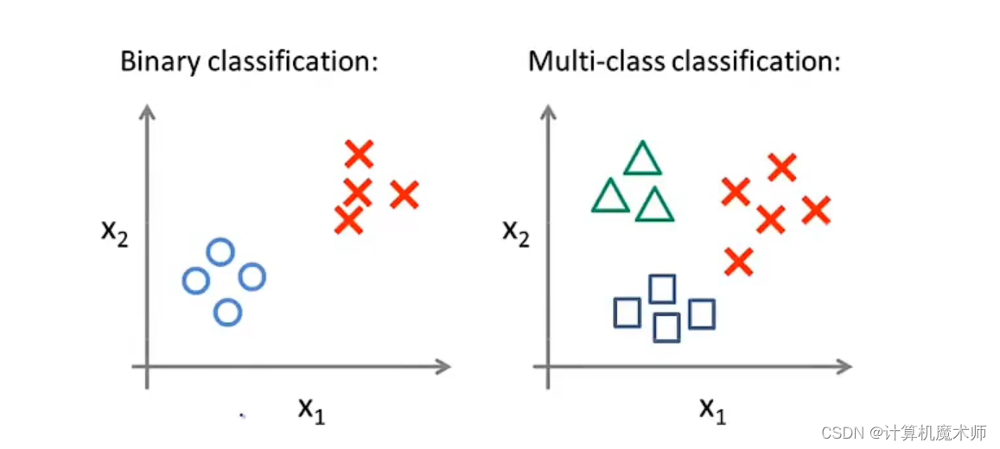
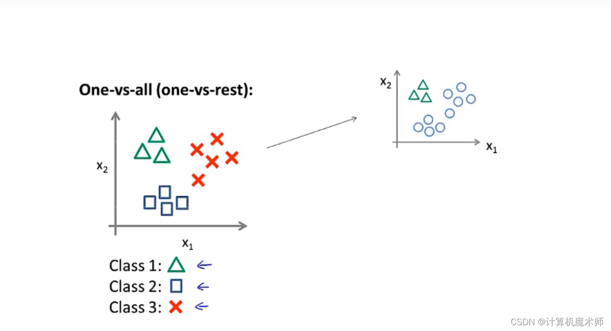
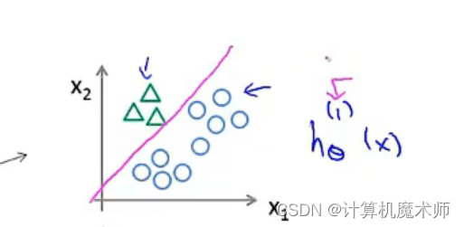
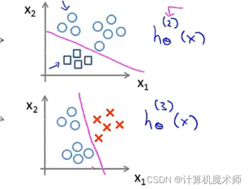
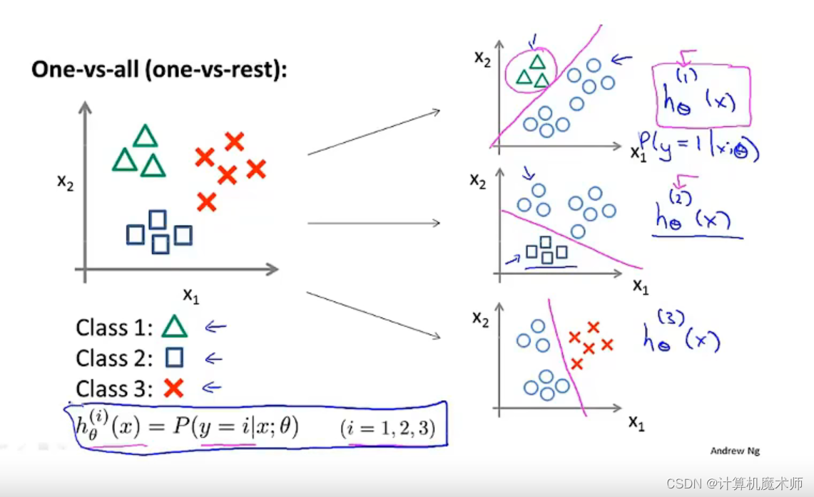

## 一、 朴素贝叶斯

贝叶斯算法（Naive Bayes）是一种常用的概率统计方法，它利用贝叶斯定理来进行分类和预测。其在计算机还没有出现前几十年就存在了，那个时候科学家们都是用手算的，是最早的机器学习形式之一，**该算法基于统计学原理，通过已知的先验概率和观测到的数据，更新对事件发生概率的估计**。因为有着一个很强的假设，每个数据特征都是独立的，这也是条件独立的前提条件，也叫"朴素的"的假设，故叫朴素贝叶斯算法。

具体公式推导如下：

1. 贝叶斯定理表达式：
   根据贝叶斯定理，我们可以得到以下表达式：
   P(A|B) = (P(B|A) * P(A)) / P(B)（注意的是 P(B|A) 的分母范围不是整体样本，而是P(A),所以乘上P(A) 就相当于是基于全局的 P(B|A)

其中，

- P(A|B) 是在**给定观测数据 B** 的条件下事件 A 发生的概率（**后验**概率）。
- P(B|A) 是在事件 A 发生的条件下观测到数据 B 的概率（似然）。
- P(A) 是事件 A 发生的**先验**概率。
- P(B) 是观测到的数据 B 的概率。

> 贝叶斯定理的核心思想是通过已知的条件概率和边际概率，计算出后验概率。先验概率是在考虑任何观测数据之前，基于先前的知识或经验得出的概率。后验概率是在考虑观测数据之后，根据先验概率和条件概率计算得出的概率。 

2. 朴素贝叶斯分类器：
   在朴素贝叶斯分类器中，我们**假设特征之间相互独立，即给定类别的情况下，特征之间是条件独立的**。基于这个假设，我们可以将贝叶斯定理改写为：
   P(C|X) = (P(X|C) * P(C)) / P(X)

其中，

- P(C|X) 是在给定观测数据 X 的条件下类别 C 发生的概率（后验概率）。
- P(X|C) 是在类别 C 发生的条件下观测到数据 X 的概率（似然）。
- P(C) 是类别 C 的先验概率。
- P(X) 是观测到的数据 X 的概率。

3. 具体公式推导：
   假设观测数据有 n 个特征，我们可以将数据表示为 X = (x₁, x₂, ..., xₙ)，其中 xᵢ 表示第 i 个特征的取值。根据朴素贝叶斯分类器的条件**独立性假设**，上述表达式可以进一步简化为：
   P(C|X) = (P(x₁|C) * P(x₂|C) * ... * P(xₙ|C) * P(C)) / P(X)

为了进行分类，我们需要计算**每个类别的后验概率P(C|X) **，并**选择具有最高后验概率的类别作为预测结果**。具体大白话来说就是，更具已知数据中这个类别的概率是多少再乘上数据中特征属于这个类别的概率的结果就是其后验概率了。而其中的这个 P(X|C) 似然概率就需要进行参数估计，见下一部分。

4. 参数估计：
   在实际应用中，我们需要利用训练数据来计算各个概率的估计值。常见的参数估计方法有**极大似然估计和贝叶斯估计。** （极大似然估计 vs 贝叶斯估计：谁才是朴素贝叶斯的最佳伴侣？）

- 极大似然估计：假设训练集中包含 m 个样本，属于类别 C 的样本个数为 mᵢ（i ∈ {1, 2, ..., k}，k 是类别的个数）。则根据极大似然估计，我们可以得到：
  `P(C) = mᵢ / m`
  `P(x|C) = m(x, C) / m`

其中，

- P(C) 是类别 C 的先验概率。 
- P(x|C) 是**在类别 C 发生的条件下特征 x 出现的概率（似然）**。
- m(x, C) 是**在训练集中属于类别 C 且特征为 x 的样本个数**。

> 1. 假设样本数据是从某个概率分布生成的,该分布属于一个参数化家族。
>
> 2. 在这个参数化家族中,找到一组参数,使得样本数据Based on这组参数生成的概率(即似然函数)最大。
>
> 3. 这组参数就是对总体参数的极大似然估计。
>
> 假设有样本数据 $X_1, X_2, ..., X_n$，它们独立同分布，**概率密度函数或概率质量函数为 $f(x|\theta)$**，其中 $\theta$ 是未知参数。则似然函数为：
>
> $L(\theta|X_1,X_2,...,X_n) = f(X_1|\theta)f(X_2|\theta)...f(X_n|\theta)$
>
> 极大似然估计的**目标是找到一组 $\theta$ 的值，使得这个似然函数最大**（即概率最大）：
>
> $\theta_{\text{MLE}} = \arg\max_\theta L(\theta|X_1,X_2,...,X_n)$
>
> 即满足：
>
> $\frac{dL}{d\theta} = 0$
>
> **解这个方程组就可以得到 $\theta$ 的极大似然估计。**
>
> 极大似然估计有以下几个主要性质: 
>
> 1. 当样本量趋于无穷大时,MLE是渐进最优的,即收敛于真实参数值。
>
> 2. **MLE不需要事先指定先验分布**。
>
> 3. 对给定的数据集,MLE总是存在的。
>
> 4. MLE是充分利用数据信息的。
>
> 5. MLE比较容易计算。
>
> 综上,极大似然估计通过最大化似然函数,找到最有可能产生观测数据的模型参数,是一种常用而有效的参数估计方法。它具有渐进最优、无需先验等优点,理论性质良好。

- 贝叶斯估计：**贝叶斯估计是对极大似然估计进行修正，以解决可能出现的概率为零的情况**。常见的贝叶斯估计方法有`拉普拉斯平滑`和`Lidstone`平滑。

> 1. 贝叶斯估计（Bayesian Estimation）：
>    - 先验概率的估计：贝叶斯估计引入了一个**先验分布**，**用于对先验概率进行平滑。常见的先验分布包括拉普拉斯平滑和贝叶斯平滑**。拉普拉斯平滑将每个类别的出现次数**加上一个常数 $\alpha$，然后再进行归一化**，以平滑先验概率的估计。贝叶斯平滑则使用一个更一般的先验分布，例如狄利克雷分布，通过调整参数来控制平滑的程度。
>    - 条件概率的估计：对于条件概率的估计，我们可以使用与先验概率相似的方法进行平滑。例如，对于每个**特征 $X_j$，我们可以将每个取值的出现次数加上一个常数 $\alpha$，然后再进行归一化，以平滑条件概率的估计。**
>
> 贝叶斯估计相对于极大似然估计的优势在于它可以通过**引入先验分布来减小估计的偏差**，**并在数据较少时提供更稳定的估计结果。**然而，贝叶斯估计也会引入一定的偏差，因为它基于先验分布的假设。
>
> 在实际应用中，我们可以根据数据集的大小和特征的分布情况选择适当的参数估计方法。**对于较大的数据集，极大似然估计通常可以提供较好的结果。而对于较小的数据集或特征分布较稀疏的情况，贝叶斯估计可以提供更稳定的估计结果。**

这些公式和推导提供了贝叶斯算法的基本原理，但具体应用时需要根据实际情况进行相应的调整和优化。

贝叶斯算法是一种基于概率理论的机器学习算法，它可以用来处理分类、回归和聚类等各种问题。以下是一些贝叶斯算法常见的应用场景：

1. 文本分类：贝叶斯算法在文本分类中非常有用，尤其是垃圾邮件过滤、情感分析和主题识别等任务。**通过学习单词出现的频率和概率**，模型可以根据文本内容将其分类到不同的类别。

2. 垃圾邮件过滤：利用贝叶斯算法可以构建一个垃圾邮件过滤器，该模型能够根据电子邮件中**包含的单词或短语**判断是否为垃圾邮件。

3. 个性化推荐系统：贝叶斯算法可用于构建个性化推荐系统，在**用户历史行为数据（如浏览记录、购买记录）的基础上预测用户可能感兴趣或喜欢的物品**。

4. 医学诊断：贝叶斯网络在医学领域被广泛应用于疾病诊断与风险评估。通过结合先验知识和实时检测结果，帮助医生进行准确的疾病诊断和预测。

5. 图像分类：贝叶斯算法可以用于图像分类任务，通过学习图像特征的概率分布来对新图像进行分类。这在计算机视觉领域中有广泛应用，如人脸识别、目标检测等。

需要注意的是，贝叶斯算法假设了一些先验概率，并且依赖于输入数据的正确性。因此，在实际应用中，选择合适的先验分布和处理不确定性非常重要。

希望这些例子能够帮助你理解贝叶斯算法在不同领域中的应用！如果还有其他问题，请随时提问。

### 1.1 案例

> 基于朴素贝叶斯算法的生活案例可以是垃圾邮件分类。我们可以使用朴素贝叶斯算法来训练一个模型，该模型可以根据邮件的内容将其分类为垃圾邮件或非垃圾邮件。
>
> 具体的推导建模步骤如下：
>
> 1. 数据准备：收集一批已经标记好的垃圾邮件和非垃圾邮件样本数据。每个样本数据包含邮件的内容和标签（垃圾或非垃圾）。
>
> 2. 数据预处理：对邮件内容进行预处理，包括去除停用词、标点符号和数字，将文本转换为小写，并进行词干提取或词形还原等操作。
>
> 3. 特征提取：将每个邮件转换为特征向量表示。常用的方法是使用词袋模型（Bag of Words），**将每个单词作为一个特征，统计每个单词在邮件中出现的频率。**
>
>    > 词袋模型是一种常用的文本特征提取方法，它将文本转换为固定长度的向量表示。在词袋模型中，文本被看作是一个袋子，**其中包含了所有单词，而忽略了它们的顺序和语法结构。每个词都独立地出现**。
>    >
>    > 以下是词袋模型的基本步骤：
>    >
>    > 1. **构建词汇表**：首先，需要构建一个词汇表，其中包含了**所有在训练数据中出现的单词**。这个词汇表可以根据整个语料库或者特定的文档集合来构建。
>    >2. **向量化**：对于每个文本样本，将其转换为一个特征向量。**特征向量的长度等于词汇表中单词的数量**。通常，可以使用稀疏向量表示来表示特征向量，其中大部分元素为零。
>    > 2. **计算词频**：对于每个文本样本，计算每个单词在文本中出现的频率。将这些频率作为特征向量的元素值。
>    >
>    > 例如，假设我们有两个文档：
>    >
>    > 文档1： "我喜欢看电影"
>    > 文档2： "我不喜欢看电影"
>    >
>    > 在这个例子中，我们的词汇表是 {我，喜欢，看，电影，不}。那么，文档1和文档2的词袋表示分别是：
>    >
>    > 文档1： [1, 1, 1, 1, 0]
>    > 文档2： [1, 1, 1, 1, 1]
>    >
>    > 词袋模型的主要优点是简单和高效。然而，它也有一些缺点。首先，它**忽略了词的顺序，这在许多情况下是非常重要的**。其次，它假设所有的词都是独立的，**不考虑词与词之间的关系**。最后，**它只考虑了词频，没有考虑词的重要性**，这在信息检索中是非常重要的。（在一些应用中只需要词频很有效）
>    >
>    > 为了解决这些问题，有一些改进的词袋模型，如TF-IDF模型，它考虑了词的重要性。还有词嵌入模型，如Word2Vec和GloVe，它们考虑了词与词之间的关系。
>
> 4. 计算概率：根据训练数据**计算每个特征在垃圾邮件和非垃圾邮件中出现的概率**。具体来说，这些单词对应的特征控制了属于垃圾邮箱还是非垃圾邮箱的概率。
>
> 5. 训练模型：根据计算得到的概率，训练一个朴素贝叶斯分类器模型。
>
> 6. 预测分类：对于一个新的邮件，将其转换为特征向量表示，并使用训练好的模型预测其分类。
>
> 下面是一个不使用封装库的Python代码示例：
>
> ```python
> import re
> import math
> 
> # 数据准备
> spam_emails = [
>     "Get a free laptop now!",
>     "Earn money fast with no effort!",
>     "Enlarge your assets with our product!",
>     "Meet singles in your area tonight!"
> ]
> 
> ham_emails = [
>     "Hi, how are you?",
>     "Can we meet tomorrow?",
>     "Remember to buy groceries on your way home.",
>     "I'll be there in 5 minutes."
> ]
> 
> # 数据预处理
> def preprocess_email(email):
>     email = email.lower() # 全部小写
>     email = re.sub(r'\W', ' ', email)  # 去除非字母数字字符
>     email = re.sub(r'\s+', ' ', email)  # 合并多个空格为一个空格
>     return email.strip() # 去除空格
> 
> spam_emails = [preprocess_email(email) for email in spam_emails]
> ham_emails = [preprocess_email(email) for email in ham_emails]
> 
> # 特征提取(每一封邮件)
> def extract_features(email):
>     features = {}
>     words = email.split()
>     for word in words:
>         features[word] = features.get(word, 0) + 1  # 字典查询不存在值返回默认值0实现自动添加。
>     return features
> 
> spam_features = [extract_features(email) for email in spam_emails]
> ham_features = [extract_features(email) for email in ham_emails]
> print(spam_emails)
> print(spam_features)
> # 计算概率 （建立词汇表及其对应单词的概率）
> spam_word_count = {}
> ham_word_count = {}
> spam_total_words = 0
> ham_total_words = 0
> 
> for email in spam_features:
>     for word, count in email.items():
>         spam_word_count[word] = spam_word_count.get(word, 0) + count
>         spam_total_words += count
> 
> for email in ham_features:
>     for word, count in email.items():
>         ham_word_count[word] = ham_word_count.get(word, 0) + count
>         ham_total_words += count
> 
> print(spam_word_count,spam_total_words)
> spam_word_prob = {}
> ham_word_prob = {}
> 
> for word, count in spam_word_count.items():
>     spam_word_prob[word] = count / spam_total_words  # 极大似然估计求概率 （ p(x|c(spam))/m^i ）
> 
> for word, count in ham_word_count.items():
>     ham_word_prob[word] = count / ham_total_words
> 
> print("spam_word_prob:\n",spam_word_prob)
> # 训练模型
> spam_prior = len(spam_emails) / (len(spam_emails) + len(ham_emails)) # 先验概率 P(C(spam)|X)
> ham_prior = len(ham_emails) / (len(spam_emails) + len(ham_emails)) # 先验概率  P(C(ham)|X)
> 
> # 预测分类
> def predict(email):
>     email = preprocess_email(email)
>     features = extract_features(email)
> 
>     # 加法求分数 （避免概率相乘时出现下溢问题）
>     spam_score = math.log(spam_prior)
>     ham_score = math.log(ham_prior)
>     print(spam_score,ham_score)
>     for word, count in features.items():
> #         print(word,spam_word_prob[word])
>         if word in spam_word_prob:
>             spam_score += math.log(spam_word_prob[word]) * count  
>         if word in ham_word_prob:
>             ham_score += math.log(ham_word_prob[word]) * count # 这里有一细节，就是说如果没有一个特征在这里，那按照数学公式，应该是置为0，这里为0.5, 如果没有对应单词就会初始值为0.5很大
>     if(math.exp(spam_score) == 0.5):
>         spam_score = 0
> 	if(math.exp(ham_score) == 0.5):
>         ham_score = 0	
>     print(spam_score,ham_score)
>     spam_score = math.exp(spam_score)
>     ham_score = math.exp(ham_score)
>     # 乘法分数  （概率相乘时出现下溢问题）
> #     spam_score = (spam_prior)
> #     ham_score = (ham_prior)
> 
> #     for word, count in features.items():
> #         if word in spam_word_prob:
> #             spam_score *= spam_word_prob[word] ** count
> #         if word in ham_word_prob:
> #             ham_score *= ham_word_prob[word] ** count
>     print(spam_score,ham_score)
>     if spam_score >= ham_score:
>         return "spam"
>     else:
>         return "ham"
> 
> # 测试
> test_email = "Get a free laptop now!"
> prediction = predict(test_email)
> print(f"\nPrediction for email '{test_email}': {prediction}")
> ```
>
> 输出： 
>
> ```
> ['get a free laptop now', 'earn money fast with no effort', 'enlarge your assets with our product', 'meet singles in your area tonight']
> [{'get': 1, 'a': 1, 'free': 1, 'laptop': 1, 'now': 1}, {'earn': 1, 'money': 1, 'fast': 1, 'with': 1, 'no': 1, 'effort': 1}, {'enlarge': 1, 'your': 1, 'assets': 1, 'with': 1, 'our': 1, 'product': 1}, {'meet': 1, 'singles': 1, 'in': 1, 'your': 1, 'area': 1, 'tonight': 1}]
> {'get': 1, 'a': 1, 'free': 1, 'laptop': 1, 'now': 1, 'earn': 1, 'money': 1, 'fast': 1, 'with': 2, 'no': 1, 'effort': 1, 'enlarge': 1, 'your': 2, 'assets': 1, 'our': 1, 'product': 1, 'meet': 1, 'singles': 1, 'in': 1, 'area': 1, 'tonight': 1} 23
> spam_word_prob:
>  {'get': 0.043478260869565216, 'a': 0.043478260869565216, 'free': 0.043478260869565216, 'laptop': 0.043478260869565216, 'now': 0.043478260869565216, 'earn': 0.043478260869565216, 'money': 0.043478260869565216, 'fast': 0.043478260869565216, 'with': 0.08695652173913043, 'no': 0.043478260869565216, 'effort': 0.043478260869565216, 'enlarge': 0.043478260869565216, 'your': 0.08695652173913043, 'assets': 0.043478260869565216, 'our': 0.043478260869565216, 'product': 0.043478260869565216, 'meet': 0.043478260869565216, 'singles': 0.043478260869565216, 'in': 0.043478260869565216, 'area': 0.043478260869565216, 'tonight': 0.043478260869565216}
> -0.6931471805599453 -0.6931471805599453
> 2.4423470353692043 -0.6931471805599453
> 5.577841251298354 -0.6931471805599453
> 8.713335467227504 -0.6931471805599453
> 11.848829683156653 -0.6931471805599453
> 14.984323899085803 -0.6931471805599453
> 3218171.4999999995 0.5
> 
> Prediction for email 'Get a free laptop now!': spam
> ```
>
> > 实践大于理论 —— 伽利略
> >
> > 对数函数具有一些特殊的性质，使得它在概率计算中非常有用。
> >
> > 在概率计算中，我们通常需要计算多个概率的乘积。当这些概率非常小的时候，连续相乘可能会导致结果变为零或非常接近零。这是由于计算机浮点数的精度限制所导致的。
> >
> > 为了解决这个问题，我们可以使用对数概率进行计算。对数函数具有以下性质：
> >
> > 1. 对数函数是单调递增的。这意味着概率的**对数值的大小顺序与概率本身的大小顺序**（都会变小）相同。因此，对数概率的加法可以代替概率的乘法。
> > 2. 对数函数将乘法转换为加法。对数函数的一个重要性质是，**它将乘法操作转换为加法操作**。具体来说，对数函数满足以下等式：log(ab) = log(a) + log(b)。这意味着将两个概率的对数相加，等于将这两个概率相乘。
> >
> > 通过将概率转换为对数概率，我们可以将概率的乘法转换为对数概率的加法，**从而避免了下溢问题**。这样做的好处是，我们可以**在对数空间中进行计算，而不会丢失精度**（其实相当于是转换到对数空间了）。
> >
> > 在代码中，使用math.log函数对概率进行取对数操作，将概率的乘法转换为对数概率的加法。然后，在最后比较概率大小时，使用math.exp函数将对数概率转换回原始概率进行比较。
> >
> > 总结起来，使用对数概率进行计算是为了避免概率相乘时出现下溢问题，并且利用对数函数的性质将乘法转换为加法，从而提高计算的准确性和效率。
>
> 这段代码用了简单的词频特征提取方法，将**每个单词的计数作为特征（词频）**，且在计算概率时没有进行平滑处理。平滑处理是为了避免在训练数据中**出现未见过的单词时，概率为零的情况**。sklearn中的MultinomialNB分类器**默认使用了拉普拉斯平滑（Laplace smoothing）**来处理这种情况。并默认使用了更复杂的特征提取方法，称为词袋模型（Bag of Words），它将每个单词的出现与否作为特征
>
> 下面是一个使用封装库`scikit-learn`的Python代码示例：
>
> ```python
> from sklearn.feature_extraction.text import CountVectorizer
> from sklearn.naive_bayes import MultinomialNB
> 
> # 数据准备
> spam_emails = [
>     "Get a free laptop now!",
>     "Earn money fast with no effort!",
>     "Enlarge your assets with our product!",
>     "Meet singles in your area tonight!"
> ]
> 
> ham_emails = [
>     "Hi, how are you?",
>     "The cat sat on the mat",
>     "Can we meet tomorrow?",
>     "Remember to buy groceries on your way home.",
>     "I'll be there in 5 minutes."
> ]
> 
> labels = ["spam", "spam", "spam", "spam", "ham", "ham", "ham", "ham", "ham"]
> 
> # 特征提取
> vectorizer = CountVectorizer()
> X = vectorizer.fit_transform(spam_emails + ham_emails)
> print(type(X))
> print(X)
> print(vectorizer.get_feature_names_out())
> print(X.toarray())
> # 训练模型
> model = MultinomialNB() # 多项式朴素贝叶斯
> model.fit(X, labels) # 接受数组和稀疏矩阵
> 
> # 预测分类
> test_email = ["Get a free laptop now!", "how are you?"]
> test_email_vector = vectorizer.transform(test_email)
> print(test_email_vector)
> prediction = model.predict(test_email_vector)[0]
> print(f"Prediction for email '{test_email}': {prediction}")
> ```
>
> 输出： 
>
> ```
> <class 'scipy.sparse._csr.csr_matrix'>
>   (0, 12)	1
>   (0, 11)	1
>   (0, 18)	1
>   (0, 25)	1
>   (1, 7)	1
>   (1, 23)	1
>   (1, 10)	1
>   (1, 39)	1
>   (1, 24)	1
>   (1, 8)	1
>   (2, 39)	1
>   (2, 9)	1
>   (2, 41)	1
>   (2, 2)	1
>   (2, 27)	1
>   (2, 28)	1
>   (3, 41)	1
>   (3, 21)	1
>   (3, 31)	1
>   (3, 17)	1
>   (3, 1)	1
>   (3, 36)	1
>   (4, 14)	1
>   (4, 16)	1
>   (4, 0)	1
>   (4, 40)	1
>   (5, 32)	2
>   (5, 6)	1
>   (5, 30)	1
>   (5, 26)	1
>   (5, 20)	1
>   (6, 21)	1
>   (6, 5)	1
>   (6, 38)	1
>   (6, 35)	1
>   (7, 41)	1
>   (7, 26)	1
>   (7, 29)	1
>   (7, 34)	1
>   (7, 4)	1
>   (7, 13)	1
>   (7, 37)	1
>   (7, 15)	1
>   (8, 17)	1
>   (8, 19)	1
>   (8, 3)	1
>   (8, 33)	1
>   (8, 22)	1
> ['are' 'area' 'assets' 'be' 'buy' 'can' 'cat' 'earn' 'effort' 'enlarge'
>  'fast' 'free' 'get' 'groceries' 'hi' 'home' 'how' 'in' 'laptop' 'll'
>  'mat' 'meet' 'minutes' 'money' 'no' 'now' 'on' 'our' 'product' 'remember'
>  'sat' 'singles' 'the' 'there' 'to' 'tomorrow' 'tonight' 'way' 'we' 'with'
>  'you' 'your']
> [[0 0 0 0 0 0 0 0 0 0 0 1 1 0 0 0 0 0 1 0 0 0 0 0 0 1 0 0 0 0 0 0 0 0 0 0
>   0 0 0 0 0 0]
>  [0 0 0 0 0 0 0 1 1 0 1 0 0 0 0 0 0 0 0 0 0 0 0 1 1 0 0 0 0 0 0 0 0 0 0 0
>   0 0 0 1 0 0]
>  [0 0 1 0 0 0 0 0 0 1 0 0 0 0 0 0 0 0 0 0 0 0 0 0 0 0 0 1 1 0 0 0 0 0 0 0
>   0 0 0 1 0 1]
>  [0 1 0 0 0 0 0 0 0 0 0 0 0 0 0 0 0 1 0 0 0 1 0 0 0 0 0 0 0 0 0 1 0 0 0 0
>   1 0 0 0 0 1]
>  [1 0 0 0 0 0 0 0 0 0 0 0 0 0 1 0 1 0 0 0 0 0 0 0 0 0 0 0 0 0 0 0 0 0 0 0
>   0 0 0 0 1 0]
>  [0 0 0 0 0 0 1 0 0 0 0 0 0 0 0 0 0 0 0 0 1 0 0 0 0 0 1 0 0 0 1 0 2 0 0 0
>   0 0 0 0 0 0]
>  [0 0 0 0 0 1 0 0 0 0 0 0 0 0 0 0 0 0 0 0 0 1 0 0 0 0 0 0 0 0 0 0 0 0 0 1
>   0 0 1 0 0 0]
>  [0 0 0 0 1 0 0 0 0 0 0 0 0 1 0 1 0 0 0 0 0 0 0 0 0 0 1 0 0 1 0 0 0 0 1 0
>   0 1 0 0 0 1]
>  [0 0 0 1 0 0 0 0 0 0 0 0 0 0 0 0 0 1 0 1 0 0 1 0 0 0 0 0 0 0 0 0 0 1 0 0
>   0 0 0 0 0 0]]
>   (0, 11)	1
>   (0, 12)	1
>   (0, 18)	1
>   (0, 25)	1
>   (1, 0)	1
>   (1, 16)	1
>   (1, 40)	1
> Prediction for email '['Get a free laptop now!', 'how are you?']': spam
> ```
>
> `CountVectorizer`是`sklearn.feature_extraction.text`模块中的一个类，它用于将文本数据转换为向量形式，这种形式对于机器学习算法的输入非常有用。下面是`CountVectorizer`的基本原理：
>
> 1. **Tokenization（分词）**：`CountVectorizer`首先将文本分解为单独的单词（在英文中通常是通过空格来分隔），这个过程被称为分词。例如，句子 "The cat sat on the mat" 可能会被分解为 "The", "cat", "sat", "on", "the", "mat"。
>
> 2. **Vocabulary Building（构建词汇表）**：然后，`CountVectorizer`会创建一个词汇表，其中包含所有出现在所有文档中的唯一单词。例如，如果我们有两个文档，一个是 "The cat sat on the mat"，另一个是 "The dog sat on the log"，那么词汇表就会是 "The", "cat", "sat", "on", "the", "mat", "dog", "log"。
>
> 3. **Encoding（编码）**：最后，`CountVectorizer`会将每个文档转换为一个向量。向量的长度等于词汇表中的单词数量，每个元素代表词汇表中对应单词在文档中出现的次数。例如，对于文档 "The cat sat on the mat" 和词汇表 "The", "cat", "sat", "on", "the", "mat", "dog", "log"，其对应的向量可能是 [2, 1, 1, 1, 1, 1, 0, 0]（这里假设我们不区分大小写，"The" 和 "the" 被视为同一个单词，则表示出现了两次）。
>
> 这就是`CountVectorizer`的基本原理。需要注意的是，`CountVect orizer`还有许多参数可以调整，例如你可以选择是否将所有单词转换为小写，是否删除停用词，是否包含n-gram特征等等。其中输出是稀疏矩阵的表示形式。
>
> (0, 11) 1 表示在第0个样本(也就是第一个邮件"Get a free laptop now!")中,词汇表中的第11个词出现了1次。
>
> (1, 6) 1 表示在第1个样本(第二个邮件"Earn money fast with no effort!")中,词汇表中的第6个词出现了1次。 **注意一下，之所以这个稀疏矩阵之所以需要记录样本是第几个，就是为了后续确定他是垃圾邮件还是非垃圾邮件，以实现垃圾邮件的单词数量汇总，得到先验概率**
>
> 以此类推。这里的词汇表是根据所有邮件内容提取出来的,包含了**所有唯一的词**。数字11、6等就是每个词在这个词汇表中的位置。
>
> 而输出的是稀疏矩阵(sparse matrix)的形式,只显示了非零元素,比如一个词在一个邮件中出现过,那么就显示其行号、列号和计数,没有出现的位置就不显示了。
>
> 这样的稀疏矩阵表示可以节省空间,因为大多数位置都是0,不需要存储和显示。
>
> 总结一下,这个输出表示了每个邮件中包含的单词及其出现次数,这些特征已经转换为了向量化的表示,作为后续机器学习算法的输入。

### 1.2 应用场景

朴素贝叶斯（Naive Bayes）是一种常用的机器学习算法，主要用于解决分类问题。它基于贝叶斯定理和特征条件独立性假设，通过计算给定特征下类别的概率来进行分类。

朴素贝叶斯在以下情况下非常有用（**以下都是可以很好确定特征条件概率和条件独立性假设的，比如计算单词词频作为条件 概率**）：

1. 文本分类：可以将文档或邮件归类为垃圾邮件或非垃圾邮件。
2. 情感分析：可以判断评论、推文等的**情感倾向**（如正面、中性或负面）。
3. 垃圾过滤：可以识别电子邮件中是否包含垃圾内容。
4. 特征选择：可用于**确定最相关的特征**并筛选掉无关紧要的特征。

朴素贝叶斯之所以能够解决这些问题，并且在某些场景下表现出色，是因为它具有以下优势：

1. **快速而简单**：相对于其他复杂模型（如深度神经网络），朴素贝叶斯**计算效率高，训练速度快，并且易于实现和理解。**
2. 处理大量数据：即使训练集规模较大，朴素贝叶斯仍然能够**高效处理，并且具有较低的内存要求**。
3. 处理高维数据：朴素贝叶斯**假设特征之间是独立**的，因此**在面对高维数据时，模型仍然能够有效地进行分类**。

尽管朴素贝叶斯在某些情况下表现良好，但也存在一些局限性。由于它**基于特征条件独立性假设，在某些实际问题中可能无法满足这个假设。此外，朴素贝叶斯对输入数据的分布形态比较敏感。**

是否存在更好的方式取决于具体问题和可用的数据。**如果特征之间不满足独立性假设或其他先验知识已知**，则可以考虑使用其他算法（如决策树、支持向量机、深度学习等）。选择合适的算法应该基于`任务需求`、`可用资源`以及对`模型解释性`和`准确性`之间的权衡考虑。

>  朴素贝叶斯算法通常用于分类任务,**不太适合用于回归任务**。朴素贝叶斯的基本思想是**基于贝叶斯定理与特征条件独立假设**,通过训练数据计算**不同类别下各个特征的条件概率**,并**应用贝叶斯定理进行分类预测**。而对于回归问题,**目标变量是一个连续的值,不能简单地计算类别条件概率**。通常的做法是建立**一个高斯分布来模拟目标变量,（确定概率）**但是这种方法存在一定的局限性:
>
>  1. 需要**假设目标变量符合高斯分布**,但实际中目标变量的分布可能更为复杂。
>  2. **无法有效地处理多维目标变量**。
>  3. **对异常值比较敏感**。
>  4. **计算复杂度较高**。
>
>  所以在实际应用中,我们很少会直接使用朴素贝叶斯算法进行回归。更多的时候,朴素贝叶斯被作为生成模型与判别模型相结合的一部分来进行回归,比如高斯朴素贝叶斯（Gaussian Naive Bayes）回归。
>

## 二、logistics分类


### 一、线性回归能用于分类吗？
>$logistic$（数理逻辑）回归算法(预测**离散值** $y$ 的 非常常用的学习算法

假设有如下的八个点($y=1 或 0)$,我们需要建立一个模型得到准确的判断，那么应该如何实现呢
- 我们尝试使用之前文章所学的**线性回归** $h_\theta(x) = \theta^T*x$ 来拟合数据($\theta$是参数列向量，注意这里的$x$是关于$x_i$的向量,其中$x_0=1, 即 x_0*\theta_0 = 常数项$），并在0~1设置一个阈值 $y = 0.5 所对应的 x_{0.5} 值$， $x$  大于 $x_{0.5}$ 的点则为1，否则为0，预测会得到如下**粉丝直线**，

上一篇文章： [【机器学习】浅谈正规方程法&梯度下降](http://t.csdn.cn/4tS6D)

假设我们再增加一个**数据点**，如下图右方，按照如上算法对应的拟合直线$h_\theta(x)$则如下**蓝色直线**，此时得到错误的预测 (对于结果为`1`也小于$x_{0.5}$)

所以综上所诉，用线性回归来用于分类问题通常不是一个好主意，并且线性回归的值会远远偏离0或1，这显示不太合理。

所以**梯度下降算法**中引出 **logistic regression 算法**

### 二、二元分类
#### 2.1假设函数
>我们希望能把 $h_\theta(x) = \theta^T*x$ 结果在 0 ~ 1 之间，
>
>这里引入  $sigmoid$ 函数 (也叫做 $logistic$ 函数)    ——    $g(x) = \frac{1}{1 +  e ^{-x}}$ 


$sigmoid$函数图像是一个区间在 0 ~ 1的S型函数，$x \Rightarrow\infty$则$y\Rightarrow1$，$x \Rightarrow-\infty$则$y\Rightarrow0$
	

- 令    $h_\theta(x) =g( \theta^T*x) = \frac{1}{1 +  e ^{- \theta^T*x}}$ 
**那么我们的函数结果结果就会在0 ~ 1 之间**

那现在我们所要做的便是需要求得参数$\theta$ 拟合模型
>如下图，假设肿瘤案例，如下$x$为一个病人 同样的用列向量表示$x$的参数，那么参数一**tumorSize**便是肿瘤的大小，那么我们可以假设输出结果为 0.7 ，意思就是医生会告诉这个病人很不幸，会有很大（70%）的概率得到肿瘤。
>
>- 那么公式可以表示为    $h_\theta(x) = P（y=1|x;\theta）$
- **即在$x$的条件下 求给定$y$ (概率参数为$\theta$)的概率**


那么在$y$只有 0 和 1 的情况下，有如下公式 （二者为对立事件，符合全概率公式）
- $P（y=1|x;\theta）+ P（y=0 |x;\theta）= 1$
- $1 - P（y=0 |x;\theta）= P（y=1|x;\theta）$

概率结果只在0 ~ 1中
- 假设如下
>那么此时我们可以设置阈值$g(z)$ =  0.5，大于 0.5  的点则为1，否则为0

即在 $z<0$（即 $\theta^T*x$）中 $g(z)$< 0.5, 此时预测为0，在 $z>0$（即 $\theta^T*x$） 时,$g(z)>0$ 预测值为1


#####  2.1.1 案例一

我们假设他的各个$\theta$ 参数向量参数为-3，1，1

此时如果满足 $g(z)$> 0.5 , 也就是横坐标 $z$(**这里的 $z$ 是对应线性方程**） 大于零，预测 y 为 1 条件则如下：

 化简为条件 $x_1 + x_2 >=3$ ,  这个条件所对应的几何意义：  

即一条切割线的右侧，此时$sigomid函数的z坐标>0$ , y值 大于0.5
 


此时该切割线分割除了两个区域，分别是 $y=0 与 y=1$的 情况,我们把这条边界，称为**决策边界**，这些都是关于假设函数的属性，决定于其参数，与数据集属性无关


#####  2.1.2例子二
有数据集如下：

我们假设函数为多项式高阶函数，并对其参数假设赋值如下。


那我们的预测y=1时，$sigomid$横坐标$z$满足条件为

可以得到其**决策边界**`decision boundory`   —— $x_1^2+x_2^2 =1$
	
- 强调： 决策边界并不是数据集的属性，而是**假设函数以及其参数的属性**，数据集则是用于拟合参数 $\theta$ 
不同的高阶多项式 会得到不一样的决策边界
如：

#### 2.2 拟合logistic回归参数 $\theta_i$
- **代价函数**

我们给定如数据集

有$m$个样本，同样将每一个$x$用 $n+1$维向量表示（向量每个元素即特征，其中$x0为1$ )  分类标签$y$只有 0，1结果
- 那么我们如何选择参数$\theta$呢?

在往篇文章中我们线性回归的**均方差代价函数**可以变化如下：

简化函数，我们省略上标

因为 $sigomid$ 是复杂的非线性函数，如果直接以函数作为**代价函数**，那么所求模型对应**代价函数**为非凹函数，会有非常多的**局部最优**，如下图

我们不能保证其可以下降到函数最优

我们往往希望找到如下的凹型代价函数，以可以找到参数最优。

故我们需要找到另外的代价函数保证我们可以找到全局最小值
### 三、logistic代价函数

#### 3.1 当$y=1$代价函数图像
对该**代价函数**，我们可以画出当$y=1$时的图像。（由于 $sigomid$ **函数值域**在0~1，对应代价函数横坐标为0 ~1)

为了方便理解我们可以画出，对数函数的图像 $log(z)$ (   $z = h_\theta(x))$ )


- 从图中我们也可以看到作为**代价函数** 很好的性质


1. 当$Cost \Rightarrow 0$时，即代价函数为0，**此时有$h_\theta(x)\Rightarrow1$** 即模型拟合优秀

2.  当$Cost  \Rightarrow\infty$时，即代价函数$\Rightarrow\infty$，此时$h_\theta(x) \Rightarrow 0$即为 。此时说明模型拟合非常差

显然当 $y=1$ 时 这个代价函数满足我们的要求


#### 3.2 当$y=0$代价函数图像
对应 $y=0$的情况下：

- 如下图

1. 当$Cost \Rightarrow 0$时，即代价函数为 $\Rightarrow0$，**此时有$h_\theta(x)\Rightarrow0$** 即模型拟合优秀

2.  当$Cost  \Rightarrow\infty$时，即代价函数 $\Rightarrow\infty$，此时$h_\theta(x) \Rightarrow 1$即为 。函数惩罚很大 

同样的符合代价函数性质


至此，我们定义了关于单变量数据样本的分类**代价函数**，我们所选择的**代价函数可以为我们解决代价函数为非凹函数的问题以及求解参数最优**，接下来我们使用**梯度下降算法**来拟合 $logistic$ 算法
### 四、 代价函数与梯度下降
为了避免让代价函数分为 $y = 1,y= 0$两种情况 ，我们要找一个方法来把这两个式子合并成一个等式，**以便更简单写出代价函数，并推导出梯度下降。**

公式如下图**蓝色字体公式**：


由于 y 只有两个情况 0，1 ，利用该性质 **当y = 1 时，y=0情况的多项式消去，y = 0 时同理**，这样就成功表达了两种不同情况的函数

- 通过将式子合并为一个等式，**代价函数**（cost function) 变化为如下（参考：统计学的**极大似然法**： `为不同模型已知数据寻找参数的方法,即选取概率最大的参数`）
 [最大似然函数参考文章](https://zhuanlan.zhihu.com/p/26614750)


同样，我们为了求最小化代价函数以拟合参数$\theta$，使用**梯度下降**

- 同样，将**微积分求其偏导**

- 并用此公式更新每个参数	（注意是：同步更新）


#### 4.1 线性回归与logistic回归的梯度下降规则
我们可以惊奇的发现以上公式与**线性回归时所用来梯度下降**的方程一样

那么**线性回归和`logistic`回归是同一种算法吗？**

>线性回归和logistic在梯度下降更新的函数**区别**在于：$h_\theta(x^i)$
>1. 对于线性回归 ：	 $h_\theta(x)   = \theta^T*x$
>2. 对于logistic回归：$h_\theta(x) = \frac{1}{1 +  e ^{- \theta^T*x}}$ 

虽然在梯度下降算法看起来规则相同，但**假设的定义发生了变化**，所以**梯度下降和logistic回归是完全不一样的算法**

- 我们用此算法更新各个参数，可以通过for进行实现，也可以通过[向量化](https://cpt-magician.blog.csdn.net/article/details/125285568)进行实现。

关于向量化，可以参考文章 [【机器学习】向量化计算 -- 机器学习路上必经路](http://t.csdn.cn/OCvLH)


同样的，在对于线性回归的梯度下降中，我们使用到了**特征缩放数据标准化**，同样的，这对于$logistic$ 回归算法同样适用。

数据标准化可参考文章： [【机器学习】梯度下降之数据标准化](http://t.csdn.cn/kzcgB)


### 五、高级优化算法
高级优化算法，与梯度下降相比能够大大提高 $logistic$ 回归速度，也使得算法更加适合大型数据集机器学习问题。
除了使用梯度下降算法，还有诸多如下算法


优点如下

 - 不需要选择学习率$\alpha$ ( 存在智能内循环，智能选择最佳的学习率$\alpha$
 - 下降速率快得多

缺点
- 太过于复杂了

在实际解决问题中，我们很少通过自己编写代码求**平方根**或者求**逆矩阵**，我们往往都是使用别人写的好的数据科学库，如`numpy`

有如下例子（求两个参数）

我们可以通过梯度下降来求得参数，如下求偏导：

`octave`代码实现如下;

这是一个简单的二次代价函数，现在我们如何将其用在logistic回归算法中呢？

在logistic回归中，我们使用如下的$\theta$参数向量 （使用参数向量化）

所以在实现这些高级算法，其实是使用不同的高级库函数，虽然这些算法在调试过程中，更加麻烦，但是其**速度远远大于梯度下降**，所以面对机器学习问题中，往往使用这些算法。


### 六、多元分类：一对多
例如将邮件分为亲人，朋友，同事。例如将天气分类，下雨，晴天等、我们可以将这些用数字0，1，2表达，以上这些都是**多类别分类**

与二分类图像不同(**右图**）

首先，我们将该数据集划分为三类

我们要做的就是将这数据集**转换为三个独立的二元分类问题**， 我们将创建一个新的**”伪“训练集**，其中**第二类第三类为负类，第一类为正类**（如下图右侧）


并拟合一个分类器$h_\theta^1(x)$,接下来我们来实现一个**标准的逻辑回归分类器**，通过训练，我们可以得到一个决策边界


- 同理，将其他两类样本如上**创建`伪`数据集**，以及对应的拟合分类器，进行一个**标准的逻辑回归分类器**，得到对应边界

总而言之，我们拟合出了三个分类器

> $h_\theta^i(x) = P(y=i|x;\theta) (i=1,2,3)$

每个分类器都对应与之的情况训练，y = 1, 2, 3 的情况


我们训练了**逻辑回归分类器** $h_\theta^i(x) = P(y=i|x;\theta) (i=1,2,3)$，用于预测 $y= i$ 的概率，为了做出预测，我们向分类器输入一个$x$，期望获得预测，我们需要在这三个回归分类器中运行输入$x$，选出结果中概率最大的一个（最可信）的那个分类器，就是我们要的类别。


 》 总结一下：
 > 用的算法是线性函数，但是通过sigmoid 变换到0 ~ 1概率形式，以满足对应的分类任务，通过概率与0，1之间的残差，即误差，得到损失函数这一目标，再通过梯度下降算法进行调整参数（也可以用其他的优化算法）
 >
 > 总而言之，就是逻辑回归模型假设特征与目标变量之间存在线性关系，利用这个线性关系来分类（这个逻辑回归是因为是线性函数，一个线性关系）

## 三、决策树

### 1.1 分类

决策树是一种基于树形结构的分类模型，它通过对数据属性的逐步划分，将数据集分成多个小的决策单元。每个小的决策单元都对应着一个叶节点，在该节点上进行分类决策。决策树的核心是如何选择最优的分割属性。常见的决策树算法有ID3、C4.5和CART。

决策树的输入数据主要包括训练集和测试集。训练集是已知类别的样本集，测试集则是需要分类的未知样本集。

具体来说，构建决策树的过程可以分为如下几个步骤：

1. 选择最优特征。在构建决策树时，需要从当前样本集合中选择**一个最优的特征**作为当前节点的划分属性。通常使用**信息增益、信息增益比或基尼指数等指标**来评估各个特征的划分能力，并选取最优特征。
2. 划分子集。**根据选取的最优特征，将当前样本集合划分成若干个子集**。每个子集对应于一个子节点，且该节点所代表的样本集合与其父节点的样本集合不重复。
3. 递归构建决策树。对于每个子节点，重复前两个步骤，直到所有的样本都被分配到叶子节点上，并且每个叶子节点对应着一个类别。
4. 剪枝操作。由于决策树容易出现过拟合，因此需要进行剪枝操作。常用的剪枝方法包括预剪枝和后剪枝。

在进行分类时，对输入测试样本，按照各个属性的划分方式逐步匹配，**最终到达某个叶子节点，并将该测试样本归为叶子节点所代表的类别**。决策树的输出结果就是针对测试样本的分类结果，即该测试样本所属的类别。

决策树的优点在于**易于理解和解释，能够处理不同类型的数据，且不需要对数据进行预处理**。但是，决策树容易出现过拟合问题，因此在构建决策树时需要进行剪枝操作。常用的剪枝方法包括预剪枝和后剪枝。

#### 1.1.1 案例

当然，我可以为您提供一个决策树的详细例子。假设我们要构建一个决策树来预测一个人是否会购买某个产品。我们将使用以下特征来进行预测：

1. 年龄：年龄范围在18岁到65岁之间。
2. 性别：男性或女性。
3. 收入：收入范围在0到100,000之间。

我们有一个包含以下数据的训练集：

| 编号 | 年龄 | 性别 | 收入    | 购买 |
|------|------|------|---------|------|
| 1    | 25   | 男性 | 30,000  | 否   |
| 2    | 35   | 女性 | 40,000  | 否   |
| 3    | 45   | 女性 | 80,000  | 是   |
| 4    | 20   | 男性 | 10,000  | 否   |
| 5    | 55   | 男性 | 60,000  | 是   |
| 6    | 60   | 女性 | 90,000  | 是   |
| 7    | 30   | 男性 | 50,000  | 否   |
| 8    | 40   | 女性 | 75,000  | 是   |

现在，我们将使用这些数据来构建一个决策树模型。

首先，我们选择一个特征来作为根节点。我们可以使用**信息增益或基尼不纯度等指标**来选择最佳特征。在这个例子中，我们选择使用信息增益。

> 基尼指数和信息增益都是用于决策树中特征选择的指标，它们各有优劣。
>
> > 基尼指数是一种**衡量数据集纯度或不确定性的指标**，常用于决策树算法中的特征选择。它基于**基尼系数的概念**，用于度量从数据集中**随机选择两个样本，其类别标签不一致的概率**。
> >
> > 基尼指数的计算公式如下：
> > $Gini(D) = 1 - Σ (p_i)^2$
> >
> > 其中，Gini(D)表示数据集D的基尼指数，p_i表示数据集D中第i个类别的样本所占比例。
> >
> > 基尼指数的取值范围为0到1，**数值越小表示数据集的纯度越高，即样本的类别越一致**。当数据集D中只包含一种类别的样本时，基尼指数为0，表示数据集完全纯净。当数据集D中的样本类别均匀分布时，基尼指数最大（即值越小），为1，表示数据集的不确定性最高。
> >
> > 在决策树算法中，基尼指数被用于衡量选择某个特征进行划分后，数据集的纯度提升程度。通过计算每个特征的基尼指数，选择基尼指数最小的特征作为划分依据，以达到最大程度地减少数据集的不确定性。
>

计算每个特征的信息增益：

- 年龄的信息增益：0.029
- 性别的信息增益：0.152
- 收入的信息增益：0.048

根据信息增益，我们选择性别作为根节点。

> 信息增益是一种用于选择决策树节点的指标，**它衡量了在选择某个特征作为节点后，数据集的纯度提高了多少**。信息增益的计算基于信息熵的概念。
>
> 信息熵是用来衡量数据集的混乱程度或不确定性的度量。对于一个二分类问题（如购买与否），信息熵的计算公式如下 （多分类也一样，每个不题类别求和）：
>
> $Entropy(S) = -p(Yes) * log2(p(Yes)) - p(No) * log2(p(No))$
>
> 其中，S是数据集，p(Yes)和p(No)分别是购买为"是"和"否"的样本在数据集中的比例。(**信息熵代表了分布越平均,样本信息含量越高,不确定性越大,信息熵越大，分布越不均匀，占比越大，信息熵会趋于0。所以以信息熵大小来确定分类，就是为了把一些小范围的集合分离出去**)
>
> 信息增益的计算公式如下（不同类别信息熵相加）： 
>
> $Gain(S, A) = Entropy(S) - ∑(|Sv| / |S|) * Entropy(Sv)$
>
> 其中，S是数据集，A是要计算信息增益的特征，**Sv是特征A的某个取值对应的子集，|Sv|是子集Sv的样本数量，|S|是数据集S的样本数量。** （通过这个子集数量控制其影响权重，然后确定信息增益最大的（**即信息熵最小**），白话就是选择一个分类中更主流的，特征更明显的）
>
> **信息增益越大，意味着使用特征A作为节点可以更好地分割数据集，提高纯度。**
>
> 在我们的例子中，我们计算了每个特征的信息增益，并选择了具有最大信息增益的特征作为根节点。然后，我们根据根节点的取值将数据集分割成子集，并对每个子集计算信息增益，以选择下一个节点。这个过程一直持续到满足停止条件为止，例如子集中的样本都属于同一类别或达到了预定的树的深度。
>
> 总结以下是基尼指数和信息增益的优缺点
>
> 优点：
>
> - 基尼指数：基尼指数是一种衡量不纯度的指标，**它在计算上比信息增益更简单和高效**。在处理大规模数据集时，基尼指数的**计算速度通常比信息增益快**。（单纯计算特征分类占比，**占比平方**）
> - 信息增益：信息增益是一种**衡量特征对于分类任务的贡献程度的指标**。它基于信息论的概念，可以**更好地处理多分类问题**。信息增益在**处理不平衡数据集时表现较好**，能够更好地处理类别不均衡的情况。（除了计算特征分类占比，还添加了一个log函数，**log比例乘上占比，使其贡献度分类占比大小情况得到增益**）
>
> 缺点：
>
> - 基尼指数：基尼指数只考虑了特征的不纯度，而没有考虑特征的取值个数。这意味着基尼指数可能会偏向具有更多取值的特征。在处理具有大量取值的特征时，基尼指数可能会导致决策树偏向这些特征。（基尼指数只要是要这个阈值，节点，能分出去的样本比例最大有多大，最大越大，越倾向于）
> - 信息增益：信息增益对于具有较多取值的特征有一定的偏好，因为它**倾向于选择具有更多分支的特征**。这可能导致决策树过于复杂，**容易过拟合训练数据**（树的深度不要太深）。（信息增益根据一种信息学的信息熵，根据其性质，分类越平均越大，分类占比大越小的一个性质，来分节点。
>
> 使用基尼指数还是信息熵取决于具体情况和需求：
>
> - 如果你想要**快速得出结果并处理大规模数据，请使用基尼指数。**
> - 如果你**关注模型的纯度和分类能力**，并且数据集较小，则信息熵可能是更好的选择。

接下来，我们根据性别的取值（男性或女性）将数据集分割成两个子集。

对于男性子集：

| 编号 | 年龄 | 收入    | 购买 |
|------|------|---------|------|
| 1    | 25   | 30,000  | 否   |
| 4    | 20   | 10,000  | 否   |
| 5    | 55   | 60,000  | 是   |
| 7    | 30   | 50,000  | 否   |

对于女性子集：

| 编号 | 年龄 | 收入    | 购买 |
|------|------|---------|------|
| 2    | 35   | 40,000  | 否   |
| 3    | 45   | 80,000  | 是   |
| 6    | 60   | 90,000  | 是   |
| 8    | 40   | 75,000  | 是   |

对于男性子集，我们可以看到购买的结**果是"是"和"否"都有，所以我们需要进一步划分**。我们选择年龄作为下一个节点。

对于年龄的取值（小于等于30岁和大于30岁）：

对于小于等于30岁的子集：

| 编号 | 收入    | 购买 |
|------|---------|------|
| 1    | 30,000  | 否   |
| 4    | 10,000  | 否   |
| 7    | 50,000  | 否   |

对于大于30岁的子集：

| 编号 | 收入    | 购买 |
|------|---------|------|
| 5    | 60,000  | 是   |

对于小于等于30岁的子集，购买的结果都是"否"，所以我们不需要再进行划分。

对于大于30岁的子集，购买的结果都是"是"，所以我们不需要再进行划分。

对于女性子集，购买的结果都是"是"，所以我们不需要再进行划分。

最终的决策树如下所示：

```
性别 = 男性:
    年龄 <= 30岁: 否
    年龄 > 30岁: 是
性别 = 女性: 是
```

这就是一个简单的决策树的例子。根据输入的特征，决策树可以根据特征的取值进行预测。请注意，这只是一个简单的示例，实际上，决策树可以有更多的特征和更复杂的结构。

首先，我们使用scikit-learn库来实现决策树：

```python
from sklearn import tree
import numpy as np

# 数据集
X = np.array([[25, 1, 30000],
              [35, 0, 40000],
              [45, 0, 80000],
              [20, 1, 10000],
              [55, 1, 60000],
              [60, 0, 90000],
              [30, 1, 50000],
              [40, 0, 75000]])

Y = np.array([0, 0, 1, 0, 1, 1, 0, 1])

# 创建决策树模型
clf = tree.DecisionTreeClassifier()

# 训练模型
clf = clf.fit(X, Y)

# 预测
print(clf.predict([[40, 0, 75000],[10, 0, 75000]]))  # 输出：[1, 0]
```

然后，我们不使用任何机器学习库来实现决策树：

```python
import numpy as np

class Node:
    def __init__(self, predicted_class):
        self.predicted_class = predicted_class  # 预测的类别
        self.feature_index = 0  # 特征索引
        self.threshold = 0  # 阈值
        self.left = None  # 左子树
        self.right = None  # 右子树

class DecisionTree:
    def __init__(self, max_depth=None):
        self.max_depth = max_depth  # 决策树的最大深度

    def fit(self, X, y):
        self.n_classes_ = len(set(y))  # 类别的数量
        self.n_features_ = X.shape[1]  # 特征的数量
        self.tree_ = self._grow_tree(X, y)  # 构建决策树

    def predict(self, X):
        return [self._predict(inputs) for inputs in X]  # 对输入数据进行预测
    
    def _best_gini_split(self, X, y):
        m = y.size  # 样本的数量
        if m <= 1:  # 如果样本数量小于等于1，无法进行分割
            return None, None
        num_parent = [np.sum(y == c) for c in range(self.n_classes_)]  # 每个类别在父节点中的样本数量
        best_gini = 1.0 - sum((n / m) ** 2 for n in num_parent)  # 父节点的基尼指数
        best_idx, best_thr = None, None  # 最佳分割特征索引和阈值
        for idx in range(self.n_features_):  # 遍历每个特征
            thresholds, classes = zip(*sorted(zip(X[:, idx], y)))  # 根据特征值对样本进行排序
            num_left = [0] * self.n_classes_  # 左子节点中每个类别的样本数量
            num_right = num_parent.copy()  # 右子节点中每个类别的样本数量，初始值为父节点的样本数量
            for i in range(1, m):  # 遍历每个样本
                c = classes[i - 1]  # 样本的类别
                num_left[c] += 1  # 更新左子节点中对应类别的样本数量
                num_right[c] -= 1  # 更新右子节点中对应类别的样本数量
                gini_left = 1.0 - sum(
                    (num_left[x] / i) ** 2 for x in range(self.n_classes_)
                )  # 左子节点的基尼指数
                gini_right = 1.0 - sum(
                    (num_right[x] / (m - i)) ** 2 for x in range(self.n_classes_)
                )  # 右子节点的基尼指数
                gini = (i * gini_left + (m - i) * gini_right) / m  # 加权平均的基尼指数
                if thresholds[i] == thresholds[i - 1]:  # 如果特征值相同，则跳过（特征阈值）
                    continue
                if gini < best_gini:  # 如果基尼指数更小，则更新最佳分割特征索引和阈值 （循环每个特征，和每个阈值，以求解最优分类
                    best_gini = gini
                    best_idx = idx
                    best_thr = (thresholds[i] + thresholds[i - 1]) / 2
        return best_idx, best_thr  # 返回最佳分割特征索引和阈值

    def _best_gain_split(self, X, y):
        m = y.size  # 样本的数量
        if m <= 1:  # 如果样本数量小于等于1，无法进行分割
            return None, None
        num_parent = [np.sum(y == c) for c in range(self.n_classes_)]  # 计算每个类别的样本数量
        best_gain = -1  # 初始化最佳信息增益
        best_idx, best_thr = None, None  # 初始化最佳特征索引和阈值
        for idx in range(self.n_features_):  # 遍历每个特征
            thresholds, classes = zip(*sorted(zip(X[:, idx], y)))  # 对每个特征值和类别标签进行排序
            num_left = [0] * self.n_classes_  # 初始化左子树的类别数量 (左边都是0,为0时自动计算为0） 
            num_right = num_parent.copy()  # 右子树的类别数量初始化为父节点的类别数量 (右边是全部）
            for i in range(1, m):  # 遍历每个样本
                c = classes[i - 1]  # 获取当前样本的类别
                num_left[c] += 1  # 左子树的类别数量增加
                num_right[c] -= 1  # 右子树的类别数量减少
                entropy_parent = -sum((num / m) * np.log2(num / m) for num in num_parent if num != 0)  # 计算父节点的熵
                entropy_left = -sum((num / i) * np.log2(num / i) for num in num_left if num != 0)  # 计算左子树的熵
                entropy_right = -sum((num / (m - i)) * np.log2(num / (m - i)) for num in num_right if num != 0)  # 计算右子树的熵
                gain = entropy_parent - (i * entropy_left + (m - i) * entropy_right) / m  # 计算信息增益（分类后左右的信息熵最小）
                if thresholds[i] == thresholds[i - 1]:  # 如果当前样本的特征值和前一个样本的特征值相同，跳过（不一样才能分界）
                    continue
                if gain > best_gain:  # 如果当前的信息增益大于最佳信息增益
                    best_gain = gain  # 更新最佳信息增益
                    best_idx = idx  # 更新最佳特征索引
                    best_thr = (thresholds[i] + thresholds[i - 1]) / 2  # 更新最佳阈值 （循环每个样本的值，根据两份数据均值确定阈值，一直循环）
        return best_idx, best_thr  # 返回最佳特征索引和阈值

    def _grow_tree(self, X, y, depth=0):
        num_samples_per_class = [np.sum(y == i) for i in range(self.n_classes_)]  # 计算每个类别的样本数量
        predicted_class = np.argmax(num_samples_per_class)  # 预测的类别为样本数量最多的类别 （即确定分到该分支样本最多的记为该类）
        node = Node(predicted_class=predicted_class)  # 创建节点
        if depth < self.max_depth:  # 如果当前深度小于最大深度
            idx, thr = self._best_gain_split(X, y)  # 计算最佳分割
            if idx is not None:  # 如果存在最佳分割
                indices_left = X[:, idx] < thr  # 左子树的样本索引 (第 idx特征中小于thr阈值的索引)
                X_left, y_left = X[indices_left], y[indices_left]  # 左子树的样本
                X_right, y_right = X[~indices_left], y[~indices_left]  # 右子树的样本
                node.feature_index = idx  # 设置节点的特征索引
                node.threshold = thr  # 设置节点的阈值
                node.left = self._grow_tree(X_left, y_left, depth + 1)  # 构建左子树
                node.right = self._grow_tree(X_right, y_right, depth + 1)  # 构建右子树
        return node  # 返回节点

    def _predict(self, inputs):
        node = self.tree_  # 获取决策树的根节点
        while node.left:  # 如果存在左子树
            if inputs[node.feature_index] < node.threshold:  # 如果输入样本的特征值小于阈值
                node = node.left  # 到左子树
            else:
                node = node.right  # 到右子树
        return node.predicted_class  # 返回预测的类别

# 数据集
X = [[25, 1, 30000],
     [35, 0, 40000],
     [45, 0, 80000],
     [20, 1, 10000],
     [55, 1, 60000],
     [60, 0, 90000],
     [30, 1, 50000],
     [40, 0, 75000]]

Y = [0, 0, 1, 0, 1, 1, 0, 1]

# 创建决策树模型
clf = DecisionTree(max_depth=2)

# 训练模型
clf.fit(np.array(X), np.array(Y))

# 预测
print(clf.predict([[40, 0, 75000],[10, 0, 75000]]))  # 输出：[1, 0]
```

请注意，这个不使用任何机器学习库的决策树实现是一个基本的版本，它可能无法处理所有的情况，例如缺失值、分类特征等。在实际应用中，我们通常使用成熟的机器学习库，如scikit-learn，因为它们提供了更多的功能和优化。

### 1.2 回归

当决策树用于回归任务时，它被称为决策树回归模型。与分类树不同，决策树回归模型的叶子节点不再表示类别标签，而是**表示一段连续区间或者一个数值**。它同样基于树形结构，通过对数据特征的逐步划分，将数据集分成多个小的决策单元，并在每个叶子节点上输出一个预测值。

以下是决策树回归模型的详细原理：

1. 划分过程

与分类树相似，决策树回归模型也采用递归二分的方式进行划分。具体来说，从根节点开始，选择一个最优特征和该特征的最优划分点。然后将数据集按照该特征的取值分为两部分，分别构建左右子树。重复以上步骤，直到满足停止条件，比如达到最大深度、划分后样本数少于阈值等。

2. 叶子节点的输出值

当到达某个叶子节点时，该叶子节点的输出值就是训练集中该**叶子节点对应的所有样本的平均值（或中位数等）**。

3. 预测过程

对于一个测试样本，从根节点开始，按照各个特征的划分方式逐步匹配，最终到达某个叶子节点，并将该测试样本的预测值设为该叶子节点的输出值。

4. 剪枝操作

与分类树一样，决策树回归模型也容易出现过拟合问题，因此需要进行剪枝操作。常用的剪枝方法包括预剪枝和后剪枝。

5. 特点

决策树回归模型具有以下特点：

（1）易于解释：决策树回归模型能够直观地反映各个特征对目标变量的影响程度。

（2）非参数性：决策树回归模型不对数据分布做任何假设，适用于各种类型的数据。

（3）**可处理多元特征**：决策树回归模型可以同时处理多个输入特征。

（4）**不需要数据正态化**：决策树回归模型不需要对输入数据进行正态化等预处理。


## 三、随即森林

随机森林(Random Forest)是一种集成学习(Ensemble Learning)算法，它结合了决策树的思想和随机化的优点，在分类、回归和特征选择等方面都有着广泛的应用。

随机森林由多个决策树构成，通过对训练数据进行随机抽样和随机特征选择，生成多个不同且相互独立的决策树，也就是“森林”。在分类问题中，随机森林采用投票法（voting）来确定最终分类结果；在回归问题中，随机森林采用平均值法（averaging）来确定最终预测结果。

具体来说，随机森林的建模过程如下：

1. 随机选取n个样本作为训练集；
2. 从所有特征中随机选择k个特征，k << m，其中m为总特征数；
3. 使用选定的n个样本和k个特征构建决策树；
4. 重复步骤1~3，生成t棵决策树；
5. 在分类问题中，使用投票法确定最终分类结果；在回归问题中，使用平均值法确定最终预测结果。

随机森林的优点主要包括：

1. 随机选取训练样本和特征，减少过拟合的风险；
2. 可以处理高维数据和大规模数据集；
3. 训练速度较快；
4. 对于缺失值和不平衡数据具有较好的鲁棒性。

随机森林也有一些缺点，比如：

1. 对于噪声较大的数据容易过拟合；
2. 随机森林对于回归问题中输出变量为连续变量时预测效果不如SVM（支持向量机）等算法。

总之，随机森林是一种强大的机器学习算法，可以应用于多种场景，并且在实践中已经被证明是一种可靠和有效的方法。

> 随机森林(Random Forest)和决策树(Decision Tree)都是常用的机器学习算法，它们之间有以下几个区别：
>
> 1. 算法思想不同：决策树采用贪心算法，每次选择当前最优的特征进行划分；而随机森林则是通过对数据集进行随机抽样和随机特征选择，生成多个决策树，并通过投票或平均值来得到最终结果。
>
> 2. 防止过拟合的方式不同：决策树容易过拟合，因为它会将训练数据中的噪声也当做信号来处理。而随机森林通过对数据集进行随机抽样和随机特征选择来降低过拟合的风险。
>
> 3. 计算效率不同：随着训练数据量的增加，决策树的计算复杂度会增加，因为它需要遍历所有数据点。而随机森林能够处理大规模数据且具有较快的计算速度，因为它可以并行地构建多个决策树。
>
> 4. 解决问题的类型不同：决策树主要用于分类和回归问题，而随机森林在这些问题上都表现良好，同时也可以用于特征选择、异常检测和聚类等领域。
>
> 综上所述，随机森林是一种对决策树进行改进的算法，它通过引入随机性来降低过拟合风险，并且能够处理大规模数据集并具有较快的计算速度。


## 梯度提升机

梯度提升机（Gradient Boosting Machine，简称GBM）是一种迭代的决策树算法，可以用于分类或回归预测问题。GBM的工作原理是，每一次新的迭代都在减少上一次迭代的残差，也就是在减少上一次预测的错误。这个过程通过梯度下降法来实现，因此得名梯度提升。

GBM的主要步骤如下：

1. 初始化一个弱学习器，通常是一个决策树。
2. 对每一个训练样本计算残差。残差是真实值和预测值之间的差。
3. **使用残差作为目标变量训练一个新的弱学习器。**
4. **将新的弱学习器的预测结果与之前的预测结果相加，得到新的预测结果。**
5. 重复步骤2-4，直到达到预设的迭代次数，或者预测结果的改进不再显著。

下面是一个使用Python的`sklearn`库实现GBM的例子：

```python
from sklearn.datasets import make_regression
from sklearn.model_selection import train_test_split
from sklearn.ensemble import GradientBoostingRegressor
from sklearn.metrics import mean_squared_error

# 创建一个回归问题的数据集
X, y = make_regression(n_samples=1000, n_features=20, noise=0.1)

# 划分训练集和测试集
X_train, X_test, y_train, y_test = train_test_split(X, y, test_size=0.2, random_state=42)

# 创建GBM模型
gbm = GradientBoostingRegressor(n_estimators=100, learning_rate=0.1, max_depth=3, random_state=42)

# 训练模型
gbm.fit(X_train, y_train)

# 预测测试集
y_pred = gbm.predict(X_test)

# 计算并打印MSE
mse = mean_squared_error(y_test, y_pred)
print("The mean squared error (MSE) on test set: {:.4f}".format(mse))
```

这个例子中，我们首先创建了一个回归问题的数据集，然后划分为训练集和测试集。接着，我们创建了一个GBM模型，并用训练集对其进行训练。最后，我们用训练好的模型对测试集进行预测，并计算了预测结果的均方误差（MSE）。

下面是一个使用Python实现GBM回归的详细案例代码，包括底层实现和细节：

```python
import numpy as np

# 定义GBM回归类
class GBMRegressor:
    def __init__(self, n_estimators, learning_rate):
        self.n_estimators = n_estimators
        self.learning_rate = learning_rate
        self.models = []  # 存储每个弱学习器

    # 定义损失函数的梯度
    def _gradient(self, y, y_pred):
        return y - y_pred

    # 定义训练弱学习器的函数
    def _train_weak_learner(self, X, y):
        # 初始化弱学习器，这里使用一个简单的线性回归模型
        model = LinearRegression()
        model.fit(X, y)
        return model

    # 定义预测函数
    def predict(self, X):
        # 初始化预测结果为0
        y_pred = np.zeros(len(X))
        # 对每个弱学习器进行预测，并累加预测结果
        for model in self.models:
            y_pred += self.learning_rate * model.predict(X)
        return y_pred

    # 定义训练函数
    def fit(self, X, y):
        # 初始化预测结果为0
        y_pred = np.zeros(len(X))
        # 迭代训练每个弱学习器
        for _ in range(self.n_estimators):
            # 计算残差
            residuals = self._gradient(y, y_pred)
            # 训练一个新的弱学习器
            model = self._train_weak_learner(X, residuals)
            # 更新预测结果
            y_pred += self.learning_rate * model.predict(X)
            # 将训练好的弱学习器添加到模型列表中
            self.models.append(model)
```

在这个案例中，我们使用了一个简单的线性回归模型作为弱学习器。您可以根据需要替换为其他模型。在训练过程中，我们迭代训练每个弱学习器，并将它们的预测结果累加到最终的预测结果中。损失函数的梯度用于计算残差，并用于训练每个弱学习器。

> 假设我们有一个回归问题，目标是预测房屋价格。我们使用GBM来解决这个问题。
>
> 1. 初始化模型：
>    - 设置迭代次数（n_estimators）和学习率（learning_rate）。
>    - 初始化一个弱学习器，通常是一个决策树，作为初始模型。
>
> 2. 训练模型：
>    - 对于每一次迭代（t = 1, 2, ..., n_estimators）：
>      - 使用当前模型对训练样本进行预测，得到当前模型的预测结果（F_t-1(x)）。
>      - 计算残差（r_t）：残差是真实值（y）与当前模型的预测结果之间的差异。
>        - r_t = y - F_t-1(x)
>      - **使用残差作为目标变量，训练一个新的弱学习器（h_t）。**
>      - **更新模型的预测结果：**
>        - **F_t(x) = F_t-1(x) + learning_rate * h_t(x)**
>
> 3. 预测：
>    - 对于新的输入样本，使用累积的预测结果（F_n(x)）作为最终的预测结果。
>
> 在上述步骤中，F_t(x)表示第t次迭代时的模型预测结果，h_t(x)表示第t次迭代时训练的弱学习器的预测结果，r_t表示第t次迭代时的残差。
>
> 具体实现时，可以使用梯度下降法来训练每个弱学习器。**梯度下降法的目标是最小化残差的平方和，即最小化以下损失函数：**
>
> **L(y, F_t-1(x) + learning_rate * h_t(x))**
>
> 其中，y是真实值，F_t-1(x)是之前模型的预测结果，h_t(x)是当前弱学习器的预测结果。
>
> 为了最小化损失函数，可以使用**梯度下降法来更新弱学习器的参数**(那就需要弱学习器的具体数学公式以求梯度）。具体步骤如下：
>
> 1. 初始化弱学习器的参数。
> 2. 对于每一次迭代（t = 1, 2, ..., n_iterations）：
>    - 计算损失函数对于当前参数的梯度。
>    - 更新参数，使损失函数下降。
> 3. 返回训练好的弱学习器。
>
> 这样，通过迭代训练多个弱学习器，并将它们的预测结果累加，就可以得到最终的预测结果。d
