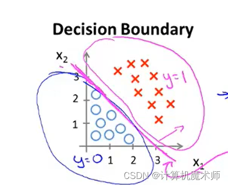
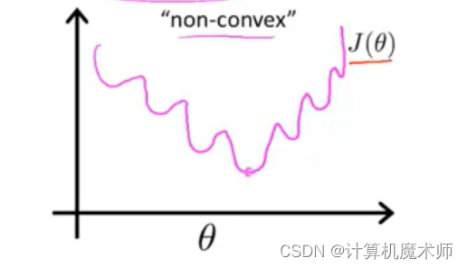
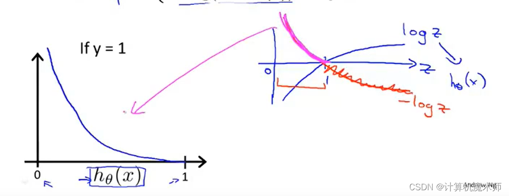
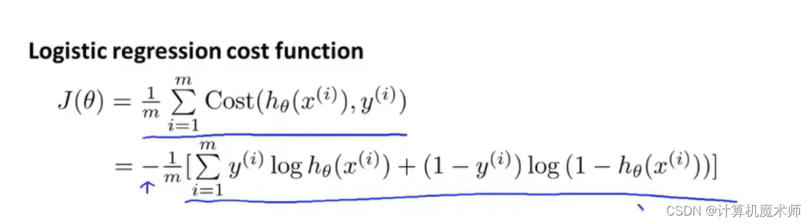

#  开篇词

机器学习主要是三个核心步骤，算法进行到每一步都要围绕以下三步

- [ ] 如何将现实场景中的问题抽象成相应的数学模型，并知道在这个抽象过程中，数学模型
   **有怎样的假设。**
- [ ] 如何对相应的**数学模型参数**进行求解。
- [ ] 如何根据实际问题提出**评估方案**，对应用的数学模型进行评估，看是否解决了实际问
题。(损失函数)

半监督学习、监督学习和非监督学习是机器学习中的三个核心概念，它们在数据处理和模型训练方面有所不同。下面我将详细解释这些概念以及它们之间的区别、效果和作用。

**1. 监督学习：**

- 监督学习是一种利用已标记好的训练样本来构建预测模型的机器学习方法。
- 在监督学习中，我们使用输入特征与其对应的输出标签进行训练，并通过最小化预测值与真实标签之间的差异（损失函数）来优化模型。
- 这些已知标签充当了“指导”或“监督”的角色，帮助算法理解如何从输入映射到正确输出。
- 常见的监督学习算法包括线性回归、逻辑回归、决策树等。

**2. 非监督学习：**
- 非监督学习是一种无需事先提供标签信息而直接从未标记数据集中发现结构或模式的机器学习方法。
- 在非监督学习中，我们主要关注数据内部的关系和相似性，以找出隐藏在数据背后的模式、特征或群集，非监督学习
- 非监督学习可以帮助我们发现数据中的**异常值**、**聚类相似样本**以及**降低数据维度**等任务。
- 常见的非监督学习算法包括聚类（如K-means、层次聚类）、关联规则挖掘和主成分分析（PCA）等。

**3. 半监督学习：**
- 半监督学习是介于监督学习和非监督学习之间的一种方法，它既利用有标签的训练样本又使用未标记的数据来构建预测模型。
- 在半监督学习中，我们假设未标记数据具有与已标记数据相似性质，并尝试通过这些未标记样本提供额外信息改进模型性能。
- 半监督学习适用于当我们难以获得大量已标记样本时，在少量已知结果下需要更好泛化能力时，或者想要充分利用可获取到的未标签数据时。

**区别和作用：**
1. 区别：
   - 监督学习需要明确指定输入特征与输出目标之间的对应关系，而非监督和半监督方法不依赖于事先给定目标变量。
   - 非监督学习主要关注数据内部结构，而监督和半监督学习更侧重于预测任务。
   - 半监督学习则是在有限的标签样本下尽可能利用未标记数据来提高模型性能。

2. 效果和作用：
   - 监督学习通常适用于需要精确预测或分类目标变量的情况，例如垃圾邮件检测、图像识别等任务。
   - 非监督学习可以帮助我们发现数据中的隐藏模式，进行分群、异常检测等。它对于探索性数据分析和特征工程非常有用。
   - 半监督学习通过结合已知标签和未知标签信息来改善模型性能，并且在训练样本稀缺或获取大量已标记样本成本较高时具有优势。

总之，这些机器学习方法各自在不同应用场景中发挥作用。选择何种方法取决于你想要解决的问题类型以及可获得的数据。

# 监督式学习

## 回归问题

线性回归的发展可以追溯到19世纪。以下是一些重要的里程碑：

1. 1805年：卡尔·弗里德里希·高斯（Carl Friedrich Gauss）提出了**最小二乘法**的概念，为线性回归提供了数学基础。

2. 1861年：弗朗西斯·高尔顿（Francis Galton）进行了一项关于遗传与身高之间关系的研究，这可以被认为是最早的线性回归应用之一。

3. 1897年：弗朗西斯·埃杰顿（Francis Edgeworth）提出了一种用于估计回归系数的方法，称为**最大似然估计。**

4. 1922年：罗纳德·费舍尔（Ronald Fisher）提出了最小二乘估计的统计性质，并发表了关于线性回归的经典论文。

5. 1950年代：由于计算机技术的发展，线性回归在统计学和经济学中得到广泛应用。

6. 1960年代：提出了**多元线性回归**，允许模型包含多个自变量。

7. 1970年代：出现了**岭回归和lasso回归**(l1,l2)等正则化方法，用于处理多重共线性和特征选择问题。

8. 1990年代至今：随着机器学习和统计学的快速发展，线性回归仍然是许多预测建模和数据分析任务中的重要方法。同时，出现了更复杂的回归模型和非线性回归方法，如**广义线性模型、多项式回归、支持向量回归**(SVM)等。

线性回归作为一种简单而强大的统计方法，在实际应用中得到广泛使用。它被应用于经济学、金融学、社会科学、医学、工程等领域，用于建立预测模型、探索变量之间的关系以及进行因果推断。

### 线性回归

线性回归是一种线性方法，用于建立自变量 $X$ 和因变量 $Y$ 之间的线性关系模型（这里的X可以是自变量矩阵）。这种关系通常形式化为以下等式：

$$
Y = \beta_0 + \beta_1X + \epsilon
$$

其中 $\beta_0$ 和 $\beta_1$ 是模型参数，代表截距和斜率，$\epsilon$ 是误差项（不被训练）。

线性回归的目标是找到参数 $\beta_0$ 和 $\beta_1$，使得模型预测的 $Y$ 值与实际 $Y$ 值之间的残差平方和最小。这被称为最小二乘法。这意味着我们想找到 $\hat{\beta}_0$ 和 $\hat{\beta}_1$，使得

$$
\sum_{i=1}^n (y_i - (\hat{\beta}_0 + \hat{\beta}_1 x_i))^2
$$

最小，其中 $(x_i, y_i)$ 是第 $i$ 个观测值。

下面是如何使用 Python 的 scikit-learn 库进行线性回归的一个例子。在这个例子中，我们使用波士顿房价数据集，这是一个典型的开源数据集。

```python
from sklearn.datasets import load_boston
from sklearn.model_selection import train_test_split
from sklearn.linear_model import LinearRegression
from sklearn.metrics import mean_squared_error

# 加载数据集
boston = load_boston()
X = boston.data
y = boston.target

# 划分训练集和测试集
X_train, X_test, y_train, y_test = train_test_split(X, y, test_size=0.2, random_state=42)

# 使用线性回归模型
model = LinearRegression()
model.fit(X_train, y_train)

# 预测
y_pred = model.predict(X_test)

# 计算均方误差
mse = mean_squared_error(y_test, y_pred)
print('Mean Squared Error:', mse)
```

首先，我们导入必要的库和数据集，然后划分训练集和测试集。接着，我们创建一个线性回归模型实例，并使用训练数据对其进行拟合。然后，我们使用该模型预测测试数据，并计算均方误差来评估模型性能。

### 多项式回归（非线性）

多项式回归是一种基于多项式函数的回归分析方法，用于拟合非线性关系的数据。它通过引入多项式特征，可以拟合更复杂的数据模式。

**原理和数学公式推导：**

假设我们有一个简单的数据集，包含一个特征 `X` 和对应的目标变量 `y`。我们希望使用多项式回归来拟合这些数据。

多项式回归模型的基本假设是，目标变量 `y` 与特征 `X` 之间存在一个多项式关系。我们可以用以下公式表示多项式回归模型：

```
y = w0 + w1*X + w2*X^2 + ... + wn*X^n
```

其中，`X` 是原始特征，`X^2` 表示 `X` 的平方，`X^3` 表示 `X` 的立方，以此类推。`w0, w1, ..., wn` 是多项式回归模型的系数，需要通过训练拟合得到。

为了使用多项式回归拟合数据，我们可以将**特征 `X` 转换为多项式特征**。通过引入**幂次组合**，我们可以将**原始特征的非线性关系**纳入考虑。

具体地，我们可以**将多项式回归问题转化为普通的线性回归问题**。将**多项式特征表示为新的特征向量** `X_poly`，然后使用线性回归模型进行训练。（将对应的多项式特征，即幂方组合当成多元线性来求解）

为了将特征 `X` 转换为多项式特征，我们可以使用 `PolynomialFeatures` 类。它可以生成包含原始特征幂次组合的新特征矩阵。

训练多项式回归模型的步骤如下：

1. 准备数据集：将原始特征 `X` 和目标变量 `y` 划分为训练集和测试集。
2. 特征转换：使用 `PolynomialFeatures` 类将训练集和测试集的特征 `X` 转换为多项式特征。可以指定多项式的次数（degree 参数）。

>  假设我们有一个简单的数据集，包含一个特征x和对应的目标变量y。原始数据如下：
>
>  ```
>  x = [1, 2, 3]
>  y = [2, 4, 6]
>  ```
>
>  使用PolynomialFeatures
>
>  ```
>  [[1 1 1]
>   [1 2 4]
>   [1 3 9]]
>  ```
>
>  可以看到，使用PolynomialFeatures对特征x进行多项式扩展后，生成了3列特征。第一列是常数项1，第二列是原始特征x，第三列是x的平方。这样，我们就得到了一个包含3个特征的新数据集x_poly。
>
>  当面对多个特征时，在多个特征上使用PolynomialFeatures。
>
>  假设我们有一个包含两个特征x1和x2的数据集，以及对应的目标变量y。原始数据如下：
>
>  ```
>  x1 = [1, 2, 3]
>  x2 = [4, 5, 6]
>  y = [10, 15, 20]
>  ```
>
>  的到如下
>
>  ```
>  [[ 1  1  4  1  4 16]
>   [ 1  2  5  4 10 25]
>   [ 1  3  6  9 18 36]]
>  ```
>
>  可以看到，使用PolynomialFeatures对特征x1和x2进行多项式扩展后，生成了6列特征。第一列是常数项1，接下来两列是原始特征x1和x2，然后是两列特征的乘积，最后两列是各特征的平方。这样，我们就得到了一个包含6个特征的新数据集x_poly。
>

1. 训练模型：使用线性回归模型（如 `LinearRegression`）对转换后的训练集进行训练。模型会学习多项式回归方程的系数。
2. 预测：使用训练好的模型对转换后的测试集进行预测。
5. 评估：通过比较预测结果与实际目标变量的值，评估多项式回归模型的性能。

**经典案例：**

以下是一个使用多项式回归拟合波士顿房价的经典案例的 Python 代码实现。

```python
import numpy as np
import matplotlib.pyplot as plt
from sklearn.linear_model import LinearRegression
from sklearn.preprocessing import PolynomialFeatures
from sklearn.metrics import mean_squared_error
from sklearn.model_selection import train_test_split
from sklearn.datasets import load_boston
from sklearn.pipeline import Pipeline

# 加载数据集
boston = load_boston()
X = boston.data
y = boston.target

# 划分训练集和测试集
X_train, X_test, y_train, y_test = train_test_split(X, y, test_size=0.2, random_state=42)

# 管道
pipeline = Pipeline([
    ("PolynomialFeatures", PolynomialFeatures(degree=2)),# 多项式特征转换
    ("LinearRegression",LinearRegression())# 线性回归模型训练
])

pipeline.fit(X_train, y_train)

# 预测结果
y_pred = pipeline.predict(X_test)


# 计算均方误差
mse = mean_squared_error(y_test, y_pred)
print('Mean Squared Error:', mse)

plt.scatter(y_test, y_pred, c='blue', alpha=0.6)
plt.plot([y_test.min(), y_test.max()], [y_test.min(), y_test.max()], 'r--')  # 绘制对角线

plt.title('Actual vs. Predicted')
plt.xlabel('Actual Values')
plt.ylabel('Predicted Values')
plt.show()

# 计算残差
residuals = y_test - y_pred

# 绘制残差图 
plt.scatter(y_test, residuals)
plt.axhline(y=0, color='r', linestyle='--')
plt.xlabel('Actual Values')
plt.ylabel('Residuals')
plt.title('Residual Plot')
```


**相关学习文档或优秀博客：**

以下是一些关于多项式回归的学习资源和优秀博客，可以帮助你更深入地理解多项式回归算法和其应用：

- [Polynomial Regression - Wikipedia](https://en.wikipedia.org/wiki/Polynomial_regression)

##### SLSQP 优化训练算法

SLSQP（Sequential Least Squares Programming）算法是一种用于求解带有**约束条件的非线性优化问题**的算法。它是一种迭代算法，通过不断迭代来逼近问题的最优解。下面我将详细介绍SLSQP算法的整体流程，并以优化带有约束条件的多项式为例进行说明。

SLSQP算法的整体流程如下：

1. 确定优化目标函数和约束条件：首先，需要明确需要优化的目标函数和约束条件。在本例中，我们假设我们要最小化一个多项式函数，同时满足一些约束条件。

2. 初始化：给定初始解，可以是随机选择的或者根据问题的特点选择的一个可行解。

3. 构建**拉格朗日函数**：将目标函数和约束条件结合起来构建拉格朗日函数。拉格朗日函数是由目标函数和约束条件通过**引入拉格朗日乘子**所得到的一个函数。

4. 求解子问题：**通过求解拉格朗日函数的子问题来更新变量的值**。子问题是通过将**拉格朗日函数对变量进行最小化**求解得到的。

5. 更新约束条件：根据当前变量的值更新约束条件。如果**约束条件中包含不等式约束，可能需要使用一些方法来将其转化为等式约束。**(引入罚函数或者松弛变量，运筹学)

6. 判断终止条件：判断当前解是否满足终止条件。终止条件可以是达到一定的迭代次数、目标函数的变化量小于某个阈值或者满足约束条件的程度达到一定的要求等。

7. 迭代更新：如果终止条件不满足，则返回第4步继续迭代更新。

8. 输出结果：当终止条件满足时，输出最优解的变量值以及对应的目标函数值。

以上是SLSQP算法的整体流程。下面我们以优化带有约束条件的多项式为例进行说明。

假设我们要最小化一个二次多项式函数 f(x) = x^2 + 2x + 1，同时满足约束条件 g(x) = x >= 0。

1. 确定优化目标函数和约束条件：目标函数为 f(x) = x^2 + 2x + 1，约束条件为 g(x) = x >= 0。
2. 引入罚函数：将不等式约束转化为罚函数惩罚项，即将原始的不等式约束 g(x) = x >= 0 转化为 g(x) - ρ，其中 ρ 是罚函数的惩罚参数，通常为非负数。
3. 初始化：选择一个初始解，例如 x = 0。
4. 构建拉格朗日函数：构建**拉格朗日函数 L(x, λ) = f(x) + λ*g(x)**，其中 λ 是拉格朗日乘子。
5. 求解子问题：通过最小化拉格朗日函数 L(x, λ) 对 x 进行求解，得到更新后的 x 值。
6. 更新约束条件：根据当前的 x 值和约束条件 g(x) 的情况，更新罚函数参数 ρ。通常情况下，如果当前解满足约束条件，可以减小 ρ 的值，以使罚函数的惩罚项对目标函数的影响减小；如果当前解不满足约束条件，可以增大 ρ 的值，以加大罚函数的惩罚项。
7. 判断终止条件：判断当前解是否满足终止条件，例如目标函数的变化量小于某个阈值。
8. 迭代更新：如果终止条件不满足，返回第4步继续迭代更新。
8. 输出结果：当终止条件满足时，输出最优解的变量值以及对应的目标函数值。

通过以上流程，我们可以使用SLSQP算法找到满足约束条件下的多项式的最小值。需要注意的是，实际应用中，可能需要根据具体问题对SLSQP算法进行一些调整和优化，以提高求解效率和准确性。

代码案例：

我们首先需要目标函数和损失函数,所以需要先定义以实现

```python
import numpy as np
from sklearn.datasets import load_boston
from sklearn.preprocessing import PolynomialFeatures
from scipy.optimize import minimize
from sklearn.metrics import mean_squared_error, r2_score
from time import time

start = time()

# 加载波士顿数据集
boston = load_boston()
X = boston.data  # 特征矩阵
y = boston.target  # 目标变量

# 划分训练集和测试集
X_train, X_test, y_train, y_test = train_test_split(
    X, y, test_size=0.2, random_state=42)

# 创建PolynomialFeatures对象，生成多项式特征
poly_features = PolynomialFeatures(degree=2)
X_poly = poly_features.fit_transform(X_train)

# 定义损失函数（均方误差）
def loss_function(theta):
    y_pred = np.dot(X_poly, theta)
    mse = mean_squared_error(y_train, y_pred)
    return mse

# 定义约束条件（无约束）
constraints = ()

# 定义优化问题 初始参数x0（全零向量）
optimization_problem = minimize(loss_function, x0=np.zeros(X_poly.shape[1]), constraints=constraints, method='SLSQP')

# 获取优化结果
theta_optimized = optimization_problem.x

# 在测试集上进行预测
X_test_poly = poly_features.transform(X_test)
y_pred = np.dot(X_test_poly, theta_optimized)

# 计算测试集上的均方误差和决定系数
mse_train = mean_squared_error(y_test, y_pred)
r2_train = r2_score(y_test, y_pred)

# 输出结果
print("多项式回归模型拟合结果：")
print("均方误差（MSE）：", mse_train)
print("决定系数（R2 Score）：", r2_train)
print("运行时间（duration）：", time() - start)

plt.scatter(y_test, y_pred, c='blue', alpha=0.6)
plt.plot([y_test.min(), y_test.max()], [y_test.min(), y_test.max()], 'r--')  # 绘制对角线

plt.title('Actual vs. Predicted')
plt.xlabel('Actual Values')
plt.ylabel('Predicted Values')
plt.show()

# 计算残差
residuals = y_test - y_pred

# 绘制残差图 
plt.scatter(y_test, residuals)
plt.axhline(y=0, color='r', linestyle='--')
plt.xlabel('Actual Values')
plt.ylabel('Residuals')
plt.title('Residual Plot')
```


可以看时间是比较久的，整体精度更高但是时间较慢，还有便是该算法在面对非常数据能够有着非常良好的效果！比如六个点拟合

### 广义线性模型

广义线性模型（Generalized Linear Model，GLM）是一种统计模型，用于描述和分析因变量与自变量之间的关系。GLM是线性回归模型的扩展，**允许因变量的分布不需要满足正态分布的假设，适用于更广泛的数据类型**。

在GLM中，三个核心要素是：

1. 随机分布：指定因变量的**概率分布**，可以是正态分布、泊松分布、二项分布等。**每种分布对应的GLM模型有不同的假设和参数设置**。

2. 线性预测子：通过线性组合自变量和它们的系数，构建一个线性预测子。这个线性预测子用于描述因变量与自变量之间的关系。 

3. 连接函数：连接函数（link function）**将线性预测子映射到概率空间**，将预测子的范围限制在合适的区间上。例如，对于二项分布，可以使用逻辑函数（logit function）作为连接函数，将线性预测子映射到[0, 1]的范围上。

>  GLM，我们假设Y的条件均值μ和参数θ之间存在一个线性关系，可以使用一个线性预测器η来描述这种关系。GLM的一般形式可以通过以下公式计算：
>
>  η = β₀ + β₁X₁ + β₂X₂ + ... + βₚXₚ
>
>  g(η) = μ
>
>  其中，β₀、β₁、β₂等是模型的回归系数，X₁、X₂等是自变量（特征），p是自变量的数量，链接函数（link function）g(·)将线性预测器η转换为条件均值μ。链接函数是一个单调可微函数，它将线性预测器的范围映射到条件均值的范围。不同的链接函数适用于不同的分布。
>
>  需要注意的是，在GLM中，也可以引入权重和偏差（offset）这两个概念，用于调整模型的拟合和预测。权重可以用来调整样本的重要性，偏差可以用来引入一个已知的修正量，例如在计数数据中引入观测时间的对数作为偏差。

GLM的优点是可以适应多种数据类型和分布，不仅局限于正态分布的连续型数据。通过**选择适当的分布和连接函数**，可以建立适合不同类型数据的模型。例如，可以用GLM来处理二分类问题、计数数据、时间序列数据等。

常见的GLM模型包括线性回归模型、逻辑回归模型、泊松回归模型等。通过最大似然估计等方法，可以对GLM模型进行参数估计和推断，以及预测新数据的概率分布。

#### GLM常用的链接函数

GLM中常用的链接函数有以下几种：

1. 逻辑链接函数（Logit Link Function）：
   - 适用于**二项分布**的GLM。
   - 链接函数：g(μ) = log(μ / (1 - μ))
   - 通过逻辑链接函数，线性预测器的范围映射到0和1之间，用于建模二分类问题。

2. 反正弦链接函数（Arcsinh Link Function）：
   - 适用于**高斯分布**的GLM，特别是处理**右偏（正偏）数据**时。
   - 链接函数：g(μ) = asinh(η)
   - 通过反正弦链接函数，线性预测器的范围映射到**整个实数域**，用于处理正偏数据。

3. 指数链接函数（Exponential Link Function）：
   - 适用于**泊松分布**的GLM。
   - 链接函数：g(μ) = exp(η)
   - 通过指数链接函数，线性预测器的范围映射到**非负实数域**，用于建模计数数据。

4. 反正态链接函数（Inverse Gaussian Link Function）：
   - 适用于逆高斯分布的GLM。
   - 链接函数：g(μ) = (η^(-1))^(-1)
   - 通过反正态链接函数，线性预测器的范围映射到正实数域，用于建模连续正偏数据。

5. 正态链接函数（Identity Link Function）：
   - 适用于正态分布的GLM。
   - 链接函数：g(μ) = η
   - 正态链接函数是一个恒等函数，线性预测器直接作为条件均值的估计。

这些链接函数是GLM中常见的一部分，每种链接函数在不同的分布下具有不同的性质和适用性。根据具体的问题和数据特点，选择合适的链接函数可以更好地拟合数据并进行预测。在实际应用中，还可以根据需要定义自定义的链接函数来满足特殊要求。

#### logistics 算法

>$logistic$（数理逻辑）回归算法(预测**离散值** $y$ 的 非常常用的学习算法

假设有如下的八个点($y=1 或 0)$,我们需要建立一个模型得到准确的判断，那么应该如何实现呢

- 我们尝试使用之前文章所学的**线性回归** $h_\theta(x) = \theta^T*x$ 来拟合数据($\theta$是参数列向量，注意这里的$x$是关于$x_i$的向量,其中$x_0=1, 即 x_0*\theta_0 = 常数项$），并在0~1设置一个阈值 $y = 0.5 所对应的 x_{0.5} 值$， $x$  大于 $x_{0.5}$ 的点则为1，否则为0，预测会得到如下**粉色直线**，
   
   假设我们再增加一个**数据点**，如下图右方，按照如上算法对应的拟合直线$h_\theta(x)$则如下**蓝色直线**，此时得到错误的预测 (对于结果为`1`也小于$x_{0.5}$)
   
   所以综上所诉，用线性回归来用于分类问题通常不是一个好主意，并且线性回归的值会远远偏离0或1，这显示不太合理。

所以**梯度下降算法**中引出 **logistic regression 算法**

>我们希望能把 $h_\theta(x) = \theta^T*x$ 结果在 0 ~ 1 之间，
>
>这里引入  $sigmoid$ 函数 (也叫做 $logistic$ 函数)    ——    $g(x) = \frac{1}{1 +  e ^{-x}}$ 


$sigmoid$函数图像是一个区间在 0 ~ 1的S型函数，$x \Rightarrow\infty$则$y\Rightarrow1$，$x \Rightarrow-\infty$则$y\Rightarrow0$
	


- 令    $h_\theta(x) =g( \theta^T*x) = \frac{1}{1 +  e ^{- \theta^T*x}}$ 
   **那么我们的函数结果结果就会在0 ~ 1 之间**

那现在我们所要做的便是需要求得参数$\theta$ 拟合模型

>如下图，假设肿瘤案例，如下$x$为一个病人 同样的用列向量表示$x$的参数，那么参数一**tumorSize**便是肿瘤的大小，那么我们可以假设输出结果为 0.7 ，意思就是医生会告诉这个病人很不幸，会有很大（70%）的概率得到肿瘤。
>
>- 那么公式可以表示为    $h_\theta(x) = P（y=1|x;\theta）$

- **即在$x$的条件下 求给定$y$ (概率参数为$\theta$)的概率**


那么在$y$只有 0 和 1 的情况下，有如下公式 （二者为对立事件，符合全概率公式)

- $P（y=1|x;\theta）+ P（y=0 |x;\theta）= 1$
- $1 - P（y=0 |x;\theta）= P（y=1|x;\theta）$

概率结果只在0 ~ 1中

- 假设如下

>那么此时我们可以设置阈值$g(z)$ =  0.5，大于 0.5  的点则为1，否则为0

即在 $z<0$（即 $\theta^T*x$）中 $g(z)$< 0.5, 此时预测为0，在 $z>0$（即 $\theta^T*x$） 时,$g(z)>0$ 预测值为1


**案例一**


我们假设他的各个$\theta$ 参数向量参数为-3，1，1

此时如果满足 $g(z)$> 0.5 , 也就是横坐标 $z$(**这里的 $z$ 是对应线性方程**） 大于零，预测 y 为 1 条件则如下：

 化简为条件 $x_1 + x_2 >=3$ ,  这个条件所对应的几何意义：  

即一条切割线的右侧，此时$sigomid函数的z坐标>0$ , y值 大于0.5
 


此时该切割线分割除了两个区域，分别是 $y=0 与 y=1$的 情况,我们把这条边界，称为**决策边界**，这些都是关于假设函数的属性，决定于其参数，与数据集属性无关



**例子二**

有数据集如下：

我们假设函数为多项式高阶函数，并对其参数假设赋值如下。


那我们的预测y=1时，$sigomid$横坐标$z$满足条件为

可以得到其**决策边界**`decision boundory`   —— $x_1^2+x_2^2 =1$
	

- 强调： 决策边界并不是数据集的属性，而是**假设函数以及其参数的属性**，数据集则是用于拟合参数 $\theta$ 
   不同的高阶多项式 会得到不一样的决策边界
   如：
   

 **拟合logistic回归参数 $\theta_i$**

- **代价函数**

我们给定如数据集

有$m$个样本，同样将每一个$x$用 $n+1$维向量表示（向量每个元素即特征，其中$x0为1$ )  分类标签$y$只有 0，1结果

- 那么我们如何选择参数$\theta$呢?

在往篇文章中我们线性回归的**均方差代价函数**可以变化如下：

简化函数，我们省略上标

因为 $sigomid$ 是复杂的非线性函数，如果直接以函数作为**代价函数**，那么所求模型对应**代价函数**为非凹函数，会有非常多的**局部最优**，如下图

我们不能保证其可以下降到函数最优

我们往往希望找到如下的凹型代价函数，以可以找到参数最优。

故我们需要找到另外的代价函数保证我们可以找到全局最小值

**logistic代价函数**


**当$y=1$代价函数图像**

对该**代价函数**，我们可以画出当$y=1$时的图像。（由于 $sigomid$ **函数值域**在0~1，对应代价函数横坐标为0 ~1)

为了方便理解我们可以画出，对数函数的图像 $log(z)$ (   $z = h_\theta(x))$ )



- 从图中我们也可以看到作为**代价函数** 很好的性质


1. 当$Cost \Rightarrow 0$时，即代价函数为0，**此时有$h_\theta(x)\Rightarrow1$** 即模型拟合优秀

2. 当$Cost  \Rightarrow\infty$时，即代价函数$\Rightarrow\infty$，此时$h_\theta(x) \Rightarrow 0$即为 。此时说明模型拟合非常差

显然当 $y=1$ 时 这个代价函数满足我们的要求


 **当$y=0$代价函数图像**

对应 $y=0$的情况下：


- 如下图

1. 当$Cost \Rightarrow 0$时，即代价函数为 $\Rightarrow0$，**此时有$h_\theta(x)\Rightarrow0$** 即模型拟合优秀

2. 当$Cost  \Rightarrow\infty$时，即代价函数 $\Rightarrow\infty$，此时$h_\theta(x) \Rightarrow 1$即为 。函数惩罚很大 

同样的符合代价函数性质


至此，我们定义了关于单变量数据样本的分类**代价函数**，我们所选择的**代价函数可以为我们解决代价函数为非凹函数的问题以及求解参数最优**，接下来我们使用**梯度下降算法**来拟合 $logistic$ 算法

 **代价函数与梯度下降**

为了避免让代价函数分为 $y = 1,y= 0$两种情况 ，我们要找一个方法来把这两个式子合并成一个等式，**以便更简单写出代价函数，并推导出梯度下降。**

公式如下图**蓝色字体公式**：


由于 y 只有两个情况 0，1 ，利用该性质 **当y = 1 时，y=0情况的多项式消去，y = 0 时同理**，这样就成功表达了两种不同情况的函数


- 通过将式子合并为一个等式，**代价函数**（cost function) 变化为如下（参考：统计学的**极大似然法**： `为不同模型已知数据寻找参数的方法,即选取概率最大的参数`）
   [最大似然函数参考文章](https://zhuanlan.zhihu.com/p/26614750)


同样，我们为了求最小化代价函数以拟合参数$\theta$，使用**梯度下降**


- 同样，将**微积分求其偏导**
   
- 并用此公式更新每个参数	（注意是：同步更新）
   

**线性回归与logistic回归的梯度下降规则**

我们可以惊奇的发现以上公式与**线性回归时所用来梯度下降**的方程一样

那么**线性回归和`logistic`回归是同一种算法吗？**

>线性回归和logistic在梯度下降更新的函数**区别**在于：$h_\theta(x^i)$
>
>1. 对于线性回归 ：	 $h_\theta(x)   = \theta^T*x$
>2. 对于logistic回归：$h_\theta(x) = \frac{1}{1 +  e ^{- \theta^T*x}}$ 

虽然在梯度下降算法看起来规则相同，但**假设的定义发生了变化**，所以**梯度下降和logistic回归是完全不一样的算法**

- 我们用此算法更新各个参数，可以通过for进行实现，也可以通过[向量化](https://cpt-magician.blog.csdn.net/article/details/125285568)进行实现。


同样的，在对于线性回归的梯度下降中，我们使用到了**特征缩放数据标准化**，同样的，这对于$logistic$ 回归算法同样适用。

数据标准化可参考文章： [【机器学习】梯度下降之数据标准化](http://t.csdn.cn/kzcgB)

**高级优化算法**

高级优化算法，与梯度下降相比能够大大提高 $logistic$ 回归速度，也使得算法更加适合大型数据集机器学习问题。
除了使用梯度下降算法，还有诸多如下算法


优点如下

 - 不需要选择学习率$\alpha$ ( 存在智能内循环，智能选择最佳的学习率$\alpha$
 - 下降速率快得多

缺点

- 太过于复杂了

在实际解决问题中，我们很少通过自己编写代码求**平方根**或者求**逆矩阵**，我们往往都是使用别人写的好的数据科学库，如`numpy`

有如下例子（求两个参数）

我们可以通过梯度下降来求得参数，如下求偏导：

`octave`代码实现如下;

这是一个简单的二次代价函数，现在我们如何将其用在logistic回归算法中呢？

在logistic回归中，我们使用如下的$\theta$参数向量 （使用参数向量化）

所以在实现这些高级算法，其实是使用不同的高级库函数，虽然这些算法在调试过程中，更加麻烦，但是其**速度远远大于梯度下降**，所以面对机器学习问题中，往往使用这些算法。

结果中概率最大的一个（最可信）的那个分类器，就是我们要的类别。

 》 总结一下：

 > 用的算法是线性函数，但是通过sigmoid 变换到0 ~ 1概率形式，以满足对应的分类任务，通过概率与0，1之间的残差，即误差，得到损失函数这一目标，再通过梯度下降算法进行调整参数（也可以用其他的优化算法）
 >
 > 总而言之，逻辑回归模型假设符合伯努利分布，通过关系函数投影实现广义的线性关系。

##### 案例代码

下面是一个基于sklearn自带的鸢尾花数据集（Iris dataset）的逻辑回归分类模型案例的模板代码，并包括了分类决策边界的可视化部分：

```python
import numpy as np
import matplotlib.pyplot as plt
from sklearn.datasets import load_iris
from sklearn.model_selection import train_test_split
from sklearn.linear_model import LogisticRegression

# 1. 数据准备和预处理
# 加载鸢尾花数据集
iris = load_iris()
X = iris.data[:, :2]  # 只选择前两个特征
y = iris.target

# 2. 数据集划分
X_train, X_test, y_train, y_test = train_test_split(X, y, test_size=0.2, random_state=42)

# 3. 模型训练
# 初始化逻辑回归模型
model = LogisticRegression()

# 模型训练
model.fit(X_train, y_train)

# 4. 可视化分类决策边界
# 生成网格点坐标
x_min, x_max = X[:, 0].min() - 0.5, X[:, 0].max() + 0.5
y_min, y_max = X[:, 1].min() - 0.5, X[:, 1].max() + 0.5
xx, yy = np.meshgrid(np.arange(x_min, x_max, 0.02), np.arange(y_min, y_max, 0.02))

# 预测网格点的分类结果
Z = model.predict(np.c_[xx.ravel(), yy.ravel()])
Z = Z.reshape(xx.shape)

# 绘制决策边界和样本点
plt.contourf(xx, yy, Z, alpha=0.8)
plt.scatter(X[:, 0], X[:, 1], c=y, edgecolors='k')
plt.xlabel('Sepal Length')
plt.ylabel('Sepal Width')
plt.title('Logistic Regression - Decision Boundary')
plt.show()
```

上述代码使用鸢尾花数据集作为示例数据，选择了鸢尾花的前两个特征进行逻辑回归分类模型的训练。通过生成网格点坐标，并利用模型预测网格点的分类结果，可以绘制分类决策边界。最后，使用散点图将数据样本点和决策边界可视化出来。请注意，该模板代码仅适用于二维特征的分类问题，如果特征维度更高，可视化方法会有所不同。（这个可视化决策边界的方法对于二分类的情况都很适用）

## 贝叶斯算法

### 朴素贝叶斯

贝叶斯算法（Naive Bayes）是一种常用的概率统计方法，它利用贝叶斯定理来进行分类和预测。其在计算机还没有出现前几十年就存在了，那个时候科学家们都是用手算的，是最早的机器学习形式之一，**该算法基于统计学原理，通过已知的先验概率和观测到的数据，更新对事件发生概率的估计**。因为有着一个很强的假设，每个数据特征都是独立的，这也是条件独立的前提条件，也叫"朴素的"的假设，故叫朴素贝叶斯算法。

具体公式推导如下：

1. 贝叶斯定理表达式：
   根据贝叶斯定理，我们可以得到以下表达式：
   P(A|B) = (P(B|A) * P(A)) / P(B)（注意的是 P(B|A) 的分母范围不是整体样本，而是P(A),所以乘上P(A) 就相当于是基于全局的 P(B|A)

其中，

- P(A|B) 是在**给定观测数据 B** 的条件下事件 A 发生的概率（**后验**概率）。
- P(B|A) 是在事件 A 发生的条件下观测到数据 B 的概率（似然）。
- P(A) 是事件 A 发生的**先验**概率。
- P(B) 是观测到的数据 B 的概率。

> 贝叶斯定理的核心思想是通过已知的条件概率和边际概率，计算出后验概率。先验概率是在考虑任何观测数据之前，基于先前的知识或经验得出的概率。后验概率是在考虑观测数据之后，根据先验概率和条件概率计算得出的概率。 

2. 朴素贝叶斯分类器：
   在朴素贝叶斯分类器中，我们**假设特征之间相互独立，即给定类别的情况下，特征之间是条件独立的**。基于这个假设，我们可以将贝叶斯定理改写为：
   P(C|X) = (P(X|C) * P(C)) / P(X)

其中，

- P(C|X) 是在给定观测数据 X 的条件下类别 C 发生的概率（后验概率）。
- P(X|C) 是在类别 C 发生的条件下观测到数据 X 的概率（似然）。
- P(C) 是类别 C 的先验概率。
- P(X) 是观测到的数据 X 的概率。
   3. 具体公式推导：
      假设观测数据有 n 个特征，我们可以将数据表示为 X = (x₁, x₂, ..., xₙ)，其中 xᵢ 表示第 i 个特征的取值。根据朴素贝叶斯分类器的条件**独立性假设**，上述表达式可以进一步简化为（其中`P(X) = P(X | !C) * P(!C) + P(X | C) * P(C)`：
      P(C|X) = (P(x₁|C) * P(x₂|C) * ... * P(xₙ|C) * P(C)) / P(X)


为了进行分类，我们需要计算**每个类别的后验概率P(C|X) **，并**选择具有最高后验概率的类别作为预测结果**。具体大白话来说就是，更具已知数据中这个类别的概率是多少再乘上数据中特征属于这个类别的概率的结果就是其后验概率了。而其中的这个 P(X|C) 似然概率就需要进行参数估计，见下一部分。

4. 参数估计：
   在实际应用中，我们需要利用训练数据来计算各个概率的估计值。常见的参数估计方法有**极大似然估计和贝叶斯估计。** （极大似然估计 vs 贝叶斯估计：谁才是朴素贝叶斯的最佳伴侣？）

- 极大似然估计：假设训练集中包含 m 个样本，属于类别 C 的样本个数为 mᵢ（i ∈ {1, 2, ..., k}，k 是类别的个数）。则根据极大似然估计，我们可以得到：
  `P(C) = mᵢ / m`
  `P(x|C) = m(x, C) / m`

其中，

- P(C) 是类别 C 的先验概率。 
- P(x|C) 是**在类别 C 发生的条件下特征 x 出现的概率（似然）**。
- m(x, C) 是**在训练集中属于类别 C 且特征为 x 的样本个数**。

> 1. 假设样本数据是从某个概率分布生成的,该分布属于一个参数化家族。
>
> 2. 在这个参数化家族中,找到一组参数,使得样本数据Based on这组参数生成的概率(即似然函数)最大。
>
> 3. 这组参数就是对总体参数的极大似然估计。
>
> 假设有样本数据 $X_1, X_2, ..., X_n$，它们独立同分布，**概率密度函数或概率质量函数为 $f(x|\theta)$**，其中 $\theta$ 是未知参数。则似然函数为：
>
> $L(\theta|X_1,X_2,...,X_n) = f(X_1|\theta)f(X_2|\theta)...f(X_n|\theta)$
>
> 极大似然估计的**目标是找到一组 $\theta$ 的值，使得这个似然函数最大**（即概率最大）：
>
> $\theta_{\text{MLE}} = \arg\max_\theta L(\theta|X_1,X_2,...,X_n)$
>
> 即满足：
>
> $\frac{dL}{d\theta} = 0$
>
> **解这个方程组就可以得到 $\theta$ 的极大似然估计。**
>
> 极大似然估计有以下几个主要性质: 
>
> 1. 当样本量趋于无穷大时,MLE是渐进最优的,即收敛于真实参数值。
>
> 2. **MLE不需要事先指定先验分布**。
>
> 3. 对给定的数据集,MLE总是存在的。
>
> 4. MLE是充分利用数据信息的。
>
> 5. MLE比较容易计算。
>
> 综上,极大似然估计通过最大化似然函数,找到最有可能产生观测数据的模型参数,是一种常用而有效的参数估计方法。它具有渐进最优、无需先验等优点,理论性质良好。

- 贝叶斯估计：**贝叶斯估计是对极大似然估计进行修正，以解决可能出现的概率为零的情况**。常见的贝叶斯估计方法有`拉普拉斯平滑`和`Lidstone`平滑。

> 1. 贝叶斯估计（Bayesian Estimation）：
>    - 先验概率的估计：贝叶斯估计引入了一个**先验分布**，**用于对先验概率进行平滑。常见的先验分布包括拉普拉斯平滑和贝叶斯平滑**。拉普拉斯平滑将每个类别的出现次数**加上一个常数 $\alpha$，然后再进行归一化**，以平滑先验概率的估计。贝叶斯平滑则使用一个更一般的先验分布，例如狄利克雷分布，通过调整参数来控制平滑的程度。
>    - 条件概率的估计：对于条件概率的估计，我们可以使用与先验概率相似的方法进行平滑。例如，对于每个**特征 $X_j$，我们可以将每个取值的出现次数加上一个常数 $\alpha$，然后再进行归一化，以平滑条件概率的估计。**
>
> 贝叶斯估计相对于极大似然估计的优势在于它可以通过**引入先验分布来减小估计的偏差**，**并在数据较少时提供更稳定的估计结果。**然而，贝叶斯估计也会引入一定的偏差，因为它基于先验分布的假设。
>
> 在实际应用中，我们可以根据数据集的大小和特征的分布情况选择适当的参数估计方法。**对于较大的数据集，极大似然估计通常可以提供较好的结果。而对于较小的数据集或特征分布较稀疏的情况，贝叶斯估计可以提供更稳定的估计结果。**

这些公式和推导提供了贝叶斯算法的基本原理，但具体应用时需要根据实际情况进行相应的调整和优化。

贝叶斯算法是一种基于概率理论的机器学习算法，它可以用来处理分类、回归和聚类等各种问题。以下是一些贝叶斯算法常见的应用场景：

1. 文本分类：贝叶斯算法在文本分类中非常有用，尤其是垃圾邮件过滤、情感分析和主题识别等任务。**通过学习单词出现的频率和概率**，模型可以根据文本内容将其分类到不同的类别。

2. 垃圾邮件过滤：利用贝叶斯算法可以构建一个垃圾邮件过滤器，该模型能够根据电子邮件中**包含的单词或短语**判断是否为垃圾邮件。

3. 个性化推荐系统：贝叶斯算法可用于构建个性化推荐系统，在**用户历史行为数据（如浏览记录、购买记录）的基础上预测用户可能感兴趣或喜欢的物品**。

4. 医学诊断：贝叶斯网络在医学领域被广泛应用于疾病诊断与风险评估。通过结合先验知识和实时检测结果，帮助医生进行准确的疾病诊断和预测。

5. 图像分类：贝叶斯算法可以用于图像分类任务，通过学习图像特征的概率分布来对新图像进行分类。这在计算机视觉领域中有广泛应用，如人脸识别、目标检测等。

需要注意的是，贝叶斯算法假设了一些先验概率，并且依赖于输入数据的正确性。因此，在实际应用中，选择合适的先验分布和处理不确定性非常重要。

希望这些例子能够帮助你理解贝叶斯算法在不同领域中的应用！如果还有其他问题，请随时提问。

#### 案例

> 基于朴素贝叶斯算法的生活案例可以是垃圾邮件分类。我们可以使用朴素贝叶斯算法来训练一个模型，该模型可以根据邮件的内容将其分类为垃圾邮件或非垃圾邮件。
>
> 具体的推导建模步骤如下：
>
> 1. 数据准备：收集一批已经标记好的垃圾邮件和非垃圾邮件样本数据。每个样本数据包含邮件的内容和标签（垃圾或非垃圾）。
>
> 2. 数据预处理：对邮件内容进行预处理，包括去除停用词、标点符号和数字，将文本转换为小写，并进行词干提取或词形还原等操作。
>
> 3. 特征提取：将每个邮件转换为特征向量表示。常用的方法是使用词袋模型（Bag of Words），**将每个单词作为一个特征，统计每个单词在邮件中出现的频率。**
>
>    > 词袋模型是一种常用的文本特征提取方法，它将文本转换为固定长度的向量表示。在词袋模型中，文本被看作是一个袋子，**其中包含了所有单词，而忽略了它们的顺序和语法结构。每个词都独立地出现**。
>    >
>    > 以下是词袋模型的基本步骤：
>    >
>    > 1. **构建词汇表**：首先，需要构建一个词汇表，其中包含了**所有在训练数据中出现的单词**。这个词汇表可以根据整个语料库或者特定的文档集合来构建。
>    >2. **向量化**：对于每个文本样本，将其转换为一个特征向量。**特征向量的长度等于词汇表中单词的数量**。通常，可以使用稀疏向量表示来表示特征向量，其中大部分元素为零。
>    > 2. **计算词频**：对于每个文本样本，计算每个单词在文本中出现的频率。将这些频率作为特征向量的元素值。
>    >
>    > 例如，假设我们有两个文档：
>    >
>    > 文档1： "我喜欢看电影"
>    > 文档2： "我不喜欢看电影"
>    >
>    > 在这个例子中，我们的词汇表是 {我，喜欢，看，电影，不}。那么，文档1和文档2的词袋表示分别是：
>    >
>    > 文档1： [1, 1, 1, 1, 0]
>    > 文档2： [1, 1, 1, 1, 1]
>    >
>    > 词袋模型的主要优点是简单和高效。然而，它也有一些缺点。首先，它**忽略了词的顺序，这在许多情况下是非常重要的**。其次，它假设所有的词都是独立的，**不考虑词与词之间的关系**。最后，**它只考虑了词频，没有考虑词的重要性**，这在信息检索中是非常重要的。（在一些应用中只需要词频很有效）
>    >
>    > 为了解决这些问题，有一些改进的词袋模型，如TF-IDF模型，它考虑了词的重要性。还有词嵌入模型，如Word2Vec和GloVe，它们考虑了词与词之间的关系。
>
> 4. 计算概率：根据训练数据**计算每个特征在垃圾邮件和非垃圾邮件中出现的概率**。具体来说，这些单词对应的特征控制了属于垃圾邮箱还是非垃圾邮箱的概率。
>
> 5. 训练模型：根据计算得到的概率，训练一个朴素贝叶斯分类器模型。
>
> 6. 预测分类：对于一个新的邮件，将其转换为特征向量表示，并使用训练好的模型预测其分类。
>
> 下面是一个不使用封装库的Python代码示例：
>
> ```python
> import re
> import math
> 
> # 数据准备
> spam_emails = [
>     "Get a free laptop now!",
>     "Earn money fast with no effort!",
>     "Enlarge your assets with our product!",
>     "Meet singles in your area tonight!"
> ]
> 
> ham_emails = [
>     "Hi, how are you?",
>     "Can we meet tomorrow?",
>     "Remember to buy groceries on your way home.",
>     "I'll be there in 5 minutes."
> ]
> 
> # 数据预处理
> def preprocess_email(email):
>     email = email.lower() # 全部小写
>     email = re.sub(r'\W', ' ', email)  # 去除非字母数字字符
>     email = re.sub(r'\s+', ' ', email)  # 合并多个空格为一个空格
>     return email.strip() # 去除空格
> 
> spam_emails = [preprocess_email(email) for email in spam_emails]
> ham_emails = [preprocess_email(email) for email in ham_emails]
> 
> # 特征提取(每一封邮件)
> def extract_features(email):
>     features = {}
>     words = email.split()
>     for word in words:
>         features[word] = features.get(word, 0) + 1  # 字典查询不存在值返回默认值0实现自动添加。
>     return features
> 
> spam_features = [extract_features(email) for email in spam_emails]
> ham_features = [extract_features(email) for email in ham_emails]
> print(spam_emails)
> print(spam_features)
> # 计算概率 （建立词汇表及其对应单词的概率）
> spam_word_count = {}
> ham_word_count = {}
> spam_total_words = 0
> ham_total_words = 0
> 
> for email in spam_features:
>     for word, count in email.items():
>         spam_word_count[word] = spam_word_count.get(word, 0) + count
>         spam_total_words += count
> 
> for email in ham_features:
>     for word, count in email.items():
>         ham_word_count[word] = ham_word_count.get(word, 0) + count
>         ham_total_words += count
> 
> print(spam_word_count,spam_total_words)
> spam_word_prob = {}
> ham_word_prob = {}
> 
> for word, count in spam_word_count.items():
>     spam_word_prob[word] = count / spam_total_words  # 极大似然估计求概率 （ p(x|c(spam))/m^i ）
> 
> for word, count in ham_word_count.items():
>     ham_word_prob[word] = count / ham_total_words
> 
> print("spam_word_prob:\n",spam_word_prob)
> # 训练模型
> spam_prior = len(spam_emails) / (len(spam_emails) + len(ham_emails)) # 先验概率 P(C(spam)|X)
> ham_prior = len(ham_emails) / (len(spam_emails) + len(ham_emails)) # 先验概率  P(C(ham)|X)
> 
> # 预测分类
> def predict(email):
>     email = preprocess_email(email)
>     features = extract_features(email)
> 
>     # 加法求分数 （避免概率相乘时出现下溢问题）
>     spam_score = math.log(spam_prior)
>     ham_score = math.log(ham_prior)
>     print(spam_score,ham_score)
>     for word, count in features.items():
> #         print(word,spam_word_prob[word])
>         if word in spam_word_prob:
>             spam_score += math.log(spam_word_prob[word]) * count  
>         if word in ham_word_prob:
>             ham_score += math.log(ham_word_prob[word]) * count # 这里有一细节，就是说如果没有一个特征在这里，那按照数学公式，应该是置为0，这里为0.5, 如果没有对应单词就会初始值为0.5很大
>     if(math.exp(spam_score) == 0.5):
>         spam_score = 0
> 	if(math.exp(ham_score) == 0.5):
>         ham_score = 0	
>     print(spam_score,ham_score)
>     spam_score = math.exp(spam_score)
>     ham_score = math.exp(ham_score)
>     # 乘法分数  （概率相乘时出现下溢问题）
> #     spam_score = (spam_prior)
> #     ham_score = (ham_prior)
> 
> #     for word, count in features.items():
> #         if word in spam_word_prob:
> #             spam_score *= spam_word_prob[word] ** count
> #         if word in ham_word_prob:
> #             ham_score *= ham_word_prob[word] ** count
>     print(spam_score,ham_score)
>     if spam_score >= ham_score:
>         return "spam"
>     else:
>         return "ham"
> 
> # 测试
> test_email = "Get a free laptop now!"
> prediction = predict(test_email)
> print(f"\nPrediction for email '{test_email}': {prediction}")
> ```
>
> 输出： 
>
> ```
> ['get a free laptop now', 'earn money fast with no effort', 'enlarge your assets with our product', 'meet singles in your area tonight']
> [{'get': 1, 'a': 1, 'free': 1, 'laptop': 1, 'now': 1}, {'earn': 1, 'money': 1, 'fast': 1, 'with': 1, 'no': 1, 'effort': 1}, {'enlarge': 1, 'your': 1, 'assets': 1, 'with': 1, 'our': 1, 'product': 1}, {'meet': 1, 'singles': 1, 'in': 1, 'your': 1, 'area': 1, 'tonight': 1}]
> {'get': 1, 'a': 1, 'free': 1, 'laptop': 1, 'now': 1, 'earn': 1, 'money': 1, 'fast': 1, 'with': 2, 'no': 1, 'effort': 1, 'enlarge': 1, 'your': 2, 'assets': 1, 'our': 1, 'product': 1, 'meet': 1, 'singles': 1, 'in': 1, 'area': 1, 'tonight': 1} 23
> spam_word_prob:
>  {'get': 0.043478260869565216, 'a': 0.043478260869565216, 'free': 0.043478260869565216, 'laptop': 0.043478260869565216, 'now': 0.043478260869565216, 'earn': 0.043478260869565216, 'money': 0.043478260869565216, 'fast': 0.043478260869565216, 'with': 0.08695652173913043, 'no': 0.043478260869565216, 'effort': 0.043478260869565216, 'enlarge': 0.043478260869565216, 'your': 0.08695652173913043, 'assets': 0.043478260869565216, 'our': 0.043478260869565216, 'product': 0.043478260869565216, 'meet': 0.043478260869565216, 'singles': 0.043478260869565216, 'in': 0.043478260869565216, 'area': 0.043478260869565216, 'tonight': 0.043478260869565216}
> -0.6931471805599453 -0.6931471805599453
> 2.4423470353692043 -0.6931471805599453
> 5.577841251298354 -0.6931471805599453
> 8.713335467227504 -0.6931471805599453
> 11.848829683156653 -0.6931471805599453
> 14.984323899085803 -0.6931471805599453
> 3218171.4999999995 0.5
> 
> Prediction for email 'Get a free laptop now!': spam
> ```
>
> > **实践大于理论** —— 伽利略
> >
> > 对数函数具有一些特殊的性质，使得它在概率计算中非常有用。
> >
> > 在概率计算中，我们通常需要计算多个概率的乘积。当这些概率非常小的时候，连续相乘可能会导致结果变为零或非常接近零。这是由于计算机浮点数的精度限制所导致的。
> >
> > 为了解决这个问题，我们可以使用对数概率进行计算。对数函数具有以下性质：
> >
> > 1. 对数函数是单调递增的。这意味着概率的**对数值的大小顺序与概率本身的大小顺序**（都会变小）相同。因此，对数概率的加法可以代替概率的乘法。
> > 2. 对数函数将乘法转换为加法。对数函数的一个重要性质是，**它将乘法操作转换为加法操作**。具体来说，对数函数满足以下等式：log(ab) = log(a) + log(b)。这意味着将两个概率的对数相加，等于将这两个概率相乘。
> >
> > 通过将概率转换为对数概率，我们可以将概率的乘法转换为对数概率的加法，**从而避免了下溢问题**。这样做的好处是，我们可以**在对数空间中进行计算，而不会丢失精度**（其实相当于是转换到对数空间了）。
> >
> > 在代码中，使用math.log函数对概率进行取对数操作，将概率的乘法转换为对数概率的加法。然后，在最后比较概率大小时，使用math.exp函数将对数概率转换回原始概率进行比较。
> >
> > 总结起来，使用对数概率进行计算是为了避免概率相乘时出现下溢问题，并且利用对数函数的性质将乘法转换为加法，从而提高计算的准确性和效率。
>
> 这段代码用了简单的词频特征提取方法，将**每个单词的计数作为特征（词频）**，且在计算概率时没有进行平滑处理。平滑处理是为了避免在训练数据中**出现未见过的单词时，概率为零的情况**。sklearn中的MultinomialNB分类器**默认使用了拉普拉斯平滑（Laplace smoothing）**来处理这种情况。并默认使用了更复杂的特征提取方法，称为词袋模型（Bag of Words），它将每个单词的出现与否作为特征
>
> 下面是一个使用封装库`scikit-learn`的Python代码示例：
>
> ```python
> from sklearn.feature_extraction.text import CountVectorizer
> from sklearn.naive_bayes import MultinomialNB
> 
> # 数据准备
> spam_emails = [
>     "Get a free laptop now!",
>     "Earn money fast with no effort!",
>     "Enlarge your assets with our product!",
>     "Meet singles in your area tonight!"
> ]
> 
> ham_emails = [
>     "Hi, how are you?",
>     "The cat sat on the mat",
>     "Can we meet tomorrow?",
>     "Remember to buy groceries on your way home.",
>     "I'll be there in 5 minutes."
> ]
> 
> labels = ["spam", "spam", "spam", "spam", "ham", "ham", "ham", "ham", "ham"]
> 
> # 特征提取
> vectorizer = CountVectorizer()
> X = vectorizer.fit_transform(spam_emails + ham_emails)
> print(type(X))
> print(X)
> print(vectorizer.get_feature_names_out())
> print(X.toarray())
> # 训练模型
> model = MultinomialNB() # 多项式朴素贝叶斯
> model.fit(X, labels) # 接受数组和稀疏矩阵
> 
> # 预测分类
> test_email = ["Get a free laptop now!", "how are you?"]
> test_email_vector = vectorizer.transform(test_email)
> print(test_email_vector)
> prediction = model.predict(test_email_vector)[0]
> print(f"Prediction for email '{test_email}': {prediction}")
> ```
>
> 输出： 
>
> ```
> <class 'scipy.sparse._csr.csr_matrix'>
>   (0, 12)	1
>   (0, 11)	1
>   (0, 18)	1
>   (0, 25)	1
>   (1, 7)	1
>   (1, 23)	1
>   (1, 10)	1
>   (1, 39)	1
>   (1, 24)	1
>   (1, 8)	1
>   (2, 39)	1
>   (2, 9)	1
>   (2, 41)	1
>   (2, 2)	1
>   (2, 27)	1
>   (2, 28)	1
>   (3, 41)	1
>   (3, 21)	1
>   (3, 31)	1
>   (3, 17)	1
>   (3, 1)	1
>   (3, 36)	1
>   (4, 14)	1
>   (4, 16)	1
>   (4, 0)	1
>   (4, 40)	1
>   (5, 32)	2
>   (5, 6)	1
>   (5, 30)	1
>   (5, 26)	1
>   (5, 20)	1
>   (6, 21)	1
>   (6, 5)	1
>   (6, 38)	1
>   (6, 35)	1
>   (7, 41)	1
>   (7, 26)	1
>   (7, 29)	1
>   (7, 34)	1
>   (7, 4)	1
>   (7, 13)	1
>   (7, 37)	1
>   (7, 15)	1
>   (8, 17)	1
>   (8, 19)	1
>   (8, 3)	1
>   (8, 33)	1
>   (8, 22)	1
> ['are' 'area' 'assets' 'be' 'buy' 'can' 'cat' 'earn' 'effort' 'enlarge'
>  'fast' 'free' 'get' 'groceries' 'hi' 'home' 'how' 'in' 'laptop' 'll'
>  'mat' 'meet' 'minutes' 'money' 'no' 'now' 'on' 'our' 'product' 'remember'
>  'sat' 'singles' 'the' 'there' 'to' 'tomorrow' 'tonight' 'way' 'we' 'with'
>  'you' 'your']
> [[0 0 0 0 0 0 0 0 0 0 0 1 1 0 0 0 0 0 1 0 0 0 0 0 0 1 0 0 0 0 0 0 0 0 0 0
>   0 0 0 0 0 0]
>  [0 0 0 0 0 0 0 1 1 0 1 0 0 0 0 0 0 0 0 0 0 0 0 1 1 0 0 0 0 0 0 0 0 0 0 0
>   0 0 0 1 0 0]
>  [0 0 1 0 0 0 0 0 0 1 0 0 0 0 0 0 0 0 0 0 0 0 0 0 0 0 0 1 1 0 0 0 0 0 0 0
>   0 0 0 1 0 1]
>  [0 1 0 0 0 0 0 0 0 0 0 0 0 0 0 0 0 1 0 0 0 1 0 0 0 0 0 0 0 0 0 1 0 0 0 0
>   1 0 0 0 0 1]
>  [1 0 0 0 0 0 0 0 0 0 0 0 0 0 1 0 1 0 0 0 0 0 0 0 0 0 0 0 0 0 0 0 0 0 0 0
>   0 0 0 0 1 0]
>  [0 0 0 0 0 0 1 0 0 0 0 0 0 0 0 0 0 0 0 0 1 0 0 0 0 0 1 0 0 0 1 0 2 0 0 0
>   0 0 0 0 0 0]
>  [0 0 0 0 0 1 0 0 0 0 0 0 0 0 0 0 0 0 0 0 0 1 0 0 0 0 0 0 0 0 0 0 0 0 0 1
>   0 0 1 0 0 0]
>  [0 0 0 0 1 0 0 0 0 0 0 0 0 1 0 1 0 0 0 0 0 0 0 0 0 0 1 0 0 1 0 0 0 0 1 0
>   0 1 0 0 0 1]
>  [0 0 0 1 0 0 0 0 0 0 0 0 0 0 0 0 0 1 0 1 0 0 1 0 0 0 0 0 0 0 0 0 0 1 0 0
>   0 0 0 0 0 0]]
>   (0, 11)	1
>   (0, 12)	1
>   (0, 18)	1
>   (0, 25)	1
>   (1, 0)	1
>   (1, 16)	1
>   (1, 40)	1
> Prediction for email '['Get a free laptop now!', 'how are you?']': spam
> ```
>
> `CountVectorizer`是`sklearn.feature_extraction.text`模块中的一个类，它用于将文本数据转换为向量形式，这种形式对于机器学习算法的输入非常有用。下面是`CountVectorizer`的基本原理：
>
> 1. **Tokenization（分词）**：`CountVectorizer`首先将文本分解为单独的单词（在英文中通常是通过空格来分隔），这个过程被称为分词。例如，句子 "The cat sat on the mat" 可能会被分解为 "The", "cat", "sat", "on", "the", "mat"。
>
> 2. **Vocabulary Building（构建词汇表）**：然后，`CountVectorizer`会创建一个词汇表，其中包含所有出现在所有文档中的唯一单词。例如，如果我们有两个文档，一个是 "The cat sat on the mat"，另一个是 "The dog sat on the log"，那么词汇表就会是 "The", "cat", "sat", "on", "the", "mat", "dog", "log"。
>
> 3. **Encoding（编码）**：最后，`CountVectorizer`会将每个文档转换为一个向量。向量的长度等于词汇表中的单词数量，每个元素代表词汇表中对应单词在文档中出现的次数。例如，对于文档 "The cat sat on the mat" 和词汇表 "The", "cat", "sat", "on", "the", "mat", "dog", "log"，其对应的向量可能是 [2, 1, 1, 1, 1, 1, 0, 0]（这里假设我们不区分大小写，"The" 和 "the" 被视为同一个单词，则表示出现了两次）。
>
> 这就是`CountVectorizer`的基本原理。需要注意的是，`CountVect orizer`还有许多参数可以调整，例如你可以选择是否将所有单词转换为小写，是否删除停用词，是否包含n-gram特征等等。其中输出是稀疏矩阵的表示形式。
>
> (0, 11) 1 表示在第0个样本(也就是第一个邮件"Get a free laptop now!")中,词汇表中的第11个词出现了1次。
>
> (1, 6) 1 表示在第1个样本(第二个邮件"Earn money fast with no effort!")中,词汇表中的第6个词出现了1次。 **注意一下，之所以这个稀疏矩阵之所以需要记录样本是第几个，就是为了后续确定他是垃圾邮件还是非垃圾邮件，以实现垃圾邮件的单词数量汇总，得到先验概率**
>
> 以此类推。这里的词汇表是根据所有邮件内容提取出来的,包含了**所有唯一的词**。数字11、6等就是每个词在这个词汇表中的位置。
>
> 而输出的是稀疏矩阵(sparse matrix)的形式,只显示了非零元素,比如一个词在一个邮件中出现过,那么就显示其行号、列号和计数,没有出现的位置就不显示了。
>
> 这样的稀疏矩阵表示可以节省空间,因为大多数位置都是0,不需要存储和显示。
>
> 总结一下,这个输出表示了每个邮件中包含的单词及其出现次数,这些特征已经转换为了向量化的表示,作为后续机器学习算法的输入。

#### 应用场景

朴素贝叶斯（Naive Bayes）是一种常用的机器学习算法，主要用于解决分类问题。它基于贝叶斯定理和特征条件独立性假设，通过计算给定特征下类别的概率来进行分类。

朴素贝叶斯在以下情况下非常有用（**以下都是可以很好确定特征条件概率和条件独立性假设的，比如计算单词词频作为条件 概率**）：

1. 文本分类：可以将文档或邮件归类为垃圾邮件或非垃圾邮件。
2. 情感分析：可以判断评论、推文等的**情感倾向**（如正面、中性或负面）。
3. 垃圾过滤：可以识别电子邮件中是否包含垃圾内容。
4. 特征选择：可用于**确定最相关的特征**并筛选掉无关紧要的特征。

朴素贝叶斯之所以能够解决这些问题，并且在某些场景下表现出色，是因为它具有以下优势：

1. **快速而简单**：相对于其他复杂模型（如深度神经网络），朴素贝叶斯**计算效率高，训练速度快，并且易于实现和理解。**
2. 处理大量数据：即使训练集规模较大，朴素贝叶斯仍然能够**高效处理，并且具有较低的内存要求**。
3. 处理高维数据：朴素贝叶斯**假设特征之间是独立**的，因此**在面对高维数据时，模型仍然能够有效地进行分类**。

尽管朴素贝叶斯在某些情况下表现良好，但也存在一些局限性。由于它**基于特征条件独立性假设，在某些实际问题中可能无法满足这个假设。此外，朴素贝叶斯对输入数据的分布形态比较敏感。**

是否存在更好的方式取决于具体问题和可用的数据。**如果特征之间不满足独立性假设或其他先验知识已知**，则可以考虑使用其他算法（如决策树、支持向量机、深度学习等）。选择合适的算法应该基于`任务需求`、`可用资源`以及对`模型解释性`和`准确性`之间的权衡考虑。

>  朴素贝叶斯算法（Naive Bayes Algorithm）是一种基于贝叶斯定理和特征条件独立性假设的分类算法。尽管朴素贝叶斯算法在许多实际应用中表现良好，但也存在一些缺点。
>
>  1. 特征独立性假设：朴素贝叶斯算法假设所有特征之间是条件独立的，即给定类别的情况下，特征之间没有相关性。然而，在实际情况中，很少有特征是完全独立的。这种假设可能导致模型对于特征之间的相关性无法准确建模，从而影响分类的准确性。
>
>  2. 零概率问题：在训练数据中，如果某个类别下的某个特征值没有出现过，那么在计算概率时会得到零概率。由于乘法计算中零概率会导致整个概率为零，这可能导致模型无法进行有效的分类。为了解决这个问题，可以使用平滑技术，如拉普拉斯平滑（Laplace smoothing），对概率进行平滑处理，避免出现零概率。
>
>  3. 对数量不平衡的数据敏感：当训练数据中不同类别的样本数量差异很大时，朴素贝叶斯算法可能会对数量较少的类别做出错误的偏好。这是因为朴素贝叶斯算法只基于概率计算进行分类，而没有直接考虑样本的分布情况。在这种情况下，可以借助于样本权重调整或使用其他更适合处理不平衡数据的算法。
>
>  4. 对输入特征的假设限制：朴素贝叶斯算法假设特征之间是条件独立的，这在某些情况下可能过于简化了问题。如果特征之间存在一定的相关性，朴素贝叶斯算法可能无法准确地捕捉到这种相关性。在这种情况下，可以考虑使用其他更灵活的模型，如高斯朴素贝叶斯或其他分类算法。
>
>  尽管朴素贝叶斯算法存在一些缺点，但它具有简单、高效、易于实现和解释的优点，并在许多实际应用中取得了不错的效果。通过适当的预处理和调整，可以在特定的应用场景中克服其缺点，并提高分类的准确性和性能。

### 高斯贝叶斯算法

朴素贝叶斯算法通常用于分类任务,**不太适合用于回归任务**。朴素贝叶斯的基本思想是**基于贝叶斯定理与特征条件独立假设**,通过训练数据计算**不同类别下各个特征的条件概率**,并**应用贝叶斯定理进行分类预测**。而对于回归问题,**目标变量是一个连续的值,不能简单地计算类别条件概率**。通常的做法是建立**一个高斯分布来模拟目标变量,（确定概率）**但是这种方法存在一定的局限性:

1. 需要**假设目标变量符合高斯分布**,但实际中目标变量的分布可能更为复杂。
2. **无法有效地处理多维目标变量**。
3. **对异常值比较敏感**。
4. **计算复杂度较高**。

所以在实际应用中,我们很少会直接使用朴素贝叶斯算法进行回归。更多的时候,朴素贝叶斯被作为生成模型与判别模型相结合的一部分来进行回归,比如高斯朴素贝叶斯（Gaussian Naive Bayes）回归。

### 多项式贝叶斯算法


 > 

## 决策树算法

决策树是一种基于树形结构的分类模型，它通过对数据属性的逐步划分，将数据集分成多个小的决策单元。每个小的决策单元都对应着一个叶节点，在该节点上进行分类决策。决策树的核心是如何选择最优的分割属性。常见的决策树算法有ID3、C4.5和CART。

以下是各类决策树算法的详细解释以及它们的优点和缺点，制成的表格如下：

| 算法  | 说明  | 优点  | 缺点  |
|---|---|---|---|
| ID3（1986） | 基于**信息熵**选择划分属性，处理**离散型**数据 | - 简单易懂，易于实现<br>- 对缺失数据支持较好<br>- 可用于不平衡数据集  | - 只处理离散型数据，**无法处理连续型特征**<br>- 对于具有**大量取值的属性，容易过拟合**<br>- 对于具有较多缺失值的数据，可能会导致**偏好选择缺失值较少**的属性 |
| C4.5（1993） | 在ID3的基础上引入**处理连续型属性和缺失数据**的能力(信息增益率) | - 支持离散型和**连续型**属性<br>- 对**缺失数据支持较好**<br>- 采用**信息增益率**来选择划分属性，减轻了对取值较多的属性的偏好 | - 对于具有**大量取值的属性，仍可能过拟合**<br>- 对于具有较多缺失值的数据，可能会导致**偏好选择缺失值较少的属性** |
| C5.0（1997） | 基于**信息增益**和**信息增益比**选择划分属性，处理**离散型和连续型**数据 | - 高效处理大规模数据集<br>- 能够处理多类别问题<br>- 可解释性强<br>- 对缺失值的处理较为灵活<br>- 使用**剪枝策略**降低过拟合风险 | - 对**噪声和异常值敏感**，容易过拟合<br>- 对连续型特征需要进行离散化处理<br>- 在处理高维数据时可能会遇到维度灾难<br>- 生成的树可能过于复杂<br>- 难以处理类别不平衡的数据集 |
| CART(Classification and Regression Tree) （1984） | 用于**分类和回归**，通过最小化基尼指数或均方差选择划分属性 | - 支持**离散型和连续型**属性<br>- 可用于分类和回归问题<br>- 生成的**树结构简单明了** | - 生成的树**倾向于过拟合**<br>- 对于**具有大量取值的属性，容易产生过于复杂的树结构** |
| CHAID （1980） | 基于**卡方检验**选择划分属性，用于分类问题 | - 对于**多分类问题**效果较好<br>- 支持离散型和连续型属性<br>- 生成的树结构简单明了 | - 对于具有大量取值的属性，容易过拟合<br>- 对于缺失数据的处理能力有限  |
| RandomForest （2001） | 基于决策树的集成学习方法，通过**随机选择特征子集和样本子集构建多棵决策树** | - 具有较高的分类准确性<br>- 能够**处理大量特征和样本**<br>- 对噪声和异常值具有较好的鲁棒性 | - 模型的**解释性较差**<br>- 训练时间相对较长<br>- 参数调整较为复杂 |
| Gradient Boosting  | 基于决策树的集成学习方法，通过迭代训练一系列决策树来纠正前一棵树的预测误差  | - 具有较高的分类准确性<br>- 能够**处理大量特征和样本**<br>- 对噪声和异常值具有较好的鲁棒性<br>- 可以处理各种类型的数据 | - 倾向于过拟合<br>- 训练时间相对较长<br>- 参数调整较为复杂  |

以下决策树算法均使用sklearn 的 tree模块实现：

`tree`模块是scikit-learn（sklearn）库中的一个子模块，提供了决策树算法的实现。它包含了用于分类和回归问题的决策树模型的类和函数。下面我将详细介绍一些`tree`模块的常用类和函数的使用方法：

1. 决策树分类器（DecisionTreeClassifier）：

   ``tree.DecisionTreeClassifier`是用于分类问题的决策树分类器的类。它的主要参数和方法包括：

   - `criterion`：分割标准，可以是"gini"（默认）或"entropy"。
   - `max_depth`：树的最大深度。
   - `min_samples_split`：分裂内部节点所需的最小样本数。
   - `fit(X, y)`：拟合决策树模型，其中`X`是特征矩阵，`y`是目标变量。
   - `predict(X)`：根据训练好的模型进行预测，其中`X`是特征矩阵。
   - `feature_importances_`：特征重要性评估结果。

   以下是使用`DecisionTreeClassifier`的示例代码：

   ````python
   from sklearn import tree
   X = [[0, 0], [1, 1]]  # 特征矩阵
   y = [0, 1]  # 目标变量
   clf = tree.DecisionTreeClassifier()
   clf.fit(X, y)
   prediction = clf.predict([[2., 2.]])
   print(prediction)
   ```

2. 决策树回归器（DecisionTreeRegressor）：

   ``tree.DecisionTreeRegressor`是用于回归问题的决策树回归器的类。它的主要参数和方法类似于`DecisionTreeClassifier`，但适用于连续目标变量。以下是使用`DecisionTreeRegressor`的示例代码：

   ````python
   from sklearn import tree
   X = [[0, 0], [1, 1]]  # 特征矩阵
   y = [0, 1]  # 目标变量
   clf = tree.DecisionTreeRegressor()
   clf.fit(X, y)
   prediction = clf.predict([[2., 2.]])
   print(prediction)
   ```

3. 可视化决策树（plot_tree）：

   ``tree.plot_tree`函数可以用于可视化决策树模型。它的主要参数包括：

   - `decision_tree`：决策树模型对象。
   - `feature_names`：特征的名称列表。
   - `class_names`：类别的名称列表。

   以下是使用`plot_tree`函数可视化决策树的示例代码：

   ````python
   from sklearn import datasets, tree
   import matplotlib.pyplot as plt
   # 加载数据集
   iris = datasets.load_iris()
   X = iris.data
   y = iris.target
   feature_names = iris.feature_names
   class_names = iris.target_names
   # 构建决策树模型
   clf = tree.DecisionTreeClassifier()
   clf.fit(X, y)
   # 可视化决策树
   plt.figure(figsize=(10, 10))
   tree.plot_tree(clf, feature_names=feature_names, class_names=class_names, filled=True)
   plt.show()
   ```
   
   这将显示一个绘制的决策树图形。

除了上述提到的类和函数外，`tree`模块还包括其他一些用于决策树模型的类和函数，例如`export_graphviz`函数可将决策树导出为DOT格式，`DecisionTreeClassifier`和`DecisionTreeRegressor`类还具有许多其他可用于自定义和调整模型的参数和方法。你可以参考scikit-learn的官方文档以了解更多关于`tree`模块和决策树算法的详细信息和用法示例。

### CART算法

CART算法由Leo Breiman等人于1984年提出（最早一批的决策树算法了）。CART算法是一种通用的决策树算法，既可以用于分类问题，也可以用于回归问题。CART算法使用基尼不纯度作为划分准则，并构建二叉决策树。CART算法的灵活性和性能使其成为决策树领域的重要算法之一。

scikit-learn库中的`DecisionTreeClassifier` 和`DecisionTreeRegressioner`  默认实现的是CART（Classification and Regression Trees）算法,

CART（Classification and Regression Trees）是一种常用的决策树算法，可以用于分类和回归任务。下面是CART决策树算法的详细步骤流程：

1. 特征选择：对于分类任务，常用的特征选择指标有**基尼指数**（Gini index）和**信息增益**（Information Gain，后面提出ID3的改进）。对于回归任务，常用的特征选择指标有**平方误差**和平均绝对误差。根据选择的特征选择指标，计算每个特征的指标值。选择指标值最佳的特征作为当前节点的分裂特征。

2. 分裂节点：将当前节点的样本根据分裂特征的取值分成多个子节点。对于离散特征，每个取值创建一个子节点；对于连续特征，根据一个阈值将样本分成两个子节点。

3. 递归构建子树：对于每个子节点，重复步骤1和步骤2，递归地构建子树，直到满足终止条件。终止条件可以是达到最大深度、达到最小样本数、所有样本属于同一类别等。

4. 剪枝：构建完整的决策树后，对决策树进行剪枝，以避免过拟合。剪枝分为预剪枝和后剪枝两种方法。预剪枝是在构建过程中通过一些预定义的条件进行剪枝；后剪枝是在构建完整的决策树后，根据验证集的表现进行剪枝。

5. 预测：使用构建好的决策树对新样本进行预测。从根节点开始，根据样本的特征值逐步向下遍历决策树，直到达到叶节点，叶节点的类别或预测值作为最终预测结果。

CART 还可以处理回归任务，根据特征连续值得划分得到阶梯函数，其中得这里虽然不可能出现斜线或者曲线，但只要**考虑极限情况，可以逼近一条曲线**（即达到均方误差最小），`决策树算法相比起使用代数算法来看，更加准确，并且随着问题和数据变复杂，变量越多，算法同样处理，优越性更显著，效果好，符合现实`。


### ID3（Iterative Dichotomiser 3）

ID3算法最早由Ross Quinlan于1986年提出。它是一种基于信息论的决策树算法，使用信息增益作为划分准则。ID3算法在其提出后的一段时间内被广泛研究和使用。 具体来说，构建决策树的过程可以分为如下几个步骤：

1. 选择最优特征。在构建决策树时，需要从当前样本集合中选择**一个最优的特征**作为当前节点的划分属性。通常使用**信息增益、信息增益比或基尼指数等指标**来评估各个特征的划分能力，并选取最优特征。

   >  基尼指数和信息增益都是用于决策树中特征选择的指标，它们各有优劣。
   >
   >  > `基尼指数`是一种**衡量数据集纯度或不确定性的指标**，常用于决策树算法中的特征选择。它基于**基尼系数的概念**，用于度量从数据集中**随机选择两个样本，其类别标签不一致的概率**，用于**衡量选择某个特征进行划分后，数据集的纯度提升程度**。
   >  >
   >  > 每一个数据集基尼指数的计算公式如下：
   >  > $Gini(D) = 1 - Σ (p_i)^2$
   >  >
   >  > 其中，$Gini(D)$表示数据集$D$的基尼指数，$p_i$表示数据集$$D$$中第$i$个类别的样本所占比例。基尼指数的取值范围为0到1，**数值越小表示数据集的纯度越高，即样本的类别越一致**。当数据集D中只包含一种类别的样本时，基尼指数为0，表示数据集完全纯净。当数据集D中的样本类别均匀分布时，基尼指数最大（即值越小）为1，表示数据集的不确定性最高。
   >  >
   >  > $gini = (i * gini_{left} + (m - i) * gini_{right}) / m  $
   >  >
   >  > 其中$m$是样本总数，$i$是左节点样本数量。通过计算在**分支节点中选择最小的加权平均的基尼指数**，以达到**最大程度地减少数据集的不确定性**（提高数据集纯度）。
   >
   >  >  `信息增益`同样衡量了在选择某个特征作为节点后，数据集的纯度提高了多少。信息增益的计算**基于信息熵的概念。**
   >  >
   >  >  信息熵是用来衡量数据集的混乱程度或不确定性的度量。对于一个二分类问题（如购买与否），信息熵的计算公式如下 （**多分类也一样，每个不题类别求和**）：
   >  >
   >  >  $Entropy(S) = -p(Yes) * log2(p(Yes)) - p(No) * log2(p(No))$
   >  >
   >  >  其中，S是数据集，`p(Yes)`和`p(No)`分别是购买为"是"和"否"的样本在数据集中的比例。(信息熵公式性质代表了分布越平均，不确定性越大，信息熵越大(如果单单是使用了`log`函数还无法达到需要加上概率相乘，可以拿一些数据案例测试一下))  
   >  >
   >  >  信息增益的计算公式如下（**不同类别信息熵相加**）： 
   >  >
   >  >  $Gain(S, A) = Entropy(S) - ∑(|Sv| / |S|) * Entropy(Sv)$
   >  >
   >  >  
   >  >
   >  >  其中，S是数据集，A是要计算信息增益的特征，Sv是特征A的某个取值对应的子集，|Sv|是子集Sv的样本数量，|S|是数据集S的样本数量。 （通过这个**子集数量大小控制影响权重**求得每个子集的信息熵求和，然后确定信息增益最大的（即信息熵最小），）
   >  >
   >  >  **信息增益越大（即信息熵越小->数据集纯度越高，确定性大）**，意味着使用特征A作为节点可以更好地分割数据集，提高纯度。
   >  >
   >  >  在我们的例子中，我们计算了每个特征的信息增益，并选择了具有最大信息增益的特征作为根节点。然后，我们根据根节点的取值将数据集分割成子集，并对**每个子集计算信息增益**，以选择下一个节点。这个过程一直持续到满足停止条件为止，例如子集中的样本都**属于同一类别**或**达到了预定的树的深度**。
   >  >
   >
   >  总结以下是基尼指数和信息增益的优缺点（**其实二者都是衡量节点分类之后子数据集的纯度提升**）
   >
   >  **基尼指数：**
   >
   >  优点：
   >
   >  1. 它在计算上比信息增益**更简单和高效**。适合处理处理**大规模数据集**，基尼指数的**计算速度通常比信息增益快**。（**平方运算要简单于对数运算**）
   >
   >  缺点：
   >
   >  1. 基尼指数**只关注当前节点**上类别标签分布情况，没有考虑到后续划分会如何影响整体数据集纯度。
   >  2. 对于**属性取值较少且不均匀分布**的特征，在使用基尼系数进行划分时可能会产生偏向性。
   >  3. 基尼指数更倾向于选择具有较大数量样本的特征作为划分点，而在多类别问题中可能会**忽略少数类别之间的差异**。
   >
   >  **信息增益：**
   >
   >  优点：
   >
   >  1. 信息增益通过熵（Entropy）衡量了一个特征对于分类任务所提供的全部信息，并能够考虑到**后续划分对整体数据集纯度改善程度**。因此，在一些情况下可以得到更好地结果。
   >  2. 适用于**处理属性取值较少且分布均匀**的特征。(毕竟计算量也挺大的)
   >  3. 它基于信息论的概念，可以**更好地处理多分类问题**。信息增益在**处理不平衡数据集时表现较好**（，能够更好地处理**类别不均衡**的情况。
   >
   >  使用基尼指数还是信息熵取决于具体情况和需求：
   >
   >  - 如果你想要**快速得出结果**并处理**大规模数据**，请使用基尼指数。
   >  - 如果你**关注模型的纯度和分类能力**（**整体数据集纯度改善程度**），并且**数据集较小**，则信息熵可能是更好的选择。且在**处理多类别问题**时，信息增益是更常用且通常更适合的选择。

2. 划分子集。**根据选取的最优特征，将当前样本集合划分成若干个子集**。每个子集对应于一个子节点，且该节点所代表的样本集合与其父节点的样本集合不重复。

3. 递归构建决策树。对于每个子节点，重复前两个步骤，直到所有的样本都被分配到叶子节点上，并且每个叶子节点对应着一个类别。

4. 剪枝操作。由于决策树容易出现过拟合，因此需要进行剪枝操作。常用的剪枝方法包括预剪枝和后剪枝。

在进行分类时，对输入测试样本，按照各个属性的划分方式逐步匹配，**最终到达某个叶子节点，并将该测试样本归为叶子节点所代表的类别**。决策树的输出结果就是针对测试样本的分类结果，即该测试样本所属的类别。

决策树的优点在于**易于理解和解释，能够处理不同类型的数据，且不需要对数据进行预处理**。但是，决策树容易出现过拟合问题，因此在构建决策树时需要进行剪枝操作。常用的剪枝方法包括预剪枝和后剪枝。

>  在构建决策树时，在处理特征取值较多的分类问题时表现良好。
>
>  >  考虑这样一个例子：假设我们要构建一个决策树模型来预测天气是否适合进行户外运动。我们可以选择两个特征：`温度`和`湿度`。`温度`可能只有**三个离散取值**（低、中、高），而`湿度`则具有**连续范围**。如果我们将`温度`作为划分依据，则每次划分仅能得到三类样本；但如果选择`湿度`作为划分依据，则可以**基于连续范围进行无数次精确地切割**，从而获得更加详尽和准确的分类结果。因为它具有更多的取值，这个特征就**有潜力提供更多信息来区分不同类别**。

####  案例

当然，我可以为您提供一个决策树的详细例子。假设我们要构建一个决策树来预测一个人是否会购买某个产品。我们将使用以下特征来进行预测：

1. 年龄：年龄范围在18岁到65岁之间。
2. 性别：男性或女性。
3. 收入：收入范围在0到100,000之间。

我们有一个包含以下数据的训练集：

| 编号 | 年龄 | 性别 | 收入    | 购买 |
|------|------|------|---------|------|
| 1    | 25   | 男性 | 30,000  | 否   |
| 2    | 35   | 女性 | 40,000  | 否   |
| 3    | 45   | 女性 | 80,000  | 是   |
| 4    | 20   | 男性 | 10,000  | 否   |
| 5    | 55   | 男性 | 60,000  | 是   |
| 6    | 60   | 女性 | 90,000  | 是   |
| 7    | 30   | 男性 | 50,000  | 否   |
| 8    | 40   | 女性 | 75,000  | 是   |

现在，我们将使用这些数据来构建一个决策树模型。

首先，我们选择一个特征来作为根节点。我们可以使用**信息增益或基尼不纯度等指标**来选择最佳特征。在这个例子中，我们选择使用信息增益。

计算每个特征的信息增益：

- 年龄的信息增益：0.029
- 性别的信息增益：0.152
- 收入的信息增益：0.048

根据信息增益，我们选择性别作为根节点。

接下来，我们根据性别的取值（男性或女性）将数据集分割成两个子集。

对于男性子集：

| 编号 | 年龄 | 收入    | 购买 |
|------|------|---------|------|
| 1    | 25   | 30,000  | 否   |
| 4    | 20   | 10,000  | 否   |
| 5    | 55   | 60,000  | 是   |
| 7    | 30   | 50,000  | 否   |

对于女性子集：

| 编号 | 年龄 | 收入    | 购买 |
|------|------|---------|------|
| 2    | 35   | 40,000  | 否   |
| 3    | 45   | 80,000  | 是   |
| 6    | 60   | 90,000  | 是   |
| 8    | 40   | 75,000  | 是   |

对于男性子集，我们可以看到购买的结**果是"是"和"否"都有，所以我们需要进一步划分**。我们选择年龄作为下一个节点。

对于年龄的取值（小于等于30岁和大于30岁）：

对于小于等于30岁的子集：

| 编号 | 收入    | 购买 |
|------|---------|------|
| 1    | 30,000  | 否   |
| 4    | 10,000  | 否   |
| 7    | 50,000  | 否   |

对于大于30岁的子集：

| 编号 | 收入    | 购买 |
|------|---------|------|
| 5    | 60,000  | 是   |

对于小于等于30岁的子集，购买的结果都是"否"，所以我们不需要再进行划分。

对于大于30岁的子集，购买的结果都是"是"，所以我们不需要再进行划分。

对于女性子集，购买的结果都是"是"，所以我们不需要再进行划分。

最终的决策树如下所示：

```
性别 = 男性:
    年龄 <= 30岁: 否
    年龄 > 30岁: 是
性别 = 女性: 是
```

这就是一个简单的决策树的例子。根据输入的特征，决策树可以根据特征的取值进行预测。请注意，这只是一个简单的示例，实际上，决策树可以有更多的特征和更复杂的结构。

首先，我们使用scikit-learn库来实现决策树：

```python
from sklearn import tree
import numpy as np

# 数据集
X = np.array([[25, 1, 30000],
              [35, 0, 40000],
              [45, 0, 80000],
              [20, 1, 10000],
              [55, 1, 60000],
              [60, 0, 90000],
              [30, 1, 50000],
              [40, 0, 75000]])

Y = np.array([0, 0, 1, 0, 1, 1, 0, 1])

# 创建决策树模型
clf = tree.DecisionTreeClassifier()

# 训练模型
clf = clf.fit(X, Y)

# 预测
print(clf.predict([[40, 0, 75000],[10, 0, 75000]]))  # 输出：[1, 0]
```

然后，我们不使用任何机器学习库来实现决策树：

```python
import numpy as np

class Node:
    def __init__(self, predicted_class):
        self.predicted_class = predicted_class  # 预测的类别
        self.feature_index = 0  # 特征索引
        self.threshold = 0  # 阈值
        self.left = None  # 左子树
        self.right = None  # 右子树

class DecisionTree:
    def __init__(self, max_depth=None):
        self.max_depth = max_depth  # 决策树的最大深度

    def fit(self, X, y):
        self.n_classes_ = len(set(y))  # 类别的数量
        self.n_features_ = X.shape[1]  # 特征的数量
        self.tree_ = self._grow_tree(X, y)  # 构建决策树

    def predict(self, X):
        return [self._predict(inputs) for inputs in X]  # 对输入数据进行预测
    
    def _best_gini_split(self, X, y):
        m = y.size  # 样本的数量
        if m <= 1:  # 如果样本数量小于等于1，无法进行分割
            return None, None
        num_parent = [np.sum(y == c) for c in range(self.n_classes_)]  # 每个类别在父节点中的样本数量
        best_gini = 1.0 - sum((n / m) ** 2 for n in num_parent)  # 父节点的基尼指数
        best_idx, best_thr = None, None  # 最佳分割特征索引和阈值
        for idx in range(self.n_features_):  # 遍历每个特征
            thresholds, classes = zip(*sorted(zip(X[:, idx], y)))  # 根据特征值对样本进行排序
            num_left = [0] * self.n_classes_  # 左子节点中每个类别的样本数量
            num_right = num_parent.copy()  # 右子节点中每个类别的样本数量，初始值为父节点的样本数量
            for i in range(1, m):  # 遍历每个样本
                c = classes[i - 1]  # 样本的类别
                num_left[c] += 1  # 更新左子节点中对应类别的样本数量
                num_right[c] -= 1  # 更新右子节点中对应类别的样本数量
                gini_left = 1.0 - sum(
                    (num_left[x] / i) ** 2 for x in range(self.n_classes_)
                )  # 左子节点的基尼指数
                gini_right = 1.0 - sum(
                    (num_right[x] / (m - i)) ** 2 for x in range(self.n_classes_)
                )  # 右子节点的基尼指数
                gini = (i * gini_left + (m - i) * gini_right) / m  # 加权平均的基尼指数
                if thresholds[i] == thresholds[i - 1]:  # 如果特征值相同，则跳过（特征阈值）
                    continue
                if gini < best_gini:  # 如果基尼指数更小，则更新最佳分割特征索引和阈值 （循环每个特征，和每个阈值，以求解最优分类
                    best_gini = gini
                    best_idx = idx
                    best_thr = (thresholds[i] + thresholds[i - 1]) / 2
        return best_idx, best_thr  # 返回最佳分割特征索引和阈值

    def _best_gain_split(self, X, y):
        m = y.size  # 样本的数量
        if m <= 1:  # 如果样本数量小于等于1，无法进行分割
            return None, None
        num_parent = [np.sum(y == c) for c in range(self.n_classes_)]  # 计算每个类别的样本数量
        best_gain = -1  # 初始化最佳信息增益
        best_idx, best_thr = None, None  # 初始化最佳特征索引和阈值
        for idx in range(self.n_features_):  # 遍历每个特征
            thresholds, classes = zip(*sorted(zip(X[:, idx], y)))  # 对每个特征值和类别标签进行排序
            num_left = [0] * self.n_classes_  # 初始化左子树的类别数量 (左边都是0,为0时自动计算为0） 
            num_right = num_parent.copy()  # 右子树的类别数量初始化为父节点的类别数量 (右边是全部）
            for i in range(1, m):  # 遍历每个样本
                c = classes[i - 1]  # 获取当前样本的类别
                num_left[c] += 1  # 左子树的类别数量增加
                num_right[c] -= 1  # 右子树的类别数量减少
                entropy_parent = -sum((num / m) * np.log2(num / m) for num in num_parent if num != 0)  # 计算父节点的熵
                entropy_left = -sum((num / i) * np.log2(num / i) for num in num_left if num != 0)  # 计算左子树的熵
                entropy_right = -sum((num / (m - i)) * np.log2(num / (m - i)) for num in num_right if num != 0)  # 计算右子树的熵
                gain = entropy_parent - (i * entropy_left + (m - i) * entropy_right) / m  # 计算信息增益（分类后左右的信息熵最小）
                if thresholds[i] == thresholds[i - 1]:  # 如果当前样本的特征值和前一个样本的特征值相同，跳过（不一样才能分界）
                    continue
                if gain > best_gain:  # 如果当前的信息增益大于最佳信息增益
                    best_gain = gain  # 更新最佳信息增益
                    best_idx = idx  # 更新最佳特征索引
                    best_thr = (thresholds[i] + thresholds[i - 1]) / 2  # 更新最佳阈值 （循环每个样本的值，根据两份数据均值确定阈值，一直循环）
        return best_idx, best_thr  # 返回最佳特征索引和阈值

    def _grow_tree(self, X, y, depth=0):
        num_samples_per_class = [np.sum(y == i) for i in range(self.n_classes_)]  # 计算每个类别的样本数量
        predicted_class = np.argmax(num_samples_per_class)  # 预测的类别为样本数量最多的类别 （即确定分到该分支样本最多的记为该类）
        node = Node(predicted_class=predicted_class)  # 创建节点
        if depth < self.max_depth:  # 如果当前深度小于最大深度
            idx, thr = self._best_gain_split(X, y)  # 计算最佳分割
            if idx is not None:  # 如果存在最佳分割
                indices_left = X[:, idx] < thr  # 左子树的样本索引 (第 idx特征中小于thr阈值的索引)
                X_left, y_left = X[indices_left], y[indices_left]  # 左子树的样本
                X_right, y_right = X[~indices_left], y[~indices_left]  # 右子树的样本
                node.feature_index = idx  # 设置节点的特征索引
                node.threshold = thr  # 设置节点的阈值
                node.left = self._grow_tree(X_left, y_left, depth + 1)  # 构建左子树
                node.right = self._grow_tree(X_right, y_right, depth + 1)  # 构建右子树
        return node  # 返回节点

    def _predict(self, inputs):
        node = self.tree_  # 获取决策树的根节点
        while node.left:  # 如果存在左子树
            if inputs[node.feature_index] < node.threshold:  # 如果输入样本的特征值小于阈值
                node = node.left  # 到左子树
            else:
                node = node.right  # 到右子树
        return node.predicted_class  # 返回预测的类别

# 数据集
X = [[25, 1, 30000],
     [35, 0, 40000],
     [45, 0, 80000],
     [20, 1, 10000],
     [55, 1, 60000],
     [60, 0, 90000],
     [30, 1, 50000],
     [40, 0, 75000]]

Y = [0, 0, 1, 0, 1, 1, 0, 1]

# 创建决策树模型
clf = DecisionTree(max_depth=2)

# 训练模型
clf.fit(np.array(X), np.array(Y))

# 预测
print(clf.predict([[40, 0, 75000],[10, 0, 75000]]))  # 输出：[1, 0]
```

ID3 有一个非常严重的缺陷，便是对一个具有着大量的取值的特征，这个时候对于连续化的数据进行离散，这个时候根据信息熵的理论，会更加偏向于此，但实际这个特征所选取的值是没有很好的分类效果的，比如对于同学们进行分类，如果输入的是学号，大量的学号，此时学号是唯一的，信息增益面对该取值信息熵为0（唯一分类）

### C4.5算法

C4.5算法是ID3算法的改进版本，由Ross Quinlan于1993年提出。C4.5算法在ID3的基础上引入了信息增益比作为划分准则，考虑了特征的取值数目对信息增益的影响，以避免偏向取值较多的特征。算法使用**信息增益比（Gain Ratio）**作为特征选择的准则，它对**信息增益进行了归一化**，解决了ID3算法对具有大量取值的特征的偏好问题。C4.5算法还支持处理缺失数据和连续特征。C4.5算法在提出后成为决策树领域的重要算法，被广泛应用和研究。

下面是C4.5决策树中使用信息增益比的算法步骤：

1. 计算数据集的熵（Entropy）：
   熵用来衡量数据集的不确定性。假设有一个分类问题，数据集D包含K个类别，每个类别的样本数量分别为$C_1, C_2, ..., C_K$。数据集D的熵可以通过下面的公式计算：
   
   $$H(D) = - \sum_{i=1}^{K} \frac{C_i}{|D|} \log_2 \left(\frac{C_i}{|D|}\right)$$
   
   其中，$|D|$表示数据集D的样本总数。

2. 对于每个特征A，计算其对数据集D的信息增益（Information Gain）：
   信息增益衡量了特征A对于减少数据集D的不确定性（熵）的能力。计算信息增益的公式如下：
   
   $$\text{Gain}(D, A) = H(D) - \sum_{v \in \text{Values}(A)} \frac{|D_v|}{|D|} \cdot H(D_v)$$
   
   其中，$\text{Values}(A)$表示特征A的所有取值，$D_v$表示特征A取值为$v$的样本子集，$|D_v|$表示$D_v$的样本数量，$H(D_v)$表示$D_v$的熵。

3. 计算特征A的分裂信息（Split Information）：
   分裂信息衡量了**特征A的取值数目**对信息增益的影响。计算特征A的分裂信息的公式如下（取值结果为负整，取值个数越少或者越多，绝对结果越小，对应的信息增益比越小：
   
   $$\text{SplitInfo}(D, A) = - \sum_{v \in \text{Values}(A)} \frac{|D_v|}{|D|} \log_2 \left(\frac{|D_v|}{|D|}\right)$$

4. 计算特征A的信息增益比（Gain Ratio）：
   信息增益比是信息增益与分裂信息之比，用来**修正信息增益对取值数目的偏好**。计算特征A的信息增益比的公式如下：
   
   $$\text{GainRatio}(D, A) = \frac{\text{Gain}(D, A)}{\text{SplitInfo}(D, A)}$$

5. 选择信息增益比最大的特征作为节点分裂的依据。

### C5.0 算法

C5.0算法是C4.5算法的进一步改进版本，由Ross Quinlan于1997年提出。C5.0算法在C4.5算法的基础上进行了一些优化，提高了算法的效率和准确性。C5.0算法引入了增强学习（boosting）技术，可以构建更强大的决策树模型。C5.0算法在商业软件中得到了广泛应用。


### 随机森林

随机森林是由Leo Breiman和Adele Cutler于2001年提出的一种集成学习算法。随机森林结合了决策树和随机性的概念，通过构建多棵决策树，并通过投票或平均的方式进行集成，提高了模型的鲁棒性和泛化能力。随机森林在解决分类和回归问题时表现出色，并且对于处理大规模数据集具有较好的扩展性。

下面我们逐步分解这个过程：

1. **创建样本集合**：从原始训练数据中通过有放回抽样（bootstrap sampling），生成多个不同的训练子集，称为自助样本。

2. **构建决策树**：对于每个自助样本，在每次划分节点时，从所有特征中选取一个随机子集作为候选特征。然后使用这些候选特征来选择最佳划分点并构建出一棵完整的决策树。

3. **重复步骤2**：重复上述步骤多次，生成多颗独立的决策树。

4. **预测和投票**：对于分类问题，在测试阶段需要用到所有生成的决策树进行预测，并采用投票方式选择类别；对于回归问题，则取平均值作为最后输出结果。

随机森林算法的优点包括：

- 随机性：通过引入自助样本和随机特征选择，减少了模型过拟合的风险。
- 稳定性：通过集成多个决策树的预测结果，降低了单个决策树由于噪声或异常值而产生错误分类的可能性。
- 可解释性：可以提供特征重要性排名，帮助我们理解数据中不同特征对预测结果的影响。

此外，还有一些技术细节需要注意：

- 决策树划分准则可以是基尼不纯度（Gini impurity）或信息增益（Information Gain），具体取决于实际应用和问题类型。
- 在构建每颗决策树时，可以限制最大深度、叶子节点最小样本数等超参数来控制模型复杂度和防止过拟合。
- 对于回归问题，在投票阶段通常使用平均值作为最终输出；对于分类问题，则采用投票方式选择类别。

如果你希望进一步学习随机森林算法，请参考以下资源：

1. [Random Forests - Leo Breiman and Adele Cutler](https://link.springer.com/article/10.1023/A:1010933404324) （原始的随机森林论文）
2. [A Gentle Introduction to Random Forests - Towards Data Science](https://towardsdatascience.com/a-gentle-introduction-to-random-forest-classification-22080a99c95) （对随机森林的简明介绍）

## 时间序列问题

和回归分析模型的预测不同，时间序列模型是依赖于事件发生的**先后顺序**的，同样大小的值改变顺序后输入模型产生的结果是不同的。首先需要明确一点的是，时间序列可以分为平稳序列，即存在某种周期，季节性及趋势的方差和均值不随时间变化的序列，及非平稳序列。

传统预测方法可以分为两种，一种是更加传统的，如移动平均法，指数平均法等；一种是用的还算较多的，即AR,MA,ARMA等，下面主要介绍一下这三种方法，这类方法比较适用于小规模，单变量的预测，比如某门店的销量预测等。

### 序列检验

在对时间序列进行建模时，我们需要对时间序列数据进行必要的检验，以下是平稳性检验及白噪声检验等。

| 名称                                       | 介绍                                                         | 优缺点                                                       |
| ------------------------------------------ | ------------------------------------------------------------ | ------------------------------------------------------------ |
| Augmented Dickey-Fuller (ADF) 检验(平稳性) | ADF检验用于**检验时间序列数据的单位根**（unit root），进而判断数据是否平稳。它基于自回归模型，通过**比较单位根存在和不存在的两种情况下的残差和临界值来进行检验**。 | 优点：广泛应用于平稳性检验，包括单变量和多变量时间序列数据；缺点：**对数据存在线性关系的假设，不适用于非线性关系的检验。** |
| Ljung-Box 检验（白噪声）                   | Ljung-Box检验用于**检验时间序列数据中的自相关性和偏相关性，从而判断数据是否具有白噪声特性**。该检验基于计算残差的自相关函数（ACF）和偏相关函数（PACF），并与临界值进行比较。 | 优点：适用于白噪声检验，可以检测时间序列数据中的高阶自相关性和偏相关性；缺点：对数据独立同分布的假设，不适用于非独立同分布的数据。 |
| KPSS 检验（平稳性）                        | KPSS检验（Kwiatkowski-Phillips-Schmidt-Shin）用于检验时间序列数据的平稳性。与ADF检验相反，KPSS检验的零假设是数据平稳。检验基于对数据的滞后差分过程进行建模，并通过比较测试统计量和临界值进行判断。 | 优点：适用于平稳性检验，可以检测数据的趋势性；缺点：对数据存在趋势的假设，不适用于非趋势性数据的检验。 |
| Jarque-Bera 检验（正态性）                 | Jarque-Bera检验用于检验时间序列数据的正态性。它**基于样本偏度和峰度的比较**，通过计算测试统计量并与临界值进行比较来判断数据是否符合正态分布。 | 优点：适用于正态性检验，可以检测数据的偏态和峰态；缺点：对数据满足独立同分布的假设，不适用于非独立同分布的数据。 |

#### ADF & PACF

自相关函数（ACF）和偏自相关函数（PACF）是用于分析时间序列数据的常用工具。它们可以帮助我们确定时间序列数据中的自相关和偏自相关结构，从而选择合适的模型来进行预测和分析。

首先，让我们了解一下自相关和偏自相关的概念。

自相关是指时间序列数据与其自身在不同时间点的相关性。简单来说，它衡量了时间序列数据**在过去时间点与当前时间点之间的相关性**。自相关函数（ACF）用于度量自相关的强度。

偏自相关是指在控制其他时间点的影响后，某一时间点与当前时间点之间的相关性。也就是说，**偏自相关关注的是两个时间点之间的直接关系，而忽略了其他时间点的影响**。偏自相关函数（PACF）用于度量偏自相关的强度。

ACF和PACF之间存在密切的关系，可以互相推导和解释。下面是它们的大致原理和关系：

1. ACF的计算方法：
   - 计算时间序列数据在不同滞后（lag）时间点上的相关性。
   - ACF图通常展示了滞后时间和相关性之间的关系。

2. PACF的计算方法：
   - 首先，假设我们要计算PACF的滞后阶数为k。
   - 然后，我们建立一个线性回归模型，使用前k个滞后值作为自变量，当前值作为因变量。
   - PACF就是回归模型的最后一个滞后系数，它**表示当前值与滞后k个时间点之间的直接关系，消除了其他滞后时间点的影响**。

3. ACF和PACF之间的关系：
   - PACF是ACF的衍生物，它反映了ACF中与当前时间点直接相关的部分。
   - 当滞后阶数增加时，PACF的值会逐渐趋于零，而ACF的值可能会持续存在非零相关性。
   - 当PACF在某个滞后阶数k之后**变为零时，意味着在这个滞后阶数之后的时间点与当前时间点之间没有直接关系，只有间接关系。**
   - 因此，PACF可以帮助我们确定时间序列数据的滞后阶数，从而选择合适的AR（自回归）模型。

为了更好地理解ACF和PACF，你可以将它们想象成一个投影。ACF是将时间序列数据投影到不同滞后时间点上的相关性，而PACF则是在控制其他滞后时间点的影响后，将时间序列数据投影到当前时间点上的相关性。

##### Augmented Dickey-Fuller (ADF)

ADF代表"Augmented Dickey-Fuller"，即"增广迪基-富勒"。ADF检验是一种常用的单位根检验方法，用于确定时间序列数据是否具有单位根（即非平稳性）。它是由迪基和富勒在1981年提出的，DF检验只能应用于一阶情况，当序列存在高阶的滞后相关时，可以使用ADF检验，所以说ADF是对DF检验的扩展。

ADF检验就是判断序列是否存在单位根：**如果序列平稳，就不存在单位根；否则，就会存在单位根。**

所以，ADF检验的 H0 假设就是存在单位根，如果得到的显著性检验统计量小于三个置信度（10%，5%，1%），则对应有（90%，95，99%）的把握来拒绝原假设。

以下是ADF算法的具体步骤：

步骤1：对原始时间序列进行差分，直到得到一个差分序列，使其具有更好的平稳性。计算一阶差分序列：$Y_t = X_t - X_{t-1}$。

步骤2：构建回归方程。将差分序列$Y_t$作为因变量，前向滞后差分序列$Y_{t-1}$作为自变量，构建回归方程：$Y_t = \alpha + \beta Y_{t-1} + \varepsilon_t$，其中$\alpha$和$\beta$是回归系数，$\varepsilon_t$是误差项。

步骤3：对回归方程进行估计，并**计算残差**。使用最小二乘法估计回归方程的系数$\hat{\alpha}$和$\hat{\beta}$。然后**计算残差序列$\hat{\varepsilon_t}$**，表示观测值和回归方程的预测值之间的差异。

步骤4：进行单位根检验。对残差序列$\hat{\varepsilon_t}$进行单位根检验，以确定时间序列的平稳性。ADF测试统计量的计算公式为：

$$
ADF = \frac{\hat{\beta}}{\text{标准误}} \quad \text{(1)}
$$

其中，$\hat{\beta}$是ADF回归系数是ADF检验回归模型中时间趋势系数（β）的估计值，ADF标准误差是ADF回归系数的标准误差。。该统计量的值与临界值进行比较，以确定是否可以拒绝原假设。（用估计量除以估计量的标准误。）

步骤5：`确定临界值`。ADF测试的**临界值取决于所选的显著性水平（P-value, 例如5%或1%）**。根据不同的样本量和回归方程的特性，可以**使用预先计算的临界值表或近似公式来确定临界值**。

步骤6：进行`统计显著性检验`。将ADF统计量与对应的临界值进行比较。如果**ADF统计量的绝对值大于临界值**，则可以拒绝原假设，并得出时间序列是平稳的结论。否则，不能拒绝原假设，时间序列被认为具有单位根，即非平稳。

请注意，ADF测试还可以进行更高阶的差分，以进一步提高时间序列的平稳性。对于更高阶差分，ADF测试的公式和步骤类似，只是回归方程和单位根检验统计量的计算会有所不同。

ADF检验可以通过python中的 **statsmodels** 模块，这个模块提供了很多统计模型。

```python
# 定义单位根检验函数
def testStationarity(ts):
    dftest = ADF(ts)
    # 对ADF求得的值进行语义描述
    dfoutput = pd.Series(dftest[0:4], index = ['Test Statistic','p-value','#Lags Used',
                                               'Number of Observations Used'])
    for key, value in dftest[4].items():
        dfoutput['Critical Value (%s)'%key] = value
    return dfoutput
```

##### Partial Autocorrelation Function（PACF）

PACF（Partial Autocorrelation Function，偏自相关函数）是用于时间序列分析的一种工具，它衡量了一个时间序列在给定滞后阶数的情况下，与自身滞后的系数相关性。PACF在建立自回归模型（AR）时非常有用，它帮助确定AR模型的滞后阶数。

PACF算法的详细步骤

1. 假设有一个时间序列数据 $X_t$，其中 $t = 1, 2, \ldots, n$。
2. 首先，计算原始数据的自相关系数（ACF）。

   自相关系数定义为：
   $$
   \rho_k = \frac{{\text{Cov}(X_t, X_{t-k})}}{{\sqrt{\text{Var}(X_t) \cdot \text{Var}(X_{t-k})}}}
   $$
   其中，$k$ 是滞后阶数，$\text{Cov}(X_t, X_{t-k})$ 是 $X_t$ 和 $X_{t-k}$ 的协方差，$\text{Var}(X_t)$ 和 $\text{Var}(X_{t-k})$ 分别是 $X_t$ 和 $X_{t-k}$ 的方差。
   
   计算自相关系数 $\rho_k$ 的方法有多种，常用的是Pearson相关系数或样本自相关函数。
   
3. 然后，我们要计算偏自相关系数（PACF）。

   偏自相关系数定义为：
   $$
   \phi_{kk} = \text{Corr}(X_t, X_{t-k} | X_{t-1}, X_{t-2}, \ldots, X_{t-(k-1)})
   $$
   其中，$\text{Corr}(X_t, X_{t-k} | X_{t-1}, X_{t-2}, \ldots, X_{t-(k-1)})$ 表示在给定 $X_{t-1}, X_{t-2}, \ldots, X_{t-(k-1)}$ 的条件下，$X_t$ 和 $X_{t-k}$ 的相关系数。
   
   偏自相关系数反映了两个变量之间的线性关系，排除了其他变量的影响，因此在建立AR模型时非常有用。
   
4. PACF的计算可以通过递归方法进行，具体推导如下：

   a. 首先，初始化 $k=1$，并假设 $\phi_{11} = \rho_1$。
   
   b. 对于 $k > 1$，计算 $\phi_{kk}$ 的值。
   
      i. 通过回归分析，将 $X_t$ 回归到 $X_{t-k}$ 上，得到残差序列 $e_t$。
   
      ii. 计算残差序列 $e_t$ 的自相关系数 $\rho_k(e_t)$。
   
      iii. 计算 $\phi_{kk}$ 的值：
   $$
      \phi_{kk} = \frac{{\rho_k - \sum_{j=1}^{k-1}\phi_{k-1,j}\rho_{k-j}}}{1 - \sum_{j=1}^{k-1}\phi_{k-1,j}\rho_j}
   $$
   
   c. 重复步骤 b 直到计算出所有的 $\phi_{kk}$。
   
5. 最后，根据计算得到的偏自相关系数 $\phi_{kk}$，可以绘制PACF图，以帮助确定AR模型的滞后阶数。在PACF图中，滞后阶数为 $k$ 的偏自相关系数表示为 $\phi_{kk}$。

这就是PACF算法的详细步骤和数学公式推导。通过计算偏自相关系数，我们可以确定AR模型的滞后阶数，从而更好地理解和预测时间序列数据。

参考文章：

http://t.csdnimg.cn/u7pIm

#### 白噪声检验

Ljung-Box白噪声检验是一种用于检验时间序列数据是否具有自相关性的统计方法。它的原理是基于检验残差序列中的自相关是否显著。

在时间序列分析中，我们通常使用某个模型（例如ARIMA模型）对数据进行拟合。然后，我们可以通过计算残差序列来评估模型的拟合效果。**如果残差序列中存在自相关性，意味着模型无法捕捉到数据中的某些模式，可能需要进一步改进模型。**

Ljung-Box白噪声检验通过计算**一系列滞后期的自相关系数，并将其平方和进行统计检验**。其基本流程如下：

1. 假设我们有一个时间序列数据，已经通过某个模型得到了残差序列。
2. 设置检验的滞后期数（通常选择较小的值，如10）。
3. 对于每个滞后期，计算残差序列的自相关系数（自相关函数）。
4. 对自相关系数进行平方，得到各个滞后期的自相关系数平方和。
5. 根据统计理论，自相关系数平方和应当近似服从自由度为滞后期数的卡方分布。
6. 基于卡方分布，我们可以计算出对应的p-value，用于衡量自相关系数平方和是否显著。
7. 如果p-value小于事先设定的显著性水平（例如0.05），则拒绝原假设，即认为残差序列存在自相关。

简单来说，Ljung-Box白噪声检验就是通过计算残差序列的自相关系数平方和，并与卡方分布进行比较，来判断是否存在自相关。

下面是一个简单的案例讲解：

假设我们有一个时间序列数据如下：

[1.2, 2.4, 3.1, 4.6, 5.3, 6.8, 7.5, 8.9, 9.7, 10.2]

我们可以使用ARIMA模型对该数据进行拟合，并得到残差序列。然后，我们可以进行Ljung-Box白噪声检验来判断残差序列是否存在自相关。

```python
import numpy as np
from statsmodels.tsa.arima_model import ARIMA
from statsmodels.stats.diagnostic import acorr_ljungbox

# 原始数据
data = np.array([1.2, 2.4, 3.1, 4.6, 5.3, 6.8, 7.5, 8.9, 9.7, 10.2])

# 拟合ARIMA模型，得到残差序列
model = ARIMA(data, order=(1, 0, 0))  # 这里以ARIMA(1, 0, 0)为例
model_fit = model.fit(disp=0)
residuals = model_fit.resid

# 进行Ljung-Box白噪声检验
lbvalue, pvalue = acorr_ljungbox(residuals, lags=5)  # 检验前5个滞后期

# 打印检验结果
print("Ljung-Box白噪声检验结果：")
for lag, p in enumerate(pvalue):
    print(f"滞后期{lag+1}：p-value={p}")
```

运行以上代码，我们可以得到如下的检验结果：

Ljung-Box白噪声检验结果：
滞后期1：p-value=0.268
滞后期2：p-value=0.528
滞后期3：p-value=0.422
滞后期4：p-value=0.616
滞后期5：p-value=0.

在这个案例中，我们使用ARIMA(1, 0, 0)模型拟合了给定的时间序列数据，并得到了残差序列。然后，我们对残差序列进行了Ljung-Box白噪声检验，设定了前5个滞后期进行检验。

根据检验结果，我们可以观察到每个滞后期的p-value。p-value是衡量自相关是否显著的指标，通常我们使用0.05作为显著性水平。如果p-value小于0.05，我们可以拒绝原假设，即残差序列存在自相关。

在这个案例中，我们可以看到每个滞后期的p-value都远大于0.05，意味着残差序列在这些滞后期上没有显著的自相关。因此，我们可以认为残差序列是一个白噪声序列，即没有自相关。

总结起来，Ljung-Box白噪声检验通过计算残差序列的自相关系数平方和，并与卡方分布进行比较，来判断是否存在自相关。在实际应用中，我们通常将残差序列作为模型拟合效果的评估指标，如果残差序列通过Ljung-Box检验显示为白噪声序列，则表示模型拟合得较好，没有遗漏的重要信息。

### 传统时间序列系列模型

以下是一些常见传统时序建模方法。

| 名称                                                         | 介绍                                                         | 优点和缺点                                                   |
| ------------------------------------------------------------ | ------------------------------------------------------------ | ------------------------------------------------------------ |
| 移动平均模型 (Moving Average Model) `MA`                     | 移动平均模型是一种基本的时间序列模型，它假设观测值是过去观测值的线性组合。该模型没有考虑趋势和季节性等因素，适用于平稳的时间序列数据。 | 优点：简单易懂，参数易于解释。缺点：忽略了趋势和季节性等重要因素，不适用于非平稳数据。 |
| 自回归模型 (Auto Regressive Model) `AR`                      | 自回归模型是一种基于时间序列过去值的线性回归模型。它假设观测值与过去观测值之间存在一种自相关关系。AR模型的阶数(p)表示其依赖的过去观测值的数量。 | 优点：能够捕捉时间序列内在的自相关性。缺点：不考虑其他影响因素，对于复杂的时间序列可能不够准确。 |
| 移动平均自回归模型 (Autoregressive Moving Average Model) `ARMA` | 移动平均自回归模型是自回归模型和移动平均模型的结合。ARMA模型包含两个参数，分别表示自回归阶数(p)和移动平均阶数(q)。 | 优点：结合了自回归和移动平均的优点，能够应对更广泛的时间序列模式。缺点：对于参数的选择和估计需要一定的经验和技巧。 |
| 季节性自回归移动平均模型 (Seasonal Autoregressive Integrated Moving Average Model) `ARIMA` | 季节性ARIMA模型是ARMA模型的扩展，用于处理具有明显季节性模式的时间序列。它包含了季节性差分和季节性ARMA模型。 | 优点：适用于具有季节性模式的时间序列数据。缺点：参数选择和估计的复杂性较高，需要较多的历史数据。 |
| 隐马尔可夫模型 (Hidden Markov Model)                         | 隐马尔可夫模型是一种统计模型，用于建模具有潜在隐状态的时间序列数据。它具有两个基本假设，即当前状态仅取决于前一个状态，并且观测值仅取决于当前状态。 | 优点：适用于具有潜在隐状态的时间序列数据，能够进行状态的预测和估计。缺点：对于较长的时间序列，模型复杂度可能较高，计算开销大。 |
| 长短期记忆网络 (Long Short-Term Memory Network)              | 长短期记忆网络是一种特殊类型的循环神经网络 (RNN)，用于处理具有长期依赖性的时间序列数据。LSTM通过门控机制来控制信息的流动，能够有效地捕捉时间序列中的长期依赖关系。 | 优点：能够处理长期依赖性，适用于复杂的时间序列模式。缺点：模型复杂度较高，训练和调整参数可能较为困难 |
|                                                              |                                                              |                                                              |

#### ARIMA模型

##### AR MA 模型介绍

我们首先捋清楚下面四个。

AR（自回归）模型是一种仅使用过去观测值来预测未来观测值的模型。它基于一个假设，即**当前观测值与过去观测值之间存在一种线性关系**，可以用来描述时间序列数据的自相关性。AR模型的**阶数表示过去的观测值对当前观测值的影响程度**，例如AR(1)表示只考虑一个过去观测值的影响。

MA（移动平均）模型是一种把一个时间序列看作是过去若干期噪声的加权平均，即当前的观察值是由过去的白噪声通过一定的线性组合得到的。**基本思想是：大部分时候时间序列应当是相对稳定的。在稳定的基础上，每个时间点上的标签值受过去一段时间内、不可预料的各种偶然事件影响而波动**。即在一段时间内，时间序列应该是围绕着某个均值上下波动的序列，时间点上的标签值会围绕着某个均值移动，因此模型才被称为“移动平均模型 Moving Average Model”. MA模型的阶数表示考虑过去的预测误差的数量，例如MA(1)表示只考虑一个过去的预测误差。

>  解释一下上述这段定义：
>
>  -  均值稳定：时间序列的均值或期望值是恒定的，不随时间变化。这就是公式中的μ项，它对所有时间点都是相同的。这也是为什么会说“时间序列应该是**围绕着某个均值上下波动的序列**”。在许多实际的时间序列分析中，我们可能需要通过一些预处理步骤（如差分或去趋势）将原始时间序列转换为均值稳定的序列。
>  -  方差稳定：时间序列的方差也是恒定的，不随时间变化。换句话说，时间序列的波动程度是一致的，不会在**不同的时间点表现出明显的扩大或缩小**。在MA模型中，这个特性主要由**白噪声项 ϵt** 来保证，因为白噪声的方差是常数。
>  -  无自相关：在理想的MA模型中，不同时间点的观察值之间没有自相关性。这意味着过去的值不能用来预测未来的值，除非你考虑到了白噪声项。这就是为什么会说“每个时间点上的标签值受过去一段时间内、不可预料的各种偶然事件影响而波动”。

ARMA（自回归移动平均）模型是AR和MA模型的结合。它综合考虑了**过去观测值和过去的白噪声序列对当前观测值的影响**。ARMA模型的阶数分别表示AR部分和MA部分的阶数，例如ARMA(1,1)表示考虑一个过去观测值和一个过去的预测误差。

ARIMA（自回归综合移动平均）模型是在ARMA模型的基础上引入了**差分操作，用于处理非平稳时间序列**（季节性）。ARIMA模型包括差分操作、自回归部分和移动平均部分。**通过差分操作，ARIMA模型可以将非平稳时间序列转化为平稳时间序列**，然后使用ARMA模型进行建模。ARIMA模型的**阶数分别表示差分操作、AR部分和MA部分的阶数**，例如ARIMA(1,1,1)表示进行一阶差分，考虑一个过去观测值和一个过去的预测误差。

##### **前提假设**

>  1、平稳性：MA模型假设时间序列是平稳的。这意味着序列的主要统计属性，如均值和方差，不随时间变化。这个假设强调了**序列在长期内保持稳定的行为，而在短期内可能会受到随机因素的影响。**
>
>  2、白噪声：MA模型假设**存在一个白噪声序列**。白噪声是随机误差项，它的均值为0，方差为常数，且各个时间点上的值是相互独立的。这个假设强调了**在一段较短的时间内，时间序列的波动可能受到不可预测的随机因素的影响。**
>
>  3、线性：MA模型假设时间序列可以被过去的白噪声项的线性组合表示。这就是模型被称为“移动平均”模型的原因，因为**它的预测值是过去白噪声的加权平均。**
>
>  4、有限历史影响：**MA模型假设只有过去的q个白噪声才对当前时间点的值有影响，其中q是模型的阶数。换句话说，过去更久的白噪声对当前值没有直接影响。**
>
>  5、标签值的关联性与白噪声的独立性：AR模型假设不同时间点的标签值之间是关联的，这反映了历史标签影响时间序列的长期趋势。而MA模型假设**偶然事件在不同时间点上产生的影响（即白噪声）是相互独立的**，这反映了在短期内，时间序列的波动可能受到不可预测的随机因素的影响。
>
>  举个例子：影响明日会不会下雨的真正因素不仅是“今天”或“昨天”这些过去的天气，而是还有风、云、日照等更加客观和科学的因素（这些其实就是MA模型认为的“偶然因素”）。随着季节的变化、时间自有自己的周期，因此天气也会存在季节性的周期，因此从**长期来**看时间序列的趋势是恒定的。

##### ARIMA算法步骤


1. 数据准备：首先，收集时间序列数据，并进行必要的预处理。确保数据是连续的，并处理任何缺失值或异常值。

2. 平稳性检验：通过**绘制时间序列图，自相关图及其单位根检验**观察数据的整体趋势、季节性和噪声。这将帮助我们选择合适的ARIMA模型参数。（确定是否符合假设，并进行平稳性检验）

3. 确定差分阶数（d）：（绘图看趋势 & ADF等检验），如果时间序列是非平稳的，需要进行差分操作，使其变为平稳序列。通过计算一阶差分、二阶差分等，直到得到平稳序列。差分阶数d即为使时间序列平稳所需的差分次数。

4. 进行白噪声检验：如果通过白噪声检验（非平稳一定不是白噪声检验），这意味着该时间序列在统计上表现出了随机性，时间序列中**没有明显的模式或趋势**。可能需要重新考虑**研究假设**或采用不同的分析方法。

5. 确定自回归（AR）和移动平均（MA）的阶数（p和q）

6. 建立公式如下

   AR部分（Autoregressive Part）：
   $$
   \text{AR}(p): \quad X_t = \phi_0 + \sum_{i=1}^{p} \phi_i X_{t-i} + \varepsilon_t
   $$

   其中：
   - $X_t$ 是时间序列在时间点t的观测值。
   - $\phi_0$ 是常数项。
   - $\phi_i$ 是自回归系数，表示时间序列在过去p个时间点的滞后值与当前值之间的线性关系。
   - $\varepsilon_t$ 是白噪声随机干扰误差项。

   差分部分（Integrated Part）：
   $$
   \text{I}(d): \quad Y_t = (1 - L)^d X_t
   $$

   其中：
   - $Y_t$ 是经过d阶差分处理后的时间序列。
   - $L$ 是滞后 算子，表示对时间序列进行一步滞后操作，即$LX_t = X_{t-1}$。

   移动平均部分（Moving Average Part）：
   $$
   \text{MA}(q): \quad X_t = μ  + \varepsilon_{0} +  \sum_{i=1}^{q} \theta_i \varepsilon_{t-i}
   $$

   其中：
   - $\theta_i$ 是移动平均系数，表示误差项在过去q个时间点的滞后值与当前值之间的线性关系。 $\varepsilon_{0} $ 为零均值白噪声序列，$μ$为均值。

   - >  在实际计算时，MA模型规定 ϵ 等同于模型的预测值 Y^t *与真实标签* Yt 之间的差值（Residuals），即：
      >
      >  $ϵt=Yt−Y^t$
      >
      >  MA模型使用预测标签与真实标签之间的差异就来代表“无法被预料、无法被估计、无法被模型捕捉的偶然事件的影响”。MA模型相信这些影响累加起来共同影响下一个时间点的标签值，因此 Yt 等于所有 ϵ 的线性组合（加权求和）。 ϵt的前面没有需要求解的系数（即默认系数为1），这可能代表当前的“偶然事件”对 ϵt 的标签的影响程度是100%。

   - 具体地说，给定过去q个时刻的误差项，当前时刻t的误差项ε_t可以通过以下方式计算：

      $$ε_t = X_t - μ - θ_1ε_(t-1) - θ_2ε_(t-2) - ... - θ_qε_(t-q)$$

      也就是说，当前时刻的误差项是**观测值与序列均值以及过去q个时刻的误差项的加权差。**(将公式变换一下)

   综合起来，ARIMA(p, d, q)模型的数学公式可以表示为：

   

   这个公式描述了ARIMA模型中时间序列的变化规律，其中p、d和q分别表示AR、差分和MA的阶数。通过拟合ARIMA模型到历史数据，并使用该模型进行预测，可以获得对未来时间序列值的估计。 

6. 模型训练：使用最大似然估计或其他优化算法，对ARIMA模型的参数进行估计和优化。

7. 模型评估：使用各种评估指标（如均方根误差RMSE、平均绝对误差MAE等）来评估模型的拟合效果。如果模型拟合效果不好，可以调整参数并重新拟合模型。

8. 模型预测：使用训练好的ARIMA模型进行未来时间点的差分预测并通过逆差分得到目标数据。可以通过逐步预测或一次性预测多个时间点。

下面是一个使用Python库实现ARIMA模型的模板示例：

```python
import pandas as pd
from statsmodels.datasets import get_rdataset
from statsmodels.tsa.arima.model import ARIMA

# 获取AirPassengers数据集
data = get_rdataset('AirPassengers').data

# 将Month列转换为日期类型
data['Month'] = pd.to_datetime(data['Month'])

# 将Month列设置为索引列
data.set_index('Month', inplace=True)

# 拆分数据集为训练集和测试集
train_data = data[:'1959']
test_data = data['1960':]

# 创建ARIMA模型(注意将时间作为index)
model = ARIMA(train_data, order=(2, 1, 2))

# 拟合模型
model_fit = model.fit()

# 预测未来值
predictions = model_fit.predict(start='1960-01-01', end='1960-12-01', dynamic=False)

# 打印预测结果
print(predictions)
```

下面是一个不使用库的ARIMA大致建立流程

```python
import numpy as np

# 定义ARIMA模型类
class ARIMA:
    def __init__(self, p, d, q):
        self.p = p  # AR阶数
        self.d = d  # 差分阶数
        self.q = q  # MA阶数
        self.coefficients = None
    
    # 对数据进行差分操作
    def difference(self, data):
        diff = []
        for i in range(self.d, len(data)):
            value = data[i] - data[i - self.d]
            diff.append(value)
        return np.array(diff)
    
    # 估计模型参数
    def estimate_parameters(self, data):
        # TODO: 根据ACF和PACF图选择AR和MA的滞后阶数
        pass
    
    # 拟合ARIMA模型
    def fit(self, data):
        diff_data = self.difference(data)
        self.estimate_parameters(diff_data)
        
        # 拟合ARIMA模型
        self.coefficients = self._fit_arima(diff_data)
    
    # 拟合ARIMA模型的内部方法
    def _fit_arima(self, data):
        p, d, q = self.p, self.d, self.q
        coefficients = []
        
        # 初始化模型参数
        phi = np.zeros(p)
        theta = np.zeros(q)
        residuals = data.copy()
        
        for t in range(len(data)):
            # 计算AR部分的预测值
            ar_pred = np.dot(phi, residuals[max(0, t-p):t][::-1])
            
            # 计算MA部分的预测值
            ma_pred = np.dot(theta, residuals[max(0, t-q):t][::-1])
            
            # 计算当前时刻的预测值
            pred = ar_pred + ma_pred
            
            # 计算当前时刻的残差
            residual = residuals[t] - pred
            residuals = np.append(residuals, residual)
            
            # 更新模型参数
            if t >= p:
                phi = np.linalg.inv(residuals[max(0, t-p):t][::-1]) @ residuals[t-p:t]
                
            if t >= q:
                theta = np.linalg.inv(residuals[max(0, t-q):t][::-1]) @ residuals[t-q:t]
            
            coefficients.append((pred, residual))
        
        return coefficients
    
    # 预测未来时期的值
    def forecast(self, steps):
        if self.coefficients is None:
            raise ValueError("ARIMA模型尚未拟合，请先调用fit方法拟合模型。")
        
        predictions = []
        residuals = [x[1] for x in self.coefficients]
        
        for _ in range(steps):
            ar_pred = np.dot(phi, residuals[-self.p:][::-1])
            ma_pred = np.dot(theta, residuals[-self.q:][::-1])
            pred = ar_pred + ma_pred
            predictions.append(pred)
            residuals.append(pred)
        
        return predictions

# 示例数据
data = [10, 12, 15, 14, 16, 20, 18, 22, 25, 24]

# 创建ARIMA模型实例
arima_model = ARIMA(p=1, d=1, q=1)

# 拟合ARIMA模型
arima_model.fit(data)

# 预测未来时期的值
steps = 3
forecasted_values = arima_model.forecast(steps)

print("预测结果：", forecasted_values)
```

##### ARIMA定阶解决方案

| 名称                                    | 介绍                                                         | 优缺点                                                       |
| :-------------------------------------- | :----------------------------------------------------------- | :----------------------------------------------------------- |
| 自相关函数（ACF）和偏自相关函数（PACF） | 通过观察ACF和PACF图像的截尾性和拖尾性来确定AR和MA的阶数。    | 优点：简单直观，易于理解和实现。 缺点：对于复杂的时间序列，图像解释可能不明确；需要主观判断截尾和拖尾的位置。 |
| 信息准则（AIC、BIC）                    | 使用AIC（Akaike Information Criterion）或BIC（Bayesian Information Criterion）来选择最佳模型阶数。 | 优点：基于统计学原理，可自动选择模型阶数。 缺点：对于大规模数据集，计算开销较大。 |
| 网格搜索                                | 遍历多个ARIMA模型的参数组合，通过交叉验证或验证集性能来选择最佳模型。 | 优点：能够找到最佳参数组合。 缺点：计算开销较大，需要尝试多个参数组合；可能受限于搜索范围和计算资源。 |
| 自动ARIMA（auto.arima）                 | 自动选择ARIMA模型的阶数，基于AIC准则进行模型搜索和选择。     | 优点：自动化流程，省去手动选择模型阶数的步骤。 缺点：对于复杂的时间序列，可能无法找到最佳模型。 |

######   **ACF & PACF** 定阶

使用**自相关函数（ACF）和偏自相关函数（PACF）**来确定AR和MA的阶数。ACF表示观察值与滞后版本之间的相关性，PACF表示观察值与滞后版本之间的直接相关性。

下面是ACF（自相关函数）和PACF（偏自相关函数）的绘图函数及其说明，以及对应的模板代码。

| 名称        | 说明                       | 模板代码                                                     |
| ----------- | -------------------------- | ------------------------------------------------------------ |
| `plot_acf`  | 绘制自相关函数（ACF）图    | `plot_acf(x, lags=None, alpha=0.05, use_vlines=True, title='Autocorrelation', zero=False, vlines_kwargs=None, ax=None)` |
| `plot_pacf` | 绘制偏自相关函数（PACF）图 | `plot_pacf(x, lags=None, alpha=0.05, method='ywunbiased', use_vlines=True, title='Partial Autocorrelation', zero=False, vlines_kwargs=None, ax=None)` |

**函数参数说明：**

- `x`：要计算自相关或偏自相关的序列数据。
- `lags`：要绘制的滞后阶数。默认为`None`，表示绘制所有滞后阶数。
- `alpha`：置信区间的置信水平。默认为0.05，表示95%的置信水平。
- `use_vlines`：是否在图中使用垂直线表示置信区间。默认为`True`。
- `title`：图的标题。默认为"Autocorrelation"（自相关）或"Partial Autocorrelation"（偏自相关）。
- `zero`：是否在图中包含零滞后（lag）线。默认为`False`。
- `vlines_kwargs`：用于控制垂直线属性的可选参数。
- `ax`：用于绘制图形的`matplotlib`轴对象。默认为`None`，表示创建一个新的轴对象。

**示例代码：**

对于经典的时间序列数据，您可以使用其他专门的库来获取，例如 `pandas-datareader`、`yfinance`、`Alpha Vantage` 等。

```python
import matplotlib.pyplot as plt
from statsmodels.graphics.tsaplots import plot_acf, plot_pacf
import pandas as pd
from statsmodels.datasets import get_rdataset
from statsmodels.tsa.arima.model import ARIMA

# 获取AirPassengers数据集
#data = get_rdataset('AirPassengers').data # Not do stationate

# 示例数据
data = [0, 1, 2, 3, 4, 5,6,7,8,9,10,11,12,13]

# 定义绘制自相关图&偏相关函数
def draw_acf_pcf(ts):
    sample_size = len(ts)
    max_lags = sample_size // 2 - 1  # 设置最大滞后期数为样本大小的50%
    plt.figure(facecolor='white', figsize=(10, 8))
    plot_acf(ts)
    plot_pacf(ts,lags = max_lags)
    plt.title('自相关图')
    plt.show()
```

> 当计算部分相关系数时，通常需要注意设置滞后期数（nlags）的值，以确保其不超过样本大小的50%。这是因为计算部分相关系数需要估计协方差矩阵的逆矩阵，而当滞后期数过大时，逆矩阵的计算可能会变得不稳定。这里默认为50% - 1


1. 观察ACF图和PACF图的截尾性：首先，观察ACF图和PACF图的截尾性。在ACF图中，如果自相关系数在滞后阶数后逐渐衰减并趋于零，这表明可以考虑使用自回归（AR）模型（**拖尾**）。在PACF图中，如果偏相关系数在滞后阶数后截尾并趋于零，这表明可以考虑使用滑动平均（MA）模型。（**截尾**）
2. 观察ACF图和PACF图的截尾性：首先，观察ACF图和PACF图的截尾性。在ACF图中，如果自相关系数在滞后阶数后逐渐衰减并趋于零，这表明可以考虑使用自回归（AR）模型。在PACF图中，如果偏相关系数在滞后阶数后截尾并趋于零，这表明可以考虑使用滑动平均（MA）模型。
3. 确定AR模型阶数：根据ACF图的截尾性，确定AR模型的阶数。阶数可以根据ACF图中第一个超过置信区间的滞后阶数来确定。
4. 确定MA模型阶数：根据PACF图的截尾性，确定MA模型的阶数。阶数可以根据PACF图中第一个超过置信区间的滞后阶数来确定。
5. 确定ARMA模型阶数：如果ACF图和PACF图都有截尾性，可以考虑使用ARMA模型。阶数可以根据ACF图和PACF图的信息共同确定。
6. 确定AR模型阶数：根据ACF图的截尾性，确定AR模型的阶数。阶数可以根据ACF图中第一个超过置信区间的滞后阶数来确定。
7. 确定MA模型阶数：根据PACF图的截尾性，确定MA模型的阶数。阶数可以根据PACF图中第一个超过置信区间的滞后阶数来确定。
8. 确定ARMA模型阶数：如果ACF图和PACF图都有截尾性，可以考虑使用ARMA模型。阶数可以根据ACF图和PACF图的信息共同确定。

可以看到自相关图出现拖尾，而偏向关图在2阶截尾，所以选用ARIMA(2, K , 1)

###### **信息准则（AIC、BIC）定阶**

信息准则（Information Criteria）是一种用于模型选择和定阶（model selection and model order determination）的统计方法。其中两个常用的信息准则是AIC（Akaike Information Criterion）和BIC（Bayesian Information Criterion）。它们的目标是在**考虑模型拟合优度的同时，惩罚模型复杂度**，避免过度拟合。

AIC和BIC的原理都基于`信息理论`。信息理论是研究信息传输、压缩和表示的数学理论，其中一个**重要概念是信息熵**（Information Entropy）。信息熵度量了一个随机变量的不确定性或信息量。

AIC的计算公式为：AIC = 2k - 2ln(L)，其中k是模型参数的数量，L是似然函数的最大值。AIC的原理是通过最大化似然函数来拟合数据，然后用模型参数的数量k对拟合优度进行惩罚。AIC的数值越小，表示模型的拟合优度越好。

BIC的计算公式为：BIC = k * ln(n) - 2ln(L)，其中k是模型参数的数量，n是样本量，L是似然函数的最大值。BIC的原理是在AIC的基础上引入了对样本量n的惩罚。BIC的数值越小，表示模型的拟合优度越好。

下面通过一个简单的案例来说明AIC和BIC的应用：

假设有一个简单的线性回归模型，要根据数据集选择模型的阶数（即变量的数量）。

假设我们有以下数据集：

X = [1, 2, 3, 4, 5]
Y = [2, 4, 6, 8, 10]

我们可以考虑的模型阶数有1、2、3、4。对于每个阶数，我们拟合相应的线性回归模型，并计算AIC和BIC的值。

阶数为1时，模型为 Y = β0 + β1*X
阶数为2时，模型为 Y = β0 + β1*X + β2*X^2
阶数为3时，模型为 Y = β0 + β1*X + β2*X^2 + β3*X^3
阶数为4时，模型为 Y = β0 + β1*X + β2*X^2 + β3*X^3 + β4*X^4

对于每个模型，我们可以计算出似然函数的最大值（最小二乘法），然后带入AIC和BIC的计算公式得到相应的值。假设计算结果如下：

阶数1的AIC = 10.2，BIC = 12.4
阶数2的AIC = 8.5，BIC = 12.0
阶数3的AIC = 7.8，BIC = 12.8
阶数4的AIC = 9.1，BIC = 15.6

根据AIC和BIC的值，我们可以选择AIC和BIC值最小的模型作为最优模型。在这个案例中，阶数为3的模型具有最小的AIC和BIC值，因此我们选择阶数为3的模型作为最优模型。

这个案例说明了AIC和BIC在模型选择和定阶中的应用过程。它们通过考虑模型的拟合优度和复杂度，帮助我们选择最优的模型，避免过度拟合。

以下是使用库的的实现，

```python
# 通过BIC矩阵进行模型定阶
data_w = data_w.astype(float) 
pmax = 3 # 可以根据图选定
qmax = 3
bic_matrix = []  # 初始化BIC矩阵
for p in range(pmax+1):
    tmp = []
    for q in range(qmax+1):
        try:
            tmp.append(ARIMA(data_w, (p, 2, q)).fit().bic)   
        except:
            tmp.append(None)
        bic_matrix.append(tmp)
bic_matrix = pd.DataFrame(bic_matrix)
# 找出最小值位置
p, q = bic_matrix.stack().idxmin()
print('当BIC最小时，p值和q值分别为: ', p, q)
```
以下是具体代码实现，查看细节可以更好了解原理
```python
import numpy as np
from sklearn.linear_model import LinearRegression
from scipy.stats import norm

def calculate_aic(n, k, rss):
    aic = 2 * k - 2 * np.log(rss)
    return aic

def calculate_bic(n, k, rss):
    bic = k * np.log(n) - 2 * np.log(rss)
    return bic

# 生成示例数据
X = np.array([1, 2, 3, 4, 5]).reshape(-1, 1)
Y = np.array([2, 4, 6, 8, 10])

# 计算模型的AIC和BIC值
n = len(X)  # 样本量
aic_values = []
bic_values = []

for k in range(1, 5):  # 尝试不同的阶数
    model = LinearRegression()
    model.fit(X[:, :k], Y)
    y_pred = model.predict(X[:, :k])
    rss = np.sum((Y - y_pred) ** 2)  # 残差平方和

    aic = calculate_aic(n, k, rss)
    bic = calculate_bic(n, k, rss)
    
    aic_values.append(aic)
    bic_values.append(bic)

# 选择最优模型的阶数
best_aic_index = np.argmin(aic_values)
best_bic_index = np.argmin(bic_values)

best_aic_order = best_aic_index + 1
best_bic_order = best_bic_index + 1

print("AIC values:", aic_values)
print("BIC values:", bic_values)
print("Best AIC order:", best_aic_order)
print("Best BIC order:", best_bic_order)
```

其实就是在机器学习的根据参数和残差作为损失值，选择损失值最小的

##### 非平稳数据解决方案

实际场景中我们需要处理的时间序列往往会是没有趋势，非平稳的，但并不是说非平稳就一点都预测不了了。

(1) 概念漂移

所谓概念漂移，表示目标变量的**统 计特性随着时间的推移以不可预见的方式变化**的现象，也就是每过一段时间序列的规律是会变化的。所以，在这种情况下，**拿全部时间内的数据去训练，就相当于是增加了各种噪声**，预测精度是会下降的。所以，一种解决办法是**不断的取最新的一阶段内的数据来训练模型做预测**。采用全量数据，一年内的数据，半年，3个月，一个月，一周的数据做训练，其后几天的数据做预测，观察哪一个效果是最好的。怎么判断一个序列是否存在概念漂移（有相关论文可以查阅一下）

此外对于时间序列的预测而言，不同时间长度的销量序列与不同粒度的预测分析对预测结果都会产生一定的影响。在进行预测中需要分为**总体和个体来说**，总体整体趋势受影响较小适合较长时间长度，个体受近期影响较大建议采用较小的时间长度。

（2）序列的自相关性

做过时间序列的朋友可能常常会有这样的感受，用了某种算法做出来的测试集的平均绝对误差率或者r2系数都很好，但是把测试集的真实值及预测值画出来对比一下，就会发现t时刻的预测值往往是t-1时刻的真实值，也就是模型倾向于把上一时刻的真实值作为下一时刻的预测值，导致两条曲线存在滞后性，也就是真实值曲线滞后于预测值曲线，就像下图右边所显示的那样。

>  滞后性可能出现的原因有多种，其中一种可能是模型的建模方式不适合捕捉时间序列的动态特征。经典的回归模型如线性回归、支持向量回归等在处理时间序列时常常无法捕捉到序列中的时间相关性和趋势变化，因此会导致滞后性的问题。
>
>  此外，滞后性还可能与特征选择和模型参数的设定有关。如果模型过于简单或特征选择不当，模型可能只能学习到序列的短期记忆，而无法捕捉到更长期的趋势和模式。
>
>  解决滞后性问题的方法有以下几个方面：
>
>  1. 模型选择：选择适合时间序列预测的模型，如ARIMA、VAR、LSTM等。这些模型能够更好地捕捉时间序列的动态特征和长期依赖关系。
>  2. 特征工程：除了使用滞后值作为特征外，还可以引入其他与时间序列相关的特征，如滑动平均、指数加权移动平均等。这样可以帮助模型更好地理解序列的趋势和周期性。
>  3. 参数调优：通过调整模型的参数，如滞后阶数、滑动窗口大小等，以提高模型的预测能力。这可能需要通过交叉验证等方法来寻找最佳的参数组合。
>  4. 数据预处理：对于非平稳序列，可以进行差分、标准化等预处理操作，以使序列更接近平稳。这有助于减少滞后性并提高预测的准确性。

还有一点需要注意的是，**单纯使用平均绝对误差率或者r2系数容易误导**，因为即使指标效果很好，但是很有可能这个模型也是没有用的。一种做法是可以计算一个基准值，即如果**全部预测值都采用上一时刻的真实值**，这时候的平均绝对误差率或者r2系数是多少，如果你以后加了其他特征，依然没办法超过这个基准值或者提升不大，那就放弃吧，这个时间序列可能已经没办法预测了。


（3）训练集和测试集的划分

在时间序列任务上，如果还跟其他任务一样随机划分训练集和测试集那就是甩流氓。**随机划分的测试集，跟训练集的分布会是很接近的**(注意时序），效果肯定比一刀切的方法更好。因此，一般是选取某个时间节点之前作为训练集，节点之后作为测试集。比如有2012-2015年预测很多家店的未来的销量，那训练集可以是每家店2012-2014的数据，测试集是每家店2015年的数据。

（4）时间序列分解

这段内容参考自[基于EMD-SLSTM的家庭用电预测](https://zhuanlan.zhihu.com/c_192680363)。对于无明显周期和非平稳时序数据，直接预测难以达到满意效果，可以利用经验模式分解(empirical(实证) mode(模式) decomposition,EMD)和长短期记忆(long(长) short-term memory, LSTM)的组合算法应用于时序预测。将时序数据通过EMD算法进行分解,然后将分解后的分量数据分别转化为三维数据样本。对归一化的分量数据和原始数据分别进行预测建模及其 重构。实验结果表明EMD-LSTM更能有效的表达出家庭短期负荷的时序关系，具有更高的预测精度。所谓经验模式分解，能使复杂信号分解为有限个本征模函数（Intrinsic(内在) Mode(模式) Function(功能)，简称IMF），所分解出来的各IMF分量包含了原信号的不同时间尺度的局部特征信号，可以达到降噪的目的。另外看到类似的做法还有小波变换，这一块比较涉及数字信号的知识了。


关于ARIMA算法的学习资源，以下是一些推荐的资源：

- "Time Series Analysis and Its Applications: With R Examples"（作者：Robert H. Shumway和David S. Stoffer）：这本书详细介绍了时间序列分析的理论和实践，包括ARIMA模型及其应用。
- "Forecasting: Principles and Practice"（作者：Rob J. Hyndman和George Athanasopoulos）：这本开放教材提供了关于时间序列预测的广泛介绍，包括ARIMA模型和其他预测方法。
- statsmodels文档：statsmodels是一个Python库，提供了许多时间序列分析的功能，包括ARIMA模型。可以参考statsmodels的官方文档以了解更多细节和示例。
- Kaggle竞赛：在Kaggle上有许多关于时间序列预测的竞赛，可以学习其他人的解决方案和实践经验。
- 好文推荐：https://machinelearningmastery.com/arima-for-time-series-forecasting-with-python/ （全英附代码）
- https://zhuanlan.zhihu.com/p/54413813 （时间序列总结好文）
- https://zhuanlan.zhihu.com/p/633402058 （MA模型讲解好文）
- https://blog.csdn.net/weixin_41013322/article/details/108801516（ADF PACF定阶好文）

### 现代预测方法模型

这就指的是机器学习方法以及深度学习方法。

对于机器学习方法，xgboost，随机森林及SVM这些都是可以用的，也没有说哪个模型好用，需要看具体的场景及实验，总之就是看效果说话。那么，用数据挖掘的方法关键在于特征工程，跟其他挖掘任务不同的是，时间序列的特征工程会使用滑动窗口，即**计算滑动窗口内的数据指标**，如最小值，最大值，均值，方差等来作为新的特征。

对于深度学习方法，循环神经网络RNN用的最多也适合解决这类问题，但是，卷积神经网络CNN，及新出的空间卷积网络TCN都是可以尝试的。

#### LSTM模型

LSTM构建时间序列模型同样需要用到**滑动窗口**的概念构建数据集与标签。


## 梯度提升机

梯度提升机（Gradient Boosting Machine，简称GBM）是一种迭代的决策树算法，可以用于分类或回归预测问题。GBM的工作原理是，每一次新的迭代都在减少上一次迭代的残差，也就是在减少上一次预测的错误。这个过程通过梯度下降法来实现，因此得名梯度提升。

GBM的主要步骤如下：

1. 初始化一个弱学习器，通常是一个决策树。
2. 对每一个训练样本计算残差。残差是真实值和预测值之间的差。
3. **使用残差作为目标变量训练一个新的弱学习器。**
4. **将新的弱学习器的预测结果与之前的预测结果相加，得到新的预测结果。**
5. 重复步骤2-4，直到达到预设的迭代次数，或者预测结果的改进不再显著。

下面是一个使用Python的`sklearn`库实现GBM的例子：

```python
from sklearn.datasets import make_regression
from sklearn.model_selection import train_test_split
from sklearn.ensemble import GradientBoostingRegressor
from sklearn.metrics import mean_squared_error

# 创建一个回归问题的数据集
X, y = make_regression(n_samples=1000, n_features=20, noise=0.1)

# 划分训练集和测试集
X_train, X_test, y_train, y_test = train_test_split(X, y, test_size=0.2, random_state=42)

# 创建GBM模型
gbm = GradientBoostingRegressor(n_estimators=100, learning_rate=0.1, max_depth=3, random_state=42)

# 训练模型
gbm.fit(X_train, y_train)

# 预测测试集
y_pred = gbm.predict(X_test)

# 计算并打印MSE
mse = mean_squared_error(y_test, y_pred)
print("The mean squared error (MSE) on test set: {:.4f}".format(mse))
```

这个例子中，我们首先创建了一个回归问题的数据集，然后划分为训练集和测试集。接着，我们创建了一个GBM模型，并用训练集对其进行训练。最后，我们用训练好的模型对测试集进行预测，并计算了预测结果的均方误差（MSE）。

下面是一个使用Python实现GBM回归的详细案例代码，包括底层实现和细节：

```python
import numpy as np

# 定义GBM回归类
class GBMRegressor:
    def __init__(self, n_estimators, learning_rate):
        self.n_estimators = n_estimators
        self.learning_rate = learning_rate
        self.models = []  # 存储每个弱学习器

    # 定义损失函数的梯度
    def _gradient(self, y, y_pred):
        return y - y_pred

    # 定义训练弱学习器的函数
    def _train_weak_learner(self, X, y):
        # 初始化弱学习器，这里使用一个简单的线性回归模型
        model = LinearRegression()
        model.fit(X, y)
        return model

    # 定义预测函数
    def predict(self, X):
        # 初始化预测结果为0
        y_pred = np.zeros(len(X))
        # 对每个弱学习器进行预测，并累加预测结果
        for model in self.models:
            y_pred += self.learning_rate * model.predict(X)
        return y_pred

    # 定义训练函数
    def fit(self, X, y):
        # 初始化预测结果为0
        y_pred = np.zeros(len(X))
        # 迭代训练每个弱学习器
        for _ in range(self.n_estimators):
            # 计算残差
            residuals = self._gradient(y, y_pred)
            # 训练一个新的弱学习器
            model = self._train_weak_learner(X, residuals)
            # 更新预测结果
            y_pred += self.learning_rate * model.predict(X)
            # 将训练好的弱学习器添加到模型列表中
            self.models.append(model)
```

在这个案例中，我们使用了一个简单的线性回归模型作为弱学习器。您可以根据需要替换为其他模型。在训练过程中，我们迭代训练每个弱学习器，并将它们的预测结果累加到最终的预测结果中。损失函数的梯度用于计算残差，并用于训练每个弱学习器。

> 假设我们有一个回归问题，目标是预测房屋价格。我们使用GBM来解决这个问题。
>
> 1. 初始化模型：
>    - 设置迭代次数（n_estimators）和学习率（learning_rate）。
>    - 初始化一个弱学习器，通常是一个决策树，作为初始模型。
>
> 2. 训练模型：
>    - 对于每一次迭代（t = 1, 2, ..., n_estimators）：
>      - 使用当前模型对训练样本进行预测，得到当前模型的预测结果（F_t-1(x)）。
>      - 计算残差（r_t）：残差是真实值（y）与当前模型的预测结果之间的差异。
>        - r_t = y - F_t-1(x)
>      - **使用残差作为目标变量，训练一个新的弱学习器（h_t）。**
>      - **更新模型的预测结果：**
>        - **F_t(x) = F_t-1(x) + learning_rate * h_t(x)**
>
> 3. 预测：
>    - 对于新的输入样本，使用累积的预测结果（F_n(x)）作为最终的预测结果。
>
> 在上述步骤中，F_t(x)表示第t次迭代时的模型预测结果，h_t(x)表示第t次迭代时训练的弱学习器的预测结果，r_t表示第t次迭代时的残差。
>
> 具体实现时，可以使用梯度下降法来训练每个弱学习器。**梯度下降法的目标是最小化残差的平方和，即最小化以下损失函数：**
>
> **L(y, F_t-1(x) + learning_rate * h_t(x))**
>
> 其中，y是真实值，F_t-1(x)是之前模型的预测结果，h_t(x)是当前弱学习器的预测结果。
>
> 为了最小化损失函数，可以使用**梯度下降法来更新弱学习器的参数**(那就需要弱学习器的具体数学公式以求梯度）。具体步骤如下：
>
> 1. 初始化弱学习器的参数。
> 2. 对于每一次迭代（t = 1, 2, ..., n_iterations）：
>    - 计算损失函数对于当前参数的梯度。
>    - 更新参数，使损失函数下降。
> 3. 返回训练好的弱学习器。
>
> 这样，通过迭代训练多个弱学习器，并将它们的预测结果累加，就可以得到最终的预测结果。

# 非监督学习

## 聚类算法

聚类算法是一种无监督学习的机器学习算法，用于将数据集中的样本划分为具有**相似特征的组或簇**。其目标是使同一簇内的样本尽可能相似，而不同簇之间的样本差异较大。

以下是对聚类算法进行详细解释：

1. **基本概念**：在聚类过程中，我们首先需要选择合适的距离度量方法来计算样本之间的相似性（如`欧氏距离`、`曼哈顿距离`等）。然后通过定义一个评价指标（如`紧密度`、`分离度`）来衡量簇内和簇间的差异。

2. **K-means聚类**：这是最常见且简单易懂的聚类算法之一。它以用户指定数量k作为参数，并**随机初始化k个质心点**。然后迭代地将每个样本分配给与其最近质心相关联的群集，并更新质心位置以优化结果。该过程重复直到达到收敛条件。(基于阈值的聚类)

3. **层次聚类**：层次聚类方法根据数据点之间相似性构建一个树形结构，称为“谱系图”或“树”。可以使用两种策略：自底向上（凝聚）或自顶向下（分裂）。在自底向上的凝聚策略中，每个样本开始时都是一个单独的簇，并逐步合并最相似的簇，直到形成完整的层次结构。

4. **密度聚类**：与基于距离的方法不同，密度聚类算法通过计算样本点周围其他样本点的密度来确定簇。常见的密度聚类算法包括DBSCAN和OPTICS。这些算法可以有效地处理具有任意形状和大小、噪声存在以及数据集内部密度变化较大等特征。

5. **谱聚类**：谱聚类将数据转换为低维表示，并使用传统线性代数技术对其进行划分。它首先构建一个邻接图，在该图中节点表示样本，边表示相似性。然后通过计算拉普拉斯矩阵特征值和特征向量来实现降维，并将得到的低维表示作为输入应用K-means等方法进行划分。

6. **评价指标**：评价指标用于衡量聚类结果质量好坏。常见指标包括轮廓系数、Davies-Bouldin index(DBI) 和Calinski-Harabasz index(CHI)等。这些指标可以帮助我们选择最佳的聚类算法和参数设置。

### K-means聚类算法

在大多数情况下，相似的研究领域被聚类。我们的最后一种评价（evaluation）方法是分类（classification）。通过使用 k-means(意味着)标签训练分类模型，然后在单独的数据子集中对其进行测试，我们可以看到分类器的表现良好，并不是完全任意(任意)的。

无法确定主题时 可以 采用LDA

>  LDA（Latent Dirichlet Allocation）是一种无监督的概率主题模型，用于从文本数据中发现主题结构。它是由Blei、Ng和Jordan于2003年提出的。
>
>  LDA的基本假设是文档集合由多个主题组成，每个主题又由一组单词构成。它通过分析文档中出现的单词的分布，推断出隐藏的主题结构。LDA可以帮助我们理解文本数据中的隐含语义，并发现文档之间的关系。
>
>  下面是LDA算法的主要步骤：
>
>  1. **初始化**：为每个单词随机分配一个主题，并为每个主题随机分配一个单词分布。
>
>  2. **迭代推断**：重复以下步骤直到收敛：
>     - 对于每个文档中的每个单词：
>       - 计算该单词属于每个主题的概率，通过考虑该单词在不同主题和文档中的分布情况。
>       - 根据计算得到的概率，重新分配该单词的主题。
>
>  3. **迭代更新**：重复以下步骤直到收敛：
>     - 对于每个主题：
>       - 计算该主题中每个单词的概率分布，通过考虑文档中属于该主题的单词。
>
>  4. **输出结果**：得到每个文档中的主题分布和每个主题中的单词分布。
>
>  LDA的输出结果包括每个文档对应的主题分布和每个主题对应的单词分布。通过分析这些分布，可以发现文档之间的主题相似性和单词之间的语义关联。
>
>  LDA算法在文本挖掘、信息检索、推荐系统等领域有广泛应用。它可以用于主题建模、文本分类、推荐相关文档等任务，帮助我们理解和利用大规模文本数据的潜在结构。


### 系统聚类算法

### DBSCAN算法

## 启发式算法


启发式算法可以用于寻优模型中的超参数，如随机森林中的树的数量、深度等。相比于网格搜索等传统方法，启发式算法通常需要迭代的次数较少，能够更快地找到最优解。

因此，在使用随机森林建模时采用启发式算法进行寻优是一种有效的方法。然而，具体效果会受到算法选择、参数设置、数据质量等多种因素的影响，所以在实际应用中需要根据具体情况进行评估和调整。

遗传算法、模拟退火和粒子群优化（PSO）都是常用的启发式算法，它们各有优缺点。

遗传算法适用于搜索空间较大、局部最优解较多的问题，在随机森林等建模中常用于调整树的数量和深度等超参数。

模拟退火适用于需要在全局范围内搜索最优解，并且具备一定的接受劣解能力，常用于调整随机森林中树的分裂阈值、特征选取等。

PSO适用于寻找连续型参数的全局最优解，常用于调整随机森林中的树的叶节点个数、特征权重等。

因此，针对不同的问题和目标，选择不同的启发式算法进行寻优可以达到更好的效果。


# 自监督学习

## 自编码

探索不同类型的自动编码器，例如去噪、变分和稀疏编码器，可以为您的数据带来令人惊讶的变化，而不仅仅是简单的特征工程和选择可以实现的。

模型融合。组合不同模型的结果可以为您的解决方案增加多样性，从而使其更加稳健和稳定。无论什么建模技巧奏效，合奏总是我在比赛中的“最后手段”。

## 自回归


# 集成学习

