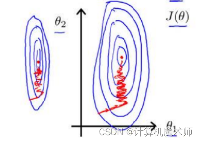
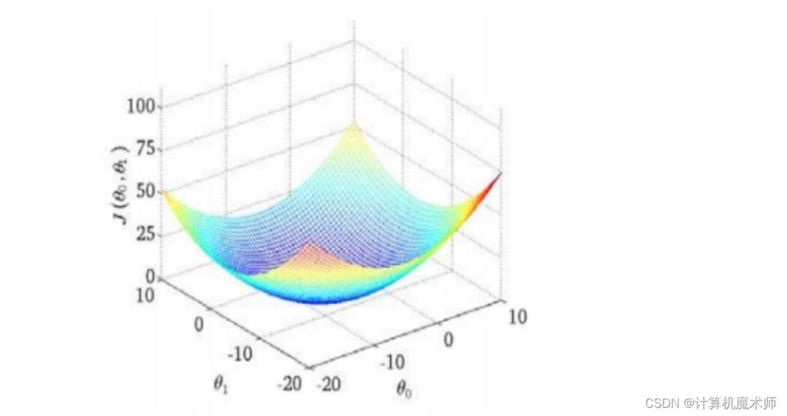

# 数据清洗

### 数据标准化和归一化

在使用梯度下降算法进行模型训练时，对输入特征进行比例缩放（或归一化）有以下几个原因：

1. 加速收敛：梯度下降的目标是找到损失函数最小化的参数值，而不同特征可能具有不同的尺度和范围。如果某些特征具有较大的值范围，那么**其相关权重更新也会更大，这可能导致算法收敛过程变得非常缓慢甚至无法收敛。**通过对输入特征进行比例缩放，可以使各个特征都处于相似的尺度范围内，从而加快算法收敛速度。

2. 防止数值溢出：在计算过程中，**涉及到较大或较小数值时容易发生数值溢出问题。**通过将输入特征进行比例缩放，可以有效地避免这种情况的发生。

3. 提高模型性能：某些机器学习模型（如支持向量机、K近邻等）对输入数据中不同尺度和范围非常敏感。**当存在明显差异的尺度时，在距离计算、权重分配等方面可能会产生偏差，并且影响模型性能**。通过比例缩放输入特征，可以确保模型能够更好地利用每个特征的信息，提高模型性能。

在线性回归中，尤其是多变量回归模型，由于各个的数据之间量化纲位不同，如果说两个参数尺度范围分别是是【0~1000，0 ~5】或者【-0.00004 ~ 0.00002，10 ~ 30】,  那么在使用梯度下降算法时，他们的等高线是一个又窄又高的等高线，如下图：   

 因为一个他们量化纲位不同会出现 （1，299），（3，800） 这种特征实例，那么等高线就会又窄又高，在梯度下降算法中，参数更新就会如上图左右震荡（权重更新一点就会导致输出变大，对大尺度的特征更加敏感，不利于学习）如果等高线如下图，参数更新就能更快收敛与更新了

如下图：代价函数（如MSE: 回归模型的预测值和实际值的差的平方和）的3D图，就像下山一样，为了达到局部最优点或全局最优点，作为下山者，你肯定希望地形比较平缓，比较清楚的知道往哪里走能够最快下山，而如果这个山又陡又窄，那下山者是不是下山肯定速度慢很多（更新中不能较快收敛，左右震荡），往哪里都是下降，不能准确找到方向。

**理想的代价函数**

**但实际往往都是下图的情况** （有许多局部最优）

数据标准化和归一化是常见的数据预处理技术，它们在以下情况下使用：

1. 特征缩放：当特征的取值范围差异较大时，可以使用数据标准化或归一化来将其缩放到相似的范围。这有助于**避免某些特征对模型训练产生过大影响**。

2. 收敛加速：在某些机器学习算法（如梯度下降）中，如果不进行数据标准化或归一化，则可能需要更多迭代次数才能收敛到最优解。通过使特征**具有类似的尺度，可以提高算法收敛速度**（不再左右震荡，权重更新性价比相同，特征之前模型一视同仁）并加快训练过程。

3. 防止数值溢出：当输入数据包含非常大或非常小的值时，计算中可能会发生**数值溢出或舍入误差**。通过将数据缩放到合理范围内，可以避免这些问题，并提高计算稳定性。

4. 算法要求：某些机器学习算法（如K均值聚类、支持向量机等）对输入数据进行了假设，**例如假设样本服从正态分布。**（机器学习算法最重要的概率统计，如果尺度和范围不同，显然很难拟合分布）在这种情况下，对于满足这些假设的算法而言，数据标准化或归一化是必要的预处理步骤。

尽管数据标准化和归一化在许多情况下都很有用，但并不是所有算法都需要进行这些操作。例如，**决策树和随机森林等基于树的模型通常不受特征缩放影响**（这种是基于不同类别的信息增益（信息熵）或者基尼指数（类别纯度）确定阈值，而图像识别等深度学习任务则通常对原始输入进行归一化处理。

在实践中，可以使用以下方法来进行数据标准化和归一化：

- 数据标准化（Standardization）：通过将每个特征值减去其均值，并除以其标准差来使特征**具有零均值和单位方差。**（这也是我们在平时数学上求正态分布的算法，使其均值为0，方差为1）

- 数据归一化（Normalization）：通过将每个特征值按比例缩放到给定范围内（如0到1之间）来**保持相对关系**（比如最大最小值归一化，或者同除于最大值)。

   >  数据归一化是将不同尺度的数据转换为统一尺度范围的过程。常见的数据归一化算法包括：
   >
   >  1. 最小-最大缩放（Min-Max Scaling）：该方法通过**线性变换**将原始数据映射到[0, 1]或者[-1, 1]之间。公式如下：
   >     $$
   >     X_{\text{new}} = \frac{{X - X_{\text{min}}}}{{X_{\text{max}} - X_{\text{min}}}}
   >     $$
   >     其中，\(X\) 是原始输入特征，\(X_{\text{new}}\) 是进行归一化后得到的新特征。
   >
   >  3. 小数定标缩放（Decimal Scaling）：该方法通过**移动小数点位置**来实现归一化处理。具体做法是**找出使得所有样本都落在[-1, 1]之间的最小整数n，然后将原始数据除以$10^n$**。公式如下：
   >     $$
   >     X_{\text{new}} = \frac{{X}}{{10^n}}
   >     $$
   >      其中，$X$ 是原始输入特征，$X_{\text{new}}$ 是进行归一化后得到的新特征。
   >
   >  相比最大-最小缩放（Min-Max Scaling），寻找使得所有样本都落在[-1, 1]之间的最小整数n算法有以下几个好处：
   >
   >  1. **不受异常值影响**：当存在异常值时，使用最大-最小缩放可能会导致归一化后的数据范围过于集中或扩散。而通过移动小数点位置来进行归一化，则可以**避免受到极端值的干扰**。
   >
   >  2. **保留原始数据分布形态**：移动小数点位置不改变原始数据之间的相对关系，只是将其映射到[-1, 1]区间内。这种方式更加**保留了原始数据分布形态**，有助于保持特征之间的相对差异性。
   >
   >  3. 方便计算和理解：与直接使用公式进行线性变换相比，寻找使得所有样本都落在[-1, 1]之间的最小整数n方法**更容易理解和实现**。它不需要具体计算每个特征的最大和最小值，并且**仅涉及整数运算**。
   >
   >  然而，在某些情况下，使用该方法也存在一些限制：
   >  - **如果你希望将数据映射到其他范围而非[-1, 1]，此方法就无法满足需求**。
   >  - **在处理稀疏数据时，该方法可能会导致数据密度不均匀**。
   >
   >  综上所述，选择使用哪种归一化方法取决于具体的应用场景和数据特点。在某些情况下，寻找使得所有样本都落在[-1, 1]之间的最小整数n算法可以更好地满足需求，并提供更可靠的归一化结果。

请注意，在应用这些技术时，应该先分割出训练集和测试集，并且**仅使用训练集上的统计信息来**对整个数据集进行转换。然后将相同的变换应用于测试集以确保结果的可靠性。

在选择数据标准化（Standardization）和数据归一化（Normalization）之前，需要根据具体情况来评估它们的优劣。

1. 数据标准化的优点：
   - **保留了原始数据分布的形状，不会改变特征的相对关系**。
   - **对异常值不敏感**。由于使用均值和标准差进行缩放，**异常值对结果影响较小**。
   - 在某些机器学习算法中表现较好，如逻辑回归、线性回归等基于距离计算或梯度下降的模型。

2. 数据归一化的优点：
   - 将特征**缩放到固定范围**内有**利于比较不同单位或取值范围的特征**。
   - 有助于加速收敛过程，在某些机器学习算法中可能提高训练速度。
   - 在某些算法要求输入数据处于特定范围时非常有用，如支持向量机、K均值聚类等。

因此，在选择数据标准化还是数据归一化时可以考虑以下因素：

- 特征类型：如果**特征之间具有明显的大小差异，并且你希望保留其相对关系，则可以选择使用数据标准化**（比如人体大小与头发大小，人体总体一定远远大于头发的关系）。如果你**更关心特征的绝对值或需要将其缩放到固定范围内，则可以选择数据归一化。**
- 算法要求：某些算法对输入数据有特定的要求，例如支持向量机需要使用归一化后的数据。在这种情况下，你应该根据算法要求来选择适当的预处理方法。
- 实验结果：**尝试不同的预处理方法并比较它们在模型性能上的效果。根据实际结果来选择最佳方法。**

总而言之，没有单一正确答案。选择数据标准化还是归一化取决于你所面临问题和具体需求，并且可能需要进行试验和评估以确定最佳方案。（实践是证明真理的唯一标准！！！ —— 伽利略） 

#### BatchNormalization

在深度学习上，Batch Normalization（批标准化）可以在某种程度上替代数据归一化和标准化。

Batch Normalization 是一种用于加速深度神经网络收敛、防止梯度消失/爆炸等问题的技术。它通过对**每个小批量样本**进行均值和方差的归一化来规范输入数据，并将其缩放和平移以恢复数据分布。

Batch Normalization 的优点包括：

1. 自适应性：相比于单纯的数据预处理方法，如标准化或归一化，Batch Normalization 能够**自动学习适合当前训练批次的均值和方差。**

   >  如何自动学习？

2. 抑制梯度问题：通过将每层输入进行规范化，Batch Normalization 有助于解决梯度消失/爆炸问题（如权重问题，数据尺度和范围问题导致的上溢下溢等问题），使得神经网络更容易训练。

3. 正则化效果：由于 Batch Normalization **引入了额外参数来调整特征缩放和平移（比如比例缩放偏置移动），它具有正则化效果**，并且能够稍微提高模型泛化能力。

因此，在使用深度神经网络时，可以考虑直接使用 Batch Norm 进行特征处理而不需要显式地对输入进行标准化或归一化。但请注意以下事项：

- 执行顺序：如果使用 Batch Normalization，**通常应该在每个隐藏层的激活函数之前进行批标准化**。这样可以确保网络从**输入层到输出层的所有中间特征都受益于规范化。**
- 数据分布：Batch Normalization 是**基于小批量数据的统计信息**来进行归一化操作的，因此**对于较小规模或不均衡的数据集可能效果不佳。**
- 预训练模型：如果你使用了预训练好的模型（**如 ImageNet 上预训练过的卷积神经网络**），则需要根据原始模型是否已经包含 Batch Norm 来决定是否需要进一步处理。

总结而言，Batch Normalization 在深度神经网络中是非常有用和有效的技术，并且可以部分替代传统的数据归一化和标准化方法。但具体选择还要根据实际情况和实验结果来确定。

### 数据划分

对于机器学习模型的训练，通常需要将数据集划分为训练集和测试集。而验证集是用于模型调优和选择最佳超参数的辅助数据集。

下面是对训练集、验证集和测试集的解释及其区别：

1. 训练集（Training Set）：训练集是用于训练机器学习模型的数据集。模型通过对训练集的样本进行学习和参数调整，以最小化训练集上的损失函数。训练集通常占整个数据集的大部分比例。

2. 验证集（Validation Set）：验证集是用于**模型调优和选择最佳超参数的数据集**（如果没有测试集，对着验证集炼丹反而有可能拟合验证集）。在训练过程中，使用验证集评估模型在未见过的数据上的性能，并进行模型参数的调整。通过在验证集上的表现，可以选择最佳的模型配置和超参数，以获得更好的泛化能力。

3. 测试集（Test Set）：测试集是用于评估训练好的模型的性能和泛化能力的数据集。测试集是模型未曾见过的数据，用于模拟模型在实际应用中遇到的新样本。通过测试集上的表现，可以得出对模型的客观评价。

区别：

- 训练集用于训练模型的参数，目标是使模型能够对训练数据进行准确拟合。
- 验证集**用于模型调优和选择超参数**，目标是**选择最佳的模型配置**，使模型具有良好的泛化能力。
- 测试集用于评估模型的性能和泛化能力，目标是得出对模型的客观评价。

重要的一点是，验证集和测试集都是在训练阶段以外的数据上进行评估，以避免模型在训练数据上过度拟合。它们的目的是验证和衡量模型的性能，但验证集用于模型调优，而测试集则用于最终评估模型的性能。

### 数据不平衡

当涉及到训练机器学习模型时，采样加权和损失加权是两种常用的技术。它们在处理不平衡数据集或高度错误分类的情况下特别有用。(一个属于是训练前，一个是训练时)

1. 采样加权（Sampling Weighting）: 采样加权是通过调整样本在训练过程中的权重来平衡不同类别之间的样本分布。通常情况下，数据集中的某些类别可能比其他类别更常见或更罕见。为了避免模型偏向于频繁出现的类别，我们可以赋予罕见类别更高的权重，使其在训练中得到更多关注。这可以通过以下步骤实现：

   - 下采样（Undersampling）：从频繁类别中删除一些样本，使得所有类别具有相似数量的样本。
   - 过采样（Oversampling）：复制罕见类别的样本，使其数量与频繁类别相当。
   - SMOTE（Synthetic Minority Over-sampling Technique）：使用插值方法生成合成的罕见类别样本。

2. 损失加权（Loss Weighting）: 损失加权是通过调整损失函数中各个样本的权重，来解决不平衡数据集问题。在某些情况下，模型可能倾向于优化常见类别而忽视罕见类别。为了解决这个问题，我们可以引入损失加权，其中样本的权重与其所属类别的相对重要性成正比。一种常见的损失加权方法是Focal Loss。

3. Focal Loss: Focal Loss（焦点损失）是一种损失函数，专门用于解决分类问题中不平衡数据集的训练问题。它通过调整难易样本的权重来解决模型在错误分类方面的问题。Focal Loss的主要思想是减少易分类样本的权重，使模型更加关注困难样本。

   Focal Loss引入两个参数：调节因子（调节困难样本的重要性）和焦点参数（控制调节因子的程度）。通过增加焦点参数，可以进一步减少易分类样本的权重，使模型更加关注困难样本。通过这种方式，Focal Loss有助于提高模型在罕见类别上的性能。

   > Focal Loss是由Lin et al.在2017年的论文《Focal Loss for Dense Object Detection》中提出的，主要用于解决目标检测任务中的类别不平衡问题。下面我将详细介绍Focal Loss的原理和推导过程。
   >
   > 假设我们有一个二分类问题，样本分为正样本（Positive）和负样本（Negative）。**传统的交叉熵损失函数对于类别不平衡的问题表现不佳**（因为交叉熵一视同仁），因为它倾向于优化常见类别，而忽视罕见类别。Focal Loss通过引入调节因子和焦点参数，使得模型更关注困难样本，以此来解决类别不平衡问题。
   >
   > 首先，假设$p_t$表示样本属于正样本的概率，$p_t \in [0, 1]$。那么样本属于负样本的概率可以表示为$1 - p_t$。经过逻辑回归（sigmoid）函数处理后，我们可以得到预测概率：
   >
   > $$
   > \hat{y}_t =
   > \begin{cases}
   > p_t, & \text{if the ground truth label is positive} \\
   > 1 - p_t, & \text{otherwise}
   > \end{cases}
   > $$
   >
   > 接下来，我们定义调节因子$(1-\hat{y}_t)^\gamma$，其中$\gamma \geq 0$。这个调节因子用于降低容易分类的样本的权重，使得模型更加关注困难样本。当$\gamma=0$时，调节因子为常数，即不对样本进行加权。当$\gamma>0$时，**调节因子会随着预测概率的增加而减小。**（让不容易的分类变得容易）
   >
   > 最后，我们将上述两个部分相乘，并使用交叉熵损失函数计算每个样本的损失。整个Focal Loss的公式如下：
   >
   > $$\text{FL}(p_t) = -\alpha_t (1-\hat{y}_t)^\gamma \log(\hat{y}_t)$$
   >
   > 其中：
   >
   > - $\alpha_t$是一个平衡因子，用于调节正负样本之间的权重关系。一般情况下，$\alpha_t$可以根据类别频率进行设置，以降低常见类别的权重。
   > - $(1-\hat{y}_t)^\gamma$是调节因子，它降低了容易分类的样本的权重，使得模型更关注困难样本。
   > - $\log(\hat{y}_t)$表示预测概率的对数。
   >
   > 通过最小化所有样本的Focal Loss，我们可以训练出在类别不平衡问题上表现更好的模型。
   >
   > 需要注意的是，以上是Focal Loss的基本原理和推导过程。具体应用中，可能还会对公式进行微调或引入其他参数来适应具体任务的需求。

总结起来，采样加权和损失加权是处理不平衡数据集中常用的技术。采样加权通过调整样本在训练过程中的权重来平衡类别分布，而损失加权通过调整损失函数中样本的权重来解决不平衡数据集问题。Focal Loss是一种常见的损失函数，通过调整样本权重来解决模型在错误分类方面的问题，特别适用于处理不平衡数据集。

### 数据缺失值

当数据存在空值时，可以采取以下几种方式进行**平滑处理**：

1. 删除空值：如果**数据集中的空值较少**，可以考虑**直接删除包含空值的行或列**。这种方法适用于数据量较大且空值分布较为随机的情况。

2. 填充均值或中位数：对于数值型数据，可以用整个特征的均值或中位数来填充空值。这种方法适用于**数据分布较为集中**的情况。

3. 填充众数：对于**分类变量或离散型数据**，可以用整个特征的众数来填充空值。这种方法适用于数据的众数比较明显的情况。

4. 插值法：对于**时间序列或连续型数据**，可以使用插值法来填充空值。常见的插值方法包括线性插值、多项式插值、样条插值等。插值法可以根据数据的趋势和分布来填充空值，相对较为准确。

5. 使用机器学习算法：可以使用机器学习算法，如回归模型或决策树，来**预测空值**。可以将其他特征作为输入，空值所在特征作为输出，训练模型来填充空值。这种方法适用于**数据之间存在较强相关性**的情况。

选择合适的平滑方法取决于数据的特点、空值的分布以及对数据的要求。在处理空值时，应该根据具体情况选择最合适的方法。同时，要注意平滑后的数据是否符合实际情况，避免平滑过程引入额外的偏差。

#### 插值法

对于时间序列的数据，以下几种插值方法比较常用和建议使用：

1. 线性插值：线性插值是最简单和常用的插值方法之一。它假设数据在两个已知数据点之间是线性变化的，通过计算两个已知数据点之间的线性函数来填充空值。线性插值简单、快速，并且可以适用于大多数情况。

2. 拉格朗日插值：拉格朗日插值是一种多项式插值方法，它通过计算一个多项式函数来逼近数据的变化。拉格朗日插值可以更准确地拟合数据的非线性变化，但对于大规模数据集和高阶多项式，计算量可能较大。

3. 样条插值：样条插值是一种平滑的插值方法，通过拟合一条平滑的曲线来逼近数据的变化。样条插值可以处理数据的曲线和趋势变化，常用的样条插值方法包括线性样条插值、三次样条插值等。

4. 时间序列模型插值：对于时间序列数据，可以使用时间序列模型来预测和填充空值。常用的时间序列模型包括ARIMA模型、指数平滑模型、神经网络模型等。这些模型可以根据时间的趋势、季节性等特征来预测未来的数值，并填充空值。

选择插值方法时，应根据时间序列数据的性质和特征选择最适合的方法。对于平稳的时间序列，线性插值或拉格朗日插值可能足够；对于非线性或具有季节性的时间序列，样条插值或时间序列模型插值可能更合适。

此外，还可以根据数据的连续性和周期性来选择插值方法。例如，对于缺失的周期性数据，可以使用周期性插值方法，如周期移动平均或周期性线性插值。

### 离散化与连续化

离散化（Discretization）和连续化（Continuousization）是数据处理中的两个相对概念，用于处理不同类型的数据。

离散化是将连续型数据或特征转换为离散型的过程。它将连续的取值范围划分为有限的离散区间或类别。离散化的目的是**简化数据表示**、**降低数据噪声影响**、改善模型性能等。常见的离散化方法包括等宽离散化（Equal Width Discretization）、等频离散化（Equal Frequency Discretization）和基于聚类的离散化（Clustering-based Discretization）等。

连续化是将离散型数据或特征转换为连续型的过程。它将离散的类别或取值转换为连续的数值表示。连续化的目的是将离散的特征转换为可用于**连续型数据分析和建模**的形式，以便于应用各种连续型数据处理技术。常见的连续化方法包括独热编码（One-Hot Encoding）、特征哈希（Feature Hashing）和嵌入（Embedding）等。

离散化和连续化在数据处理中有不同的应用场景和目的：

1. 离散化适用于处理连续型数据，将其转换为离散型数据。离散化常用于特征工程、数据预处理和某些机器学习算法中。例如，将年龄分为不同的年龄段或将收入分为不同的收入水平类别。

2. 连续化适用于处理离散型数据，将其转换为连续型数据。连续化常用于将分类变量转换为可用于连续型数据建模的形式。例如，在自然语言处理任务中，将**文本的词汇或类别转换为连续的词嵌入向量**。

需要注意的是，在离散化和连续化过程中，数据的特性和任务的要求应该被充分考虑。离散化和连续化的选择应**基于数据的分布**、**特征的含义**和具体任务的需要。此外，离散化和连续化可能会引入**信息损失**或导致**数据的变形**，因此在应用中需要谨慎处理。

# 数据增强

数据增强**通常仅在训练集上使用，而在验证集和测试集上不使用**。这是因为数据增强的目的是扩充训练集，引入多样性和噪声，有助于模型更好地学习和泛化。而验证集和测试集的目的是评估模型在真实情况下的性能，因此应该保持原始数据的真实性，以准确地评估模型的泛化能力。

通过在训练集上应用数据增强，模型能够在更多不同的样本变体上进行训练，提高其对各种情况的适应能力。这有助于减轻过拟合现象，增加模型的鲁棒性。

在验证集和测试集上不使用数据增强的原因是确保评估模型的性能时，使用的是真实的、未经过额外处理的样本。这样可以提供对模型在真实数据上的准确评估，以确定其在实际应用中的性能。

需要注意的是，在应用数据增强时，应确保在训练集和验证集/测试集之间进行适当的数据分割，以避免数据泄漏。即确保在应用数据增强之前将数据集分割为独立的训练集和验证集/测试集，以确保评估的公正性。

## Stepwise

## 原理

Stepwise扩充数据集是一种**在机器学习中常用的方法**，用于增加训练数据以改善模型性能。这种方法通过逐步添加新的样本数据，以及相应的目标变量（标签），来扩充现有的数据集。

下面是Stepwise扩充数据集的一般步骤：

1. 准备初始数据集：首先，你需要准备一个初始的数据集，其中包含已经标记好的样本数据和相应的目标变量。这个数据集可以是从现有的数据源中收集到的、自动生成的或者其他方式得到的。
2. 训练初始模型：使用初始数据集来训练一个初始模型。这个模型可以是任何合适的机器学习模型，如线性回归、决策树、支持向量机等。
3. 模型评估：使用评估指标（如准确率、均方误差等）来评估初始模型的性能。这将帮助你确定模型在当前数据集上的表现情况。
4. 识别错误样本：分析初始模型在预测过程中产生的错误，并**识别出那些被错误分类的样本**。这些样本通常具有较高的错误概率，可能对模型的泛化能力造成负面影响。
5. 扩充数据集：将**错误样本添加到初始数据集中，并为它们提供正确的目标变量（标签）**。这样，你就扩充了数据集，使其包含更多的样本。
6. 模型更新：使用扩充后的数据集重新训练模型。在训练过程中，**新的错误样本将提供额外的信息，帮助模型更好地学习和泛化。**
7. 重复步骤3至步骤6：循环执行步骤3至步骤6，直到达到某个停止条件（如模型性能不再改善或达到预定的迭代次数）为止。
8. 最终模型评估：使用独立的测试数据集对最终训练得到的模型进行评估，以获取关于模型性能的准确估计。

原理和公式推导： Stepwise扩充数据集的原理**是通过不断添加错误样本并重新训练模型来提高模型的性能**。错误样本提供了额外的训练实例，有助于模型更好地捕捉数据的特征和规律。这种方法可以有效地减小模型的偏差，并提高其泛化能力。

数学上，Stepwise扩充数据集可以表示为以下公式：

1. 初始模型：给定初始数据集 D = {(x_1, y_1), (x_2, y_2), ..., (x_n, y_n)}，其中 x_i 是输入特征向量，y_i 是相应的目标变量（标签）。使用训练算法 A 对初始数据集进行训练得到初始模型 M_0。

   M_0 = A(D)

2. 错误样本识别：对于每个样本 (x_i, y_i) ∈ D，使用初始模型 M_0 进行预测得到预测值 ŷ_i。如果预测值和真实值不一致（即 ŷ_i ≠ y_i），则将该样本标记为错误样本。

3. 数据集扩充：将错误样本添加到初始数据集中，得到新的数据集 D' = D ∪ {(x_i, y_i)}。

4. 模型更新：使用扩充后的数据集 D' = D ∪ {(x_i, y_i)} 对模型进行更新。通过训练算法 A 对新数据集进行训练，得到更新后的模型 M_1。

   M_1 = A(D')

5. 模型评估：使用评估指标对更新后的模型 M_1 进行评估，以了解其在验证集或交叉验证中的性能表现。

6. 循环迭代：重复步骤2至步骤5，识别更多的错误样本并将其添加到数据集中，然后重新训练模型。每次迭代都有机会改善模型的性能。

7. 停止条件：定义一个停止条件，如达到预定的迭代次数、模型性能不再改善等。如果满足停止条件，则结束迭代过程；否则，返回步骤2继续迭代。

Stepwise扩充数据集的目标是通过逐步纠正模型的错误，逐渐提升模型的准确性和泛化能力。这种方法在数据量有限、标注成本较高或存在类别不平衡等情况下尤为有用，可以充分利用已有信息来提高模型的性能。

需要注意的是，扩充数据集并不是解决所有问题的万能方法。在实际应用中，还需要考虑数据采集的质量、特征工程、模型选择等其他因素来构建一个鲁棒性较好的机器学习系统。

## Mixup

mixup是一种用于数据增强的技术，特别适用于语音音频数据的处理。它的基本思想是通过对两端语音音频数据的特征和标签进行线性插值，生成新的训练样本，以扩充训练集和提高模型的泛化能力。

具体而言，对于每对音频样本，mixup方法会执行以下步骤（一部分是一份数据，一部分是另外一份数据：

1. 随机选择两个不同的音频样本。
2. 从0到1之间**生成一个随机的权重因子λ。**
3. 将第一个音频样本乘以λ，并将第二个音频样本乘以（1-λ）。
4. 将两个乘积相加，得到最终的混合音频样本。

假设我们有两个语音音频样本$(x_1, y_1)$和$(x_2, y_2)$，其中$x_1$和$x_2$是两端语音音频的输入，$y_1$和$y_2$是对应的标签（例如说话者ID或语音类别）。

mixup方法的公式如下：

$$\tilde{x} = \lambda x_1 + (1 - \lambda) x_2$$
$$\tilde{y} = \lambda y_1 + (1 - \lambda) y_2$$

其中，$\lambda$是一个从Beta分布中随机采样得到的权重，它控制了两个语音音频之间的插值程度。$\lambda$的采样可以通过以下公式得到：

$$\lambda \sim Beta(\alpha, \alpha)$$

在这里，$\alpha$是mixup的超参数，通常设置为1，使得$\lambda$的采样近似于均匀分布。

生成的插值样本$(\tilde{x}, \tilde{y})$将作为额外的训练样本，与原始样本一起用于模型的训练。通过这种方式，mixup方法可以为模型提供更多多样性的训练样本，从而增强模型的泛化能力和鲁棒性。

在实际应用中，可以将mixup方法应用于语音识别、说话人识别等任务中，通过对不同说话人的语音样本进行mixup，提高模型在未知说话人上的性能表现。同时，由于语音数据往往较为稀缺和昂贵，mixup方法也可以帮助解决数据不足的问题，提高模型的训练效果。

需要注意的是，在使用mixup方法时，应该确保在训练集和验证集/测试集之间进行适当的数据分割，以避免数据泄漏，并确保在验证集和测试集上不使用数据增强，以保持对模型性能的准确评估。

除了mixup，还有其他常用的音频数据增广方法，例如时间拉伸、音高变换、噪声添加等。这些方法都旨在扩展训练数据集，提高模型的鲁棒性和性能。

需要注意的是，在应用音频数据增广方法时，需要根据任务和应用场景进行适当的调整和处理。此外，在使用混合音频样本进行训练时，**需要确保标签也按照相应的权重进行混合，以匹配混合音频样本的特征**。

