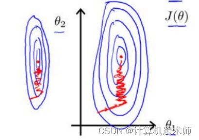
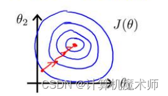
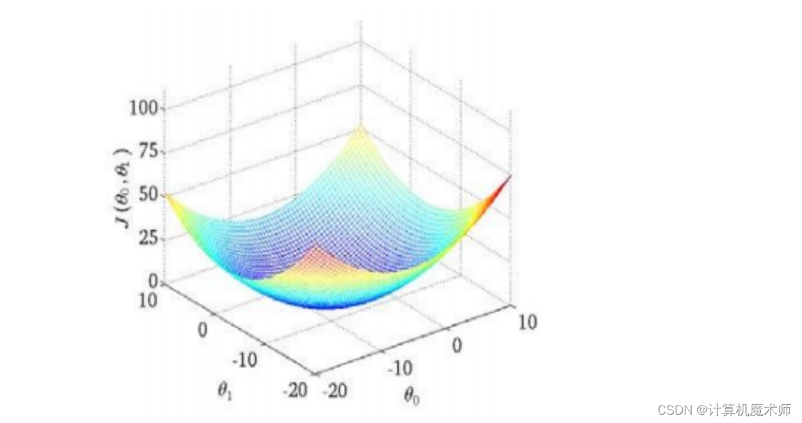
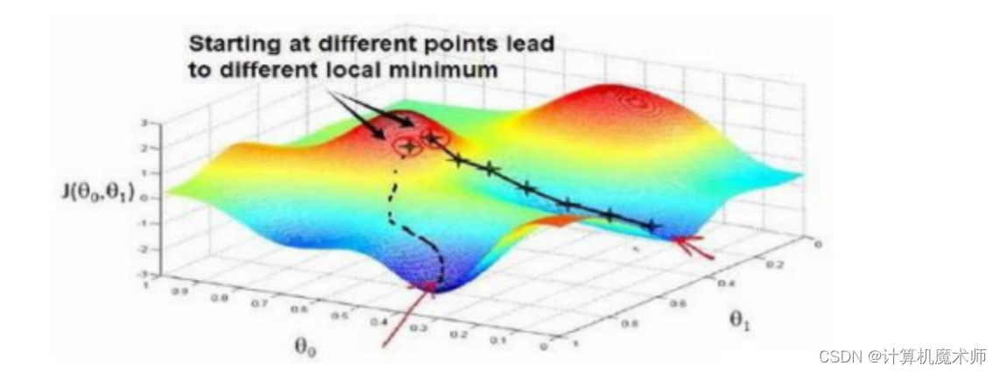
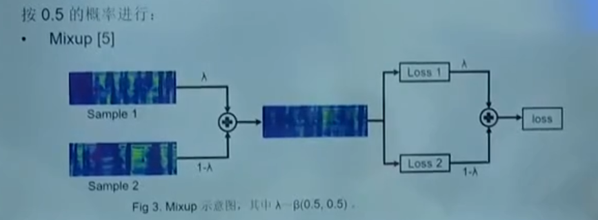

## 数据降维

### t-SNE

### PCA


### 数据标准化和归一化

在使用梯度下降算法进行模型训练时，对输入特征进行比例缩放（或归一化）有以下几个原因：

1. 加速收敛：梯度下降的目标是找到损失函数最小化的参数值，而不同特征可能具有不同的尺度和范围。如果某些特征具有较大的值范围，那么**其相关权重更新也会更大，这可能导致算法收敛过程变得非常缓慢甚至无法收敛。**通过对输入特征进行比例缩放，可以使各个特征都处于相似的尺度范围内，从而加快算法收敛速度。

2. 防止数值溢出：在计算过程中，**涉及到较大或较小数值时容易发生数值溢出问题。**通过将输入特征进行比例缩放，可以有效地避免这种情况的发生。

3. 提高模型性能：某些机器学习模型（如支持向量机、K近邻等）对输入数据中不同尺度和范围非常敏感。**当存在明显差异的尺度时，在距离计算、权重分配等方面可能会产生偏差，并且影响模型性能**。通过比例缩放输入特征，可以确保模型能够更好地利用每个特征的信息，提高模型性能。

在线性回归中，尤其是多变量回归模型，由于各个的数据之间量化纲位不同，如果说两个参数尺度范围分别是是【0~1000，0 ~5】或者【-0.00004 ~ 0.00002，10 ~ 30】,  那么在使用梯度下降算法时，他们的等高线是一个又窄又高的等高线，如下图：   




 因为一个他们量化纲位不同会出现 （1，299），（3，800） 这种特征实例，那么等高线就会又窄又高，在梯度下降算法中，参数更新就会如上图左右震荡（权重更新一点就会导致输出变大，对大尺度的特征更加敏感，不利于学习）如果等高线如下图，参数更新就能更快收敛与更新了



如下图：代价函数（如MSE: 回归模型的预测值和实际值的差的平方和）的3D图，就像下山一样，为了达到局部最优点或全局最优点，作为下山者，你肯定希望地形比较平缓，比较清楚的知道往哪里走能够最快下山，而如果这个山又陡又窄，那下山者是不是下山肯定速度慢很多（更新中不能较快收敛，左右震荡），往哪里都是下降，不能准确找到方向。

**理想的代价函数**



**但实际往往都是下图的情况** （有许多局部最优）



数据标准化和归一化是常见的数据预处理技术，它们在以下情况下使用：

1. 特征缩放：当特征的取值范围差异较大时，可以使用数据标准化或归一化来将其缩放到相似的范围。这有助于**避免某些特征对模型训练产生过大影响**。

2. 收敛加速：在某些机器学习算法（如梯度下降）中，如果不进行数据标准化或归一化，则可能需要更多迭代次数才能收敛到最优解。通过使特征**具有类似的尺度，可以提高算法收敛速度**（不再左右震荡，权重更新性价比相同，特征之前模型一视同仁）并加快训练过程。

3. 防止数值溢出：当输入数据包含非常大或非常小的值时，计算中可能会发生**数值溢出或舍入误差**。通过将数据缩放到合理范围内，可以避免这些问题，并提高计算稳定性。

4. 算法要求：某些机器学习算法（如K均值聚类、支持向量机等）对输入数据进行了假设，**例如假设样本服从正态分布。**（机器学习算法最重要的概率统计，如果尺度和范围不同，显然很难拟合分布）在这种情况下，对于满足这些假设的算法而言，数据标准化或归一化是必要的预处理步骤。

尽管数据标准化和归一化在许多情况下都很有用，但并不是所有算法都需要进行这些操作。例如，**决策树和随机森林等基于树的模型通常不受特征缩放影响**（这种是基于不同类别的信息增益（信息熵）或者基尼指数（类别纯度）确定阈值，而图像识别等深度学习任务则通常对原始输入进行归一化处理。

在实践中，可以使用以下方法来进行数据标准化和归一化：

- 数据标准化（Standardization）：通过将每个特征值减去其均值，并除以其标准差来使特征**具有零均值和单位方差。**（这也是我们在平时数学上求正态分布的算法，使其均值为0，方差为1）

- 数据归一化（Normalization）：通过将每个特征值按比例缩放到给定范围内（如0到1之间）来**保持相对关系**（比如最大最小值归一化，或者同除于最大值)。

   >  数据归一化是将不同尺度的数据转换为统一尺度范围的过程。常见的数据归一化算法包括：
   >
   >  1. 最小-最大缩放（Min-Max Scaling）：该方法通过**线性变换**将原始数据映射到[0, 1]或者[-1, 1]之间。公式如下：
   >     $$
   >     X_{\text{new}} = \frac{{X - X_{\text{min}}}}{{X_{\text{max}} - X_{\text{min}}}}
   >     $$
   >     其中，\(X\) 是原始输入特征，\(X_{\text{new}}\) 是进行归一化后得到的新特征。以下代码为实现（可以缩放到制定范围）
   >
   >     ```python
   >     X_std = (X - X.min(axis=0)) / (X.max(axis=0) - X.min(axis=0)) # 每个值缩放到0-1
   >     X_scaled = X_std * (max - min) + min  # 中间值缩放后的结果
   >     ```
   >     
   >  3. 小数定标缩放（Decimal Scaling）：该方法通过**移动小数点位置**来实现归一化处理。具体做法是**找出使得所有样本都落在[-1, 1]之间的最小整数n，然后将原始数据除以$10^n$**。公式如下：
   >     $$
   >     X_{\text{new}} = \frac{{X}}{{10^n}}
   >     $$
   >      其中，$X$ 是原始输入特征，$X_{\text{new}}$ 是进行归一化后得到的新特征。
   >
   >  >  1. **不受异常值影响**：当存在异常值时，使用最大-最小缩放可能会导致归一化后的数据范围过于集中或扩散。而通过移动小数点位置来进行归一化，则可以**避免受到极端值的干扰**。
   >  >
   >  >  2. **保留原始数据分布形态**：移动小数点位置不改变原始数据之间的相对关系，只是将其映射到[-1, 1]区间内。这种方式更加**保留了原始数据分布形态**，有助于保持特征之间的相对差异性。
   >  >
   >  >  3. 方便计算和理解：与直接使用公式进行线性变换相比，寻找使得所有样本都落在[-1, 1]之间的最小整数n方法**更容易理解和实现**。它不需要具体计算每个特征的最大和最小值，并且**仅涉及整数运算**。
   >  >
   >  >  然而，在某些情况下，使用该方法也存在一些限制：
   >  >
   >  >  - **如果你希望将数据映射到其他范围而非[-1, 1]，此方法就无法满足需求**。
   >  >- **在处理稀疏数据时，该方法可能会导致数据密度不均匀**。

请注意，在	应用这些技术时，应该先分割出训练集和测试集，并且**仅使用训练集上的统计信息来**对整个数据集进行转换。然后将相同的变换应用于测试集以确保结果的可靠性。

在选择数据标准化（Standardization）和数据归一化（Normalization）之前，需要根据具体情况来评估它们的优劣。

1. 数据标准化的优点：
   - **保留了原始数据分布的形状，不会改变特征的相对关系**。
   - **对异常值不敏感**。由于使用均值和标准差进行缩放，**异常值对结果影响较小**。
   - 在某些机器学习算法中表现较好，如逻辑回归、线性回归等基于距离计算或梯度下降的模型。

2. 数据归一化的优点：
   - 将特征**缩放到固定范围**内有**利于比较不同单位或取值范围的特征**。
   - 有助于加速收敛过程，在某些机器学习算法中可能提高训练速度。
   - 在某些算法要求输入数据处于特定范围时非常有用，如支持向量机、K均值聚类等。

因此，在选择数据标准化还是数据归一化时可以考虑以下因素：

- 数据分布：观察数据的分布情况。如果**数据分布偏态较大**，或者包含**明显的离群值**（异常值），则数据标准化可能更合适（将数据放正）。因为数据标准化使用的是均值和标准差，对异常值相对不敏感。而数据归一化可能会受到异常值的影响，因为它将数据缩放到0到1的范围。（将数据缩放变小）
- 数据要求：考虑数据在具体应用中的要求。如果应用场景对数据的绝对值大小没有特别要求，而**更关注数据的相对关系和比例**，那么数据归一化可能更适合。例如，某些机器学习算法（如支持向量机和K近邻算法）对数据的尺度敏感，此时进行数据归一化可以确保数据在相同的尺度上进行比较。
- 数据特征：考虑数据的特征和取值范围。**如果数据具有异质性，即不同特征具有不同的单位和尺度，数据标准化可以消除特征之间的差异**。而如果数据特征之间的差异不大，或者**数据已经处于相对相似的尺度上，数据归一化可能更简单和适用。**

需要注意的是，数据归一化和数据标准化只是常见的数据预处理方法之一，具体的选择还应考虑特定问题的要求和数据的特性。在实践中，可以进行实验和比较不同方法的效果，以确定最适合的数据预处理方式。另外，还可以考虑其他预处理技术，如对数转换、特征缩放等，以满足具体问题的需求。（实践是证明真理的唯一标准！！！ —— 伽利略） 

> 如下图所示，这是一个自动售货机每日销量总值预测数据标准化和最大最小值归一化的图例，可以看到三种趋势都没有变化，而只是数值范围发生变化，这就很好的去除了量纲不统一的问题，除此之外，**在这里的数据如果拿去跑神经网络，最大最小值归一化效果会更好（0-1），尤其是小数据量，更容易学习，由于其原始数据没有偏态较大，和特别的异常值所以可以选取最大最小值归一化**


### 离散化与连续化

离散化（Discretization）和连续化（Continuousization）是数据处理中的两个相对概念，用于处理不同类型的数据。

离散化是将连续型数据或特征转换为离散型的过程。它将连续的取值范围划分为有限的离散区间或类别。离散化的目的是**简化数据表示**、**降低数据噪声影响**、改善模型性能等。常见的离散化方法包括等宽离散化（Equal Width Discretization）、等频离散化（Equal Frequency Discretization）和基于聚类的离散化（Clustering-based Discretization）等。

连续化是将离散型数据或特征转换为连续型的过程。它将离散的类别或取值转换为连续的数值表示。连续化的目的是将离散的特征转换为可用于**连续型数据分析和建模**的形式，以便于应用各种连续型数据处理技术。常见的连续化方法包括独热编码（One-Hot Encoding）、特征哈希（Feature Hashing）和嵌入（Embedding）等。

离散化和连续化在数据处理中有不同的应用场景和目的：

1. 离散化适用于处理连续型数据，将其转换为离散型数据。离散化常用于特征工程、数据预处理和某些机器学习算法中。例如，将年龄分为不同的年龄段或将收入分为不同的收入水平类别。

2. 连续化适用于处理离散型数据，将其转换为连续型数据。连续化常用于将分类变量转换为可用于连续型数据建模的形式。例如，在自然语言处理任务中，将**文本的词汇或类别转换为连续的词嵌入向量**。

需要注意的是，在离散化和连续化过程中，数据的特性和任务的要求应该被充分考虑。离散化和连续化的选择应**基于数据的分布**、**特征的含义**和具体任务的需要。此外，离散化和连续化可能会引入**信息损失**或导致**数据的变形**，因此在应用中需要谨慎处理。

>  pd.cut() 可以将数据按照区间(可对应标签) 离散化

## 数据增强

数据增强**通常仅在训练集上使用，而在验证集和测试集上不使用**。这是因为数据增强的目的是扩充训练集，引入多样性和噪声，有助于模型更好地学习和泛化。而验证集和测试集的目的是评估模型在真实情况下的性能，因此应该保持原始数据的真实性，以准确地评估模型的泛化能力。

通过在训练集上应用数据增强，模型能够在更多不同的样本变体上进行训练，提高其对各种情况的适应能力。这有助于减轻过拟合现象，增加模型的鲁棒性。

在验证集和测试集上不使用数据增强的原因是确保评估模型的性能时，使用的是真实的、未经过额外处理的样本。这样可以提供对模型在真实数据上的准确评估，以确定其在实际应用中的性能。

需要注意的是，在应用数据增强时，应确保在训练集和验证集/测试集之间进行适当的数据分割，以避免数据泄漏。即确保在应用数据增强之前将数据集分割为独立的训练集和验证集/测试集，以确保评估的公正性。

### Stepwise 方法

Stepwise扩充数据集是一种**在机器学习中常用的方法**，用于增加训练数据以改善模型性能。这种方法通过逐步添加新的样本数据，以及相应的目标变量（标签），来扩充现有的数据集。

下面是Stepwise扩充数据集的一般步骤：

1. 准备初始数据集：首先，你需要准备一个初始的数据集，其中包含已经标记好的样本数据和相应的目标变量。这个数据集可以是从现有的数据源中收集到的、自动生成的或者其他方式得到的。
2. 训练初始模型：使用初始数据集来训练一个初始模型。这个模型可以是任何合适的机器学习模型，如线性回归、决策树、支持向量机等。
3. 模型评估：使用评估指标（如准确率、均方误差等）来评估初始模型的性能。这将帮助你确定模型在当前数据集上的表现情况。
4. 识别错误样本：分析初始模型在预测过程中产生的错误，并**识别出那些被错误分类的样本**。这些样本通常具有较高的错误概率，可能对模型的泛化能力造成负面影响。
5. 扩充数据集：将**错误样本添加到初始数据集中，并为它们提供正确的目标变量（标签）**。这样，你就扩充了数据集，使其包含更多的样本。
6. 模型更新：使用扩充后的数据集重新训练模型。在训练过程中，**新的错误样本将提供额外的信息，帮助模型更好地学习和泛化。**
7. 重复步骤3至步骤6：循环执行步骤3至步骤6，直到达到某个停止条件（如模型性能不再改善或达到预定的迭代次数）为止。
8. 最终模型评估：使用独立的测试数据集对最终训练得到的模型进行评估，以获取关于模型性能的准确估计。

原理和公式推导： Stepwise扩充数据集的原理**是通过不断添加错误样本并重新训练模型来提高模型的性能**。错误样本提供了额外的训练实例，有助于模型更好地捕捉数据的特征和规律。这种方法可以有效地减小模型的偏差，并提高其泛化能力。

数学上，Stepwise扩充数据集可以表示为以下公式：

1. 初始模型：给定初始数据集 D = {(x_1, y_1), (x_2, y_2), ..., (x_n, y_n)}，其中 x_i 是输入特征向量，y_i 是相应的目标变量（标签）。使用训练算法 A 对初始数据集进行训练得到初始模型 M_0。

   M_0 = A(D)

2. 错误样本识别：对于每个样本 (x_i, y_i) ∈ D，使用初始模型 M_0 进行预测得到预测值 ŷ_i。如果预测值和真实值不一致（即 ŷ_i ≠ y_i），则将该样本标记为错误样本。

3. 数据集扩充：将错误样本添加到初始数据集中，得到新的数据集 D' = D ∪ {(x_i, y_i)}。

4. 模型更新：使用扩充后的数据集 D' = D ∪ {(x_i, y_i)} 对模型进行更新。通过训练算法 A 对新数据集进行训练，得到更新后的模型 M_1。

   M_1 = A(D')

5. 模型评估：使用评估指标对更新后的模型 M_1 进行评估，以了解其在验证集或交叉验证中的性能表现。

6. 循环迭代：重复步骤2至步骤5，识别更多的错误样本并将其添加到数据集中，然后重新训练模型。每次迭代都有机会改善模型的性能。

7. 停止条件：定义一个停止条件，如达到预定的迭代次数、模型性能不再改善等。如果满足停止条件，则结束迭代过程；否则，返回步骤2继续迭代。

Stepwise扩充数据集的目标是通过逐步纠正模型的错误，逐渐提升模型的准确性和泛化能力。这种方法在数据量有限、标注成本较高或存在类别不平衡等情况下尤为有用，可以充分利用已有信息来提高模型的性能。

需要注意的是，扩充数据集并不是解决所有问题的万能方法。在实际应用中，还需要考虑数据采集的质量、特征工程、模型选择等其他因素来构建一个鲁棒性较好的机器学习系统。

### Mixup 混合方法

mixup是一种用于数据增强的技术，特别适用于语音音频数据的处理。它的基本思想是通过对两端语音音频数据的特征和标签进行线性插值，生成新的训练样本，以扩充训练集和提高模型的泛化能力。

具体而言，对于每对音频样本，mixup方法会执行以下步骤（一部分是一份数据，一部分是另外一份数据：

1. 随机选择两个不同的音频样本。
2. 从0到1之间**生成一个随机的权重因子λ。**
3. 将第一个音频样本乘以λ，并将第二个音频样本乘以（1-λ）。
4. 将两个乘积相加，得到最终的混合音频样本。

假设我们有两个语音音频样本$(x_1, y_1)$和$(x_2, y_2)$，其中$x_1$和$x_2$是两端语音音频的输入，$y_1$和$y_2$是对应的标签（例如说话者ID或语音类别）。

mixup方法的公式如下：

$$\tilde{x} = \lambda x_1 + (1 - \lambda) x_2$$
$$\tilde{y} = \lambda y_1 + (1 - \lambda) y_2$$

其中，$\lambda$是一个从Beta分布中随机采样得到的权重，它控制了两个语音音频之间的插值程度。$\lambda$的采样可以通过以下公式得到：

$$\lambda \sim Beta(\alpha, \alpha)$$

在这里，$\alpha$是mixup的超参数，通常设置为1，使得$\lambda$的采样近似于均匀分布。

生成的插值样本$(\tilde{x}, \tilde{y})$将作为额外的训练样本，与原始样本一起用于模型的训练。通过这种方式，mixup方法可以为模型提供更多多样性的训练样本，从而增强模型的泛化能力和鲁棒性。

在实际应用中，可以将mixup方法应用于语音识别、说话人识别等任务中，通过对不同说话人的语音样本进行mixup，提高模型在未知说话人上的性能表现。同时，由于语音数据往往较为稀缺和昂贵，mixup方法也可以帮助解决数据不足的问题，提高模型的训练效果。

需要注意的是，在使用mixup方法时，应该确保在训练集和验证集/测试集之间进行适当的数据分割，以避免数据泄漏，并确保在验证集和测试集上不使用数据增强，以保持对模型性能的准确评估。

除了mixup，还有其他常用的音频数据增广方法，例如时间拉伸、音高变换、噪声添加等。这些方法都旨在扩展训练数据集，提高模型的鲁棒性和性能。

需要注意的是，在应用音频数据增广方法时，需要根据任务和应用场景进行适当的调整和处理。此外，在使用混合音频样本进行训练时，**需要确保标签也按照相应的权重进行混合，以匹配混合音频样本的特征**。



总结起来，采样加权和损失加权是处理不平衡数据集中常用的技术。采样加权通过调整样本在训练过程中的权重来平衡类别分布，而损失加权通过调整损失函数中样本的权重来解决不平衡数据集问题。Focal Loss是一种常见的损失函数，通过调整样本权重来解决模型在错误分类方面的问题，特别适用于处理不平衡数据集。