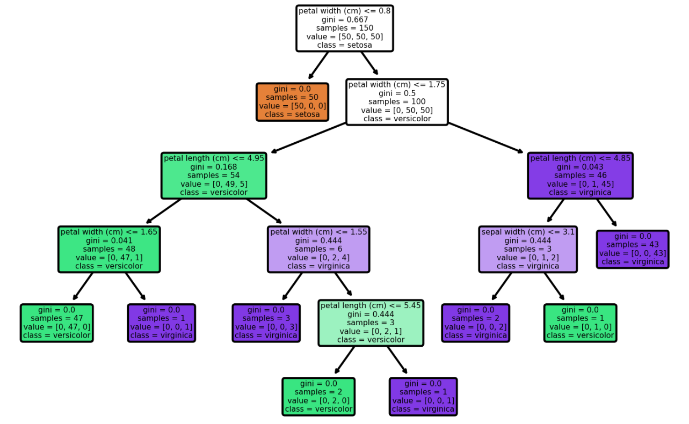
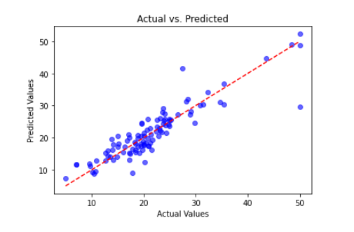
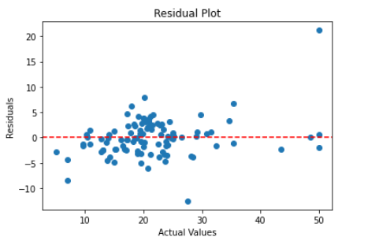

## t-SNE 可视化

t-SNE（t-Distributed Stochastic Neighbor Embedding）是一种降维和可视化技术，用于将高维数据映射到二维或三维空间中。它是一种非线性的降维方法，旨在保留原始数据之间的局部相似性关系。由Laurens van der Maaten和Geoffrey Hinton于2008年提出。在此之前，常用的降维方法如PCA（Principal Component Analysis）等主要关注全局结构，而缺乏对局部结构的捕捉能力。

t-SNE通过计算样本之间的相似度，并尝试在低维嵌入空间中保持这些相似度关系。它使用随机梯度下降等优化算法来最小化高维空间和低维嵌入空间之间的Kullback-Leibler散度。结果是，具有类似特征的样本会在低维投影中更接近。

因为t-SNE能够捕捉到复杂、非线性结构以及聚类效应，所以它通常被用于可视化高维数据集中不同类别或群组之间的分布关系。例如，在机器学习领域，可以使用t-SNE将特征向量表示为二维或三维点云图，并观察不同类别样本之间的分离程度。

## 决策树可视化

scikit-learn（sklearn）的`tree`模块提供了一个方便的函数`plot_tree`，用于可视化决策树模型。你可以使用以下步骤来使用`plot_tree`函数进行可视化（以iris数据集为例）：

1. 导入必要的库和模块：在Python脚本中，导入`tree`模块和`matplotlib.pyplot`库：

2. 可视化决策树：使用`plot_tree`函数可视化决策树模型。

3. 调用函数进行可视化：在你的代码中，调用`visualize_decision_tree`函数并传入决策树模型、特征名称和类别名称作为参数：

```python
from sklearn import tree
import matplotlib.pyplot as plt
from sklearn.datasets import load_iris

def visualize_decision_tree(decision_tree, feature_names, class_names):
    plt.figure(dpi=300)
    tree.plot_tree(decision_tree, feature_names=feature_names, class_names=class_names,
                   filled=True, rounded=True)
    plt.show()
clf = tree.DecisionTreeClassifier(random_state=0)
iris = load_iris()
clf = clf.fit(iris.data, iris.target)
visualize_decision_tree(clf,feature_names = iris.feature_names, class_names = iris.target_names)
```

结果如下图：

每一个节点都有分类阈值以及其gini指数和样本状态和类别状态。



   在上面的代码中，`decision_tree`是你的决策树模型，`feature_names`是特征的名称列表，`class_names`是类别的名称列表。`visualize_decision_tree`函数使用`plot_tree`函数将决策树模型绘制为图形。   运行代码后，你将看到绘制出的决策树图形。

请注意，`plot_tree`函数提供了一些可选参数，可以用于自定义图形的外观。你可以查阅scikit-learn的文档以了解更多关于`plot_tree`函数的详细信息和可选参数的使用方式。

## 回归可视化方案

在评估回归模型效果时，可以使用多种可视化方案来直观地比较实际值和预测值之间的差异。以下是几种常见的回归模型评估可视化方案和相应的Python代码模板：

1.  对角线图：对角线图用于比较实际值和预测值之间的差异。通过将实际值和预测值绘制在同一个图表上，并**绘制一条对角线**（理想情况下实际值等于预测值），可以**直观地观察到预测值偏离对角线的程度**。代码模板如下：

```python
import matplotlib.pyplot as plt

# 绘制对角线图
plt.scatter(y_actual, y_predicted)
plt.plot([y_actual.min(), y_actual.max()], [y_actual.min(), y_actual.max()], 'r--')
plt.xlabel('Actual Values')
plt.ylabel('Predicted Values')
plt.title('Diagonal Plot - Actual vs. Predicted')
plt.show()
```



2.  残差图：残差图用于检查回归模型的拟合情况。它将实际值和预测值之间的差异（即残差）绘制在y轴上，将实际值绘制在x轴上。通过观察残差图的分布，可以检查模型是	存在系统性的误差或模型是否满足对误差的假设。代码模板如下：

```python
import matplotlib.pyplot as plt

# 计算残差
residuals = y_actual - y_predicted

# 绘制残差图
plt.scatter(y_actual, residuals)
plt.axhline(y=0, color='r', linestyle='--')
plt.xlabel('Actual Values')
plt.ylabel('Residuals')
plt.title('Residual Plot')
plt.show()
```



3.  拟合曲线图：可以绘制拟合曲线来可视化模型的拟合效果（**只适合单变量**）。代码模板如下：

```python
import numpy as np
import matplotlib.pyplot as plt

# 生成一系列x值
x = np.linspace(min(x_actual), max(x_actual), 100)

# 预测对应的y值
y_predicted = model.predict(x)

# 绘制拟合曲线图
plt.scatter(x_actual, y_actual, label='Actual')
plt.plot(x, y_predicted, color='r', label='Predicted')
plt.xlabel('X')
plt.ylabel('Y')
plt.title('Fitted Curve')
plt.legend()
plt.show()
```

这些可视化方案提供了不同的角度和方法来评估回归模型的效果。根据数据和模型的特点，可以选择适合的可视化方案或结合多种方案来全面评估模型的性能。


